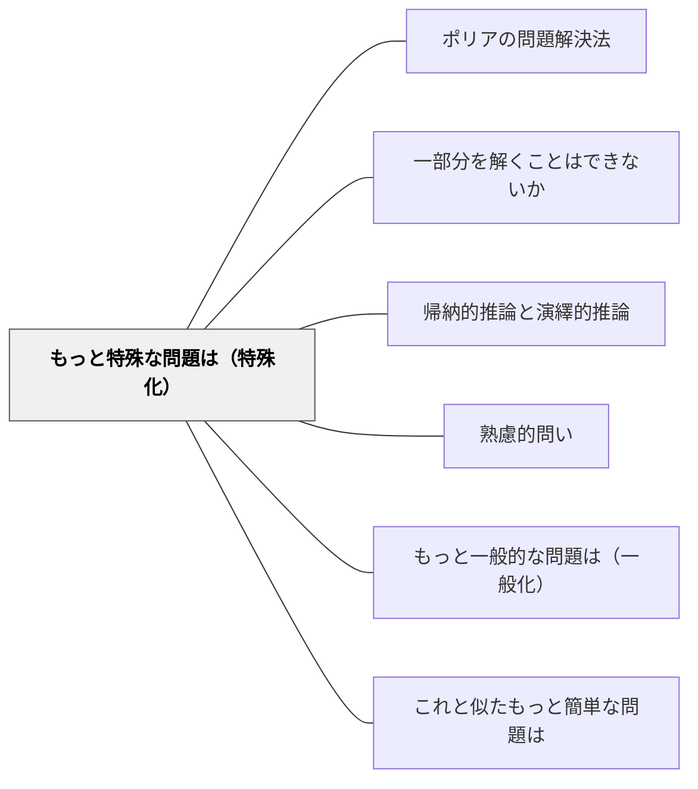

# もっと特殊な問題は（特殊化）

> 具体化・特殊化を問うことで、抽象的な概念を理解可能な事例へと落とし込む。

## Pattern Connection

**Blitzer（2014）統合（2026-05-24）——Polya の問題解決ストラテジーとしての特殊化：**

*Thinking Mathematically* Ch.1 Section 3 は、ポリアの Step 2「計画を立てる」の中に「Try a Simpler Problem（より単純な問題を解く）」を問題解決ストラテジーの一つとして明示する。

- **補強された点**：特殊化は単なる「わかりやすくする技法」ではなく、**複雑な問題の構造を単純な例で把握してから元の問題に転用する**という「問題解決の構造的戦略」として位置づけられる。ポリア（1945）の "If you cannot solve the proposed problem, try to solve first some related problem" という言葉がこれを裏付ける
- **拡張された点**：Blitzer は「具体的な数値を入れてみる（数列の次項を求める）」→「一般的なパターンを見出す」という帰納的推論の流れとして特殊化を位置づける。特殊化は [[パタン/帰納的推論と演繹的推論]] の「具体例の観察」フェーズの実践形
- **他のパタンへの波及**：[[パタン/ポリアの問題解決法]] — 特殊化が含まれる8つの問題解決ストラテジー

---

## 背景（Context）
抽象的・一般的な命題や理論は、それだけでは実感を伴いにくい。特殊な事例や具体的なケースに落とし込むことで、理解が深まり、一般命題の正しさや意味を確かめることができる。特殊化はまた、一般的な問題のデバッグにも有効である。

## 問題（Problem）
一般的な理論を学んでも、具体的場面への適用の仕方が分からないことがある。「分かった気がするが実際に使えない」という状態は、一般的な知識と具体的事例の橋渡しができていないことが原因の一つである。また、一般的な証明を理解するためにまず特殊な場合を確かめることが有効な場合も多い。

## 力のかたち（Forces）
- 具体例は抽象概念の「錨」として機能し、記憶に定着しやすくなる
- 特殊な場合の検証は、一般命題の信頼性を高める
- 特殊化によって反例を見つけ、誤った一般化を修正できる
- 「もっと限定したら」という問いが問題の核心を突くこともある

## 解決（Solution）
「もっと具体的な場合、特別な場合はどうなるか？n=2の場合は？条件を一つ追加すると？」と問いかける。例えば「一般に三角形の面積はどうなるかを考える前に、まず直角三角形の場合で確かめよう」と具体的な特殊化を促す。特殊例を複数検討してから一般化に向かう進め方も有効である。

## 結果（Consequences）
- 抽象的知識が具体的事例と結びつき、実用的な理解が生まれる
- 特殊例の積み重ねが帰納的思考と一般化への土台を作る
- 反例の発見によって、過度な一般化や誤解を修正できる

## 関連パタン
- [[パタン/ポリアの問題解決法]]
- [[パタン/一部分を解くことはできないか]]
- [[パタン/帰納的推論と演繹的推論]]
- [[パタン/熟慮的問い]] — 親パタン
- [[パタン/もっと一般的な問題は（一般化）]] — 特殊化の逆方向で理解を深める
- [[パタン/これと似たもっと簡単な問題は]] — 特殊化と単純化の組み合わせ

## クラスター図

## Actionable Insight

- 抽象的な概念を教えた後「では、具体的な例で確かめよう」と特殊な場合を一つ検討させる——具体例が抽象概念の「錨」として記憶への定着を助ける
- 「n=1の場合は？2の場合は？」と特殊な小さな数から始めて検証させる——特殊例の積み重ねが帰納的思考と一般化への土台を作る
- 特殊例を通じて「この一般命題に反例はあるか？」を探させる——反例を探す視点が過度な一般化を防ぎ批判的思考を育てる

## 出典
- [[文献/熟慮的問いのパターンリスト（動画記録）]]
- ジョージ・ポリア（1954）『いかにして問題をとくか』丸善出版
