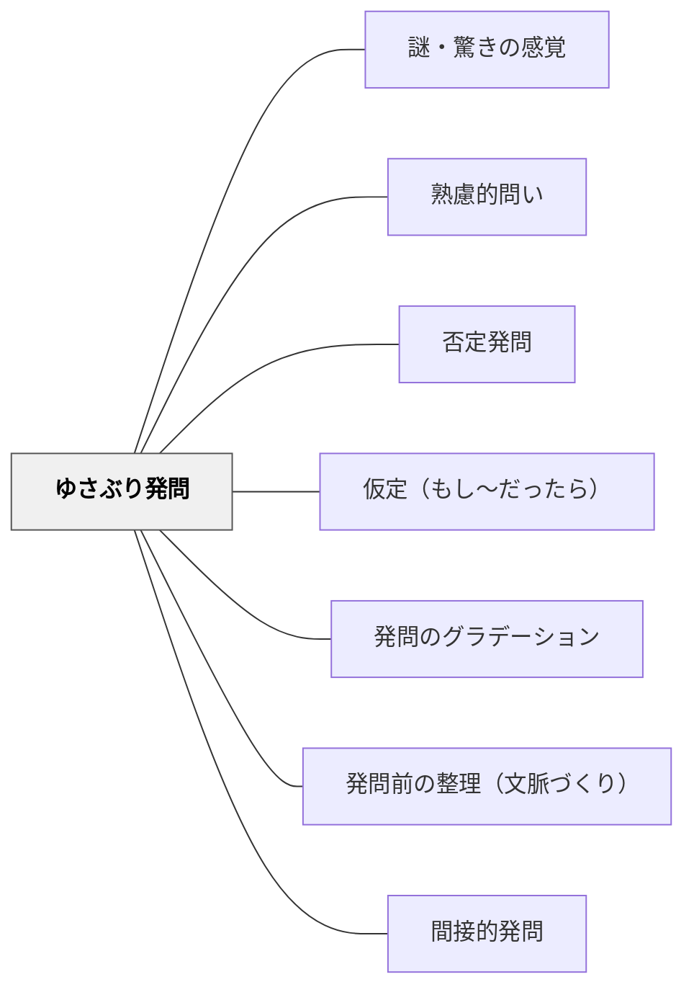

# ゆさぶり発問

> 固定観念・思い込みに疑いを投げかけ、「本当にそうか？」と認知的コンフリクトを起こす問い。

## [Pattern Connection]

- **補強された点（土居正博（2026）より）**：ゆさぶり発問は「否定発問」の大きな括りの一種でもあり、「それまでの教室の落ち着いた雰囲気をガラッと変える」機能をもつ。土居は「本当に？」というシンプルな問いかけを最も基本的なゆさぶりとして位置づけ、道徳・国語・社会など複数の教科実践で効果を示す。また [[パタン/発問のグラデーション]] の観点から、ゆさぶり発問は「教師による工夫が多い段階（グラデーション1〜2）」に位置する技法であり、子どもが育ったら徐々に使用頻度を落としていくべきとされる。
- **修正・更新点**：ゆさぶり発問は強力だが「毎時間使えない劇薬」（土居）である。頻繁に使うと「また先生どうせ間違うんでしょう」と子どもが慣れて冷めることに注意が必要。
- **他のパタンへの波及**：[[パタン/発問前の整理（文脈づくり）]] の「心理的文脈づくり」とゆさぶり発問は密接に連動する——ゆさぶりの前に、子どもが自信をもって「そうだ」と思っている状態を作ることが効果の条件である。

## 背景（Context）
学習者はしばしば「常識」や「当然のこと」として受け入れている前提を持っている。それらの前提を問わずにいると、深い理解は生まれない。思い込みや固定観念を「ゆさぶる」ことで、新たな視点や概念的な転換が起きる。

## 問題（Problem）
学習者が自信を持って答えた後、その前提に疑いを投げかけなければ、表面的な理解にとどまる。「ゆさぶり」のない授業では、学習者は既有知識の枠内でしか思考せず、概念変容が起きない。

## 力のかたち（Forces）
- 認知的葛藤は深い学びの契機になる
- ゆさぶりすぎると混乱するため、タイミングと強度が重要
- 心理的安全性が確保されていれば、ゆさぶりは探究心を高める
- 「間違っていた」気づきが、新しい概念の受け入れを促す

## 解決（Solution）
「本当にいつもそうかな？」「例外はないだろうか？」「逆の立場から見るとどうなる？」と問い、学習者の思い込みを揺さぶる。たとえば「植物は光がないと育たない」という答えに「暗い場所でも育つ植物があるとしたら？」と問う。「大きい方が重い」という思い込みに「同じ大きさでも重さが違うものを知っている？」と反例で揺さぶる。

**土居正博の実践例：**
- 道徳「嘘をつくのは良くないですよね」と確認した後、「でも本当にどんなときでも嘘をつくことは良くないと言えるでしょうか」とゆさぶる
- 国語「アップとルーズで伝える」で段落内容を確認した後、「今まではずっとテレビのことを説明してきているのに、この段落は急に新聞のことだから、この段落はなくてもいいよね」とゆさぶる
- ゆさぶり後、子どもは揺らぎ始め、それまでの自分の考えや見方を見つめ直し、より確かで深い見方へと至る

**注意**：ゆさぶり発問は「劇薬」。毎時間使うと効果が薄れ、高学年では「どうせわざと間違うんでしょう」と見透かされる可能性がある。

## 結果（Consequences）
- 固定観念が崩れ、より正確・複雑な理解へ更新される
- 「当たり前」を疑う批判的思考の習慣が育つ
- 概念変容が起き、学習の質的な深まりが生まれる

## 関連パタン
- [[パタン/謎・驚きの感覚]]
- [[パタン/熟慮的問い]] — 親パタン
- [[パタン/否定発問]] — 否定・反証を問う
- [[パタン/仮定（もし〜だったら）]] — 仮想の設定で思考を広げる
- [[パタン/発問のグラデーション]] — ゆさぶり発問は工夫多め段階（段階1〜2）に位置する
- [[パタン/発問前の整理（文脈づくり）]] — 心理的文脈づくりとゆさぶりはセットで機能する
- [[パタン/間接的発問]] — ゆさぶりは間接的発問の一形態

## クラスター図

## Actionable Insight

- 学習者が自信を持って答えた後、「本当にいつもそうかな？例外はないだろうか？」と問い直す——思い込みが崩れてより正確・複雑な理解へ更新される
- 「植物は光がないと育たない」という答えに「暗い場所でも育つ植物があるとしたら？」と問う——反例がゆさぶりの具体的な手段になる
- ゆさぶり発問の後、「当たり前を疑う」ことを価値として言語化する——批判的思考の習慣が文化として育つ

## 出典
- [[文献/熟慮的問いのパターンリスト（動画記録）]]
- 土居正博（2026）『自分で考え、学べる子を育てる！ 発問の技術』学陽書房 — ゆさぶり発問の具体的実践事例と「劇薬」としての注意点
- [[文献/自分で考え、学べる子を育てる！ 発問の技術]]
