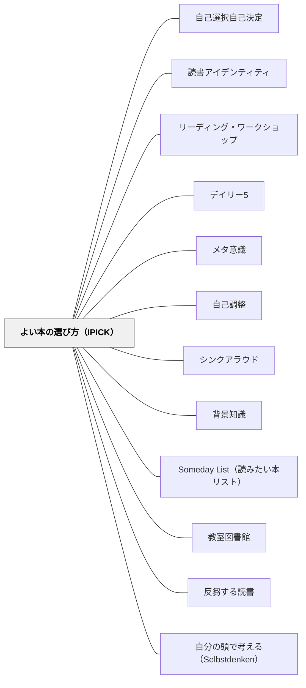

# よい本の選び方（IPICK）

> 「自分に合う本」は教師が選ぶものではなく、選び方を学んだ読者自身が選ぶもの——IPICK は選書を「スキル」として教える5段階の問いだ。

---

## Pattern Connection

**出典**: Boushey, G., & Moser, J.（2014）*The Daily 5: Fostering Literacy Independence in the Elementary Grades*（2nd ed.）. Stenhouse Publishers.

- **既存パタンとの関連**: [[パタン/自己選択自己決定]] が「選ぶ機会そのもの」の価値を論じるのに対して、本パタンは「どうやって選ぶかを教える」という手続きに焦点を当てる。[[パタン/リーディング・ワークショップ]] の選書ミニレッスンの中核コンテンツとして機能する——「自分に合う本の選び方」をミニレッスンで体系的に教えるための具体的フレーム
- **補強された点**: [[パタン/読書アイデンティティ]] の「自分は読む人間だ」という自己像の形成に、IPICK が「自分で合う本を見つけられる」という具体的な有能感を加える。IPICK を知っている読者は「この本は今の自分に合わない」という判断を自律的にできる——これが読書アイデンティティの実践的基盤になる
- **修正・拡張された点**: 本の難しさを「読書レベル（RL）」や「語数」などの外部指標で管理する従来アプローチに対して、IPICK は読者自身の内的な問いによる自己評価を中心に置く——外部指標は補助に過ぎず、最終的な判断は読者自身が持つという設計
- **他のパタンへの波及**: [[パタン/メタ意識]] — 「自分は今どれだけ理解できているか」という自己モニタリングが IPICK の C（Comprehend）で求められる。[[パタン/自己調整]] — 合わない本を途中で変える判断力は自己調整そのもの

**Atwell 2016 との接続**（2026-05-17）：

- **補強された点**：IPICK が「今の自分の力に合うか」という難しさの軸を扱うのに対し、Atwell（2016）の3種類の本（Funkhouser の分類）は「今の自分の状態に合うか」というコンテキストの軸を加える。両軸を組み合わせると「難しさ × 読書コンテキスト」の2次元で自律的に選書できる読者が育つ
- **拡張された点**：IPICK の P（Purpose: なぜ読みたいか）の中に「今日の自分はどのモードで読みたいか」という問いを組み込む——「今日は疲れているから軽い本にしよう」「最近力がついてきたのでチャレンジ本に挑もう」という判断が選書スキルの一部になる
- **他のパタンへの波及**：[[パタン/Someday List（読みたい本リスト）]] — Someday List に3種類の分類を添えると「今日はHoliday book を選ぼう」という選書時の使い勝手が上がる

**ショーペンハウアー（1851/2013）統合（2026-05-31）：**

『読書について』は選書において「良書を読む条件は悪書を読まないこと」という逆説的な原則を提示する。大衆受けする本に手を出すことは、古典・不朽の文学を読む時間とエネルギーを奪うことだという鋭い指摘は、IPICKが「今の自分に合う本」を探す基準を「内的な合致」から「長期的な価値」へと拡張する。

- **既存パタンとの関連**：IPICK の P（Purpose：なぜ読みたいか）に「長期的な価値があるか」という問いが加わる。「今面白そう」だけでなく「後になっても価値があるか」を問う——これは [[パタン/Someday List（読みたい本リスト）]] の「いつか読みたい本」リストに「不朽の文学」カテゴリを加える可能性を開く
- **補強された点**：「悪書を読まないこと（読まずに済ますコツ）」という視点が加わる。IPICK は「合う本を選ぶ」だが、ショーペンハウアーは「合わない本を読まない決断」の文化を育てることを主張する——「途中で変えていい」というIPICKの精神と一致する
- **拡張された点**：「古典作家を読むことほど、精神をリフレッシュしてくれるものはない」という指摘から、選書の視野を「新刊・トレンド」より「時間を超えた価値のある本」へ広げる選書指導の根拠が得られる。IPICK を使って古典を選ぶ体験を設計できる
- **他のパタンへの波及**：[[パタン/反芻する読書]] — 少なく深く読む「よい本」を選ぶことが反芻の前提になる；[[パタン/自分の頭で考える（Selbstdenken）]] — 借り物の知識でなく自分の血肉になる本を選ぶための眼を育てる

**Collins（2004）統合（2026-05-24）：**

*Growing Readers* はIPICKと同じ問題意識から「Just-Right Books（適正レベルの本）」と「Study Books（興味本）」の区別、および週1回の「ショッピング（Shopping）」という仕組みを提供する。

- **補強された点（Just-Right Books の定義）**：Collins は「90〜95%の正確さで読め、内容が理解できる本」をJust-Right Booksと定義し、IPICKのC（Comprehend）との対応を示す。独立読書にはJust-Right Books、Read Aloud や Study Booksは別枠——一つのBook Baggieに両方入れることで選択の混乱を防ぐ
- **拡張された点（ショッピングの仕組み）**：IPICKは「選び方」を教えるが、「選ぶ場」の設計がなければ機能しない。Collins のショッピング（週1回、レベル別バスケットから選ぶ）は、Just-Right Books の選書が習慣として機能する環境を設計している——選ぶ機会が定期的にあることが重要
- **拡張された点（図書館をマーケティングツールとして）**：Collinsは「教室の図書コーナーはマーケティングツールだ」と言う。単元に合わせてバスケットの本を入れ替え、表紙が見えるように並べ、著者バスケットを作る——「読みたい」という気持ちが先に来る環境が、適切な選書の前提になる
- **他のパタンへの波及**：[[パタン/読書の底線習慣]] — 「自分の本を持つ」「本を大切にする」という底線習慣が、Just-Right Books の適切な管理と接続する

**Allington & McGill-Franzen（2013）統合（2026-06-03）：**

*Summer Reading: Closing the Rich/Poor Reading Achievement Gap* は、自己選択の効果量を実証し、「選び方を間違えると効果がゼロになる」という失敗パターンも明示する。

- **補強された点（自己選択の効果量）**：Lindsay（2013）のメタ分析。選択あり d=.766 vs. 選択なし d=.402——選択があると効果量がほぼ2倍になる。IPICK が「選び方を教える」ことを重視する根拠が実証的に裏付けられた。さらに Guthrie & Humenick（2004）は、興味ある本へのアクセス×自己選択の組み合わせが、フォニックス直接指導の**10倍**の読解力効果をもたらすと示す
- **拡張された点（社会的バイアスの問題）**：Kim & Guryan（2010）の介入研究で介入群の**3分の2が読めないレベルの本を選択**し効果がゼロになった事例は、「自由に選ばせる」だけでは機能しないことを示す。苦手な読者は上手な友達と同じ難しい本を選んでしまう「社会的バイアス（social bias）」がある——この問題への処方箋がIPICKの明示的指導だ
- **拡張された点（3ステップ法の追加）**：Allington らが推奨する選書の3ステップが、IPICK の C（Comprehend）の実践的手続きとして機能する：① 裏表紙を読む → ② ランダムな1ページを試し読みする → ③ 1〜2語以上わからなければ別の本を探す。IPICKの「Check Comprehension」に手順レベルの具体性を加える
- **修正された点（独立読書レベルの定義）**：Allington は「独立読書レベル（Independent Reading Level）＝正確率99%以上・理解90%以上」を自発的読書の必要条件とし、「指導読書レベル（95〜98%）」と明確に区別する。CollinsのJust-Right Books定義（90〜95%）より高い基準——夏休みや自由読書では「ちょっと難しい」ではなく「確実に読める」本が必要
- **他のパタンへの波及**：[[パタン/夏の読書（格差を閉じる）]] — 夏前に全員に「本の選び方3ステップ」をミニレッスンで教えることが、夏季読書プログラムの効果を左右する

---

## 背景（Context）

読書指導において「自分に合う本を選ぶ」ことは、読書の動機・読書量・読書力のすべてに影響する。難しすぎる本は挫折と自己否定を生み、簡単すぎる本は知的な刺激も成長もない。

しかし多くの教室では、本を選ぶ方法を明示的に教えていない。「好きな本を選んでいいですよ」と言うだけでは、特に苦手な読者は選べない——表紙のかっこよさだけで選ぶ、友達と同じ本を選ぶ、読んでいない本にサインをする、などが起きる。

Boushey & Moser（2014）は、選書を「スキル」として扱い、明示的に教えることで全ての読者が自律的に選書できる状態を目指した。**IPICK は、読者が自分で「この本は今の自分に合うか」を判断するための5段階の問い**だ。

**靴のアナロジー（Boushey & Moser）**：本を選ぶことは靴を選ぶことに似ている。靴屋で「色が好きだから」「友達が履いているから」だけで靴を決めることはない——実際に履いてみて、歩いてみて、自分の足に合うかを確かめる。本も同じだ。表紙・タイトルだけで決めず、数ページ試し読みして「自分の今に合うか」を確かめる習慣を育てる——それが IPICK が教えることだ。

## 問題（Problem）

選書の方法を教えなければ：

- 自分の実力を超えた本を選んで数ページで挫折する
- いつも同じ著者・シリーズ・ジャンルだけを選び、読書の世界が広がらない
- 本に合っていないと感じても、「やめていいか」の基準がなくやめられない
- 教師がすべての本選びに関与し続けることになる

## 力のかたち（Forces）

- 読者自身がリーディング・レベルを内的に評価できることが理想——外部指標への依存は「自分で判断できない」読者を作る
- 目的・興味・理解・語彙の4軸が揃ったとき、本への没入が起きる
- 一冊の本との出会いは「今」の自分に合うかどうかで決まる——同じ本が1年後には合うこともある
- 選書を失敗体験にしないために「合わなかったら変えていい」という文化が必要

## 解決（Solution）

**「よい本」を選ぶための5つの問いを教え、生徒が本を手に取るたびにこの問いを自分にかけることで、自律的な選書力を育てる。**

---

### IPICK：5つの問い

| 文字 | 問い | ねらい |
|---|---|---|
| **I** | この本を手に取って、中と外をよく見てみよう | 本を「予視（preview）」する習慣をつける |
| **P** | **Purpose**：なぜこの本を読みたいのか？何を目的に読むか？ | 読む理由・目的の意識化 |
| **I** | **Interest**：この本が面白そうか？読み続けたいと思うか？ | 内発的な関心の確認 |
| **C** | **Comprehend**：読んでみて意味がつながるか？理解できるか？ | 読解可能性の自己評価 |
| **K** | **Know the words**：ほとんどの言葉を知っているか？知らない言葉は推測できるか？ | 語彙の自己評価 |

**IPICK の判断：C と K が YES なら「今の自分に合う本」。NO なら「今はまだ早い本（また今度）」または「誰かと一緒に読む本」。**

---

### 5本指ルール（語彙の補助チェック）

K（Know the words）の判断を助けるツール：

1. 本を開いて1ページ読む
2. 知らない言葉が出るたびに指を1本折る
3. **5本の指がすべて折れたら**「今は語彙が難しすぎる本」のサイン
4. 1〜2本なら「少し挑戦」、0本なら「とても読みやすい」

5本指ルールはあくまで補助——IPICK の C（理解できるか）と合わせて判断する。語彙は分からなくても文脈で理解できることもある。

---

### IPICK を教える：ミニレッスンの手順

**Week 1, Day 1〜2：「よい本」の概念を導入する**

- 「先生が本を選ぶとき、頭の中でどんなことを考えているか聞いてみましょう」
- 教師がシンクアラウドで数冊を手に取り、IPICK の問いを声に出す
- 「この本は…目的は（P）読み物として楽しみたい。興味は（I）ある！理解（C）…ちょっと読んでみます。うん、意味がつながる。言葉（K）…知らない言葉は2〜3か所。これは今の自分に合う本です」

**Week 1, Day 3〜4：生徒がモデリングを見て真似る**

- 2〜3人の生徒が教師の前でIPICKを声に出しながら本を選ぶ
- クラス全体で観察・フィードバック

**Week 2以降：独立選書の際にIPICKを使う習慣をつける**

- 毎回の選書前に「IPICK で確認してから読み始めよう」と声をかける
- カンファリング中に「この本はIPICKで何を確認しましたか？」と問う

---

### Pedro の話——IPICK が変えた選書体験

Pedro は読書が苦手なレッテルを貼られていた。教師がレベルによって本を決め、指定のコンテナから取ることを義務づけられていた。本への気持ちは薄く、読む時間は「終わるまでの時間」だった。

Daily 5 の起動で、初めて自分で本を選ぶ選択肢が与えられた。IPICK を使って本棚を歩き回り、「これ読みたい」と思う本を手に取った。P（目的）と I（興味）は強かった——C（理解）と K（語彙）は不安だったが、試し読みで「なんとかなりそう」と感じた。Pedro はその本を選んだ。スタミナが延び始め、「自分が選んだ本」だという所有感が読む意志を支えた。

このストーリーが示すこと：レベル管理のみの選書は、読書への動機を削いでいることがある。IPICK を使った自律的選書と、教師によるカンファリングの組み合わせが、Pedro のような読者を育てる。

---

### 3種類の本（Funkhouser）——コンテキストの軸で選ぶ

Atwell（2016）は Funkhouser の3分類を IPICK の補完として使う。IPICK が「難しさ」の判断軸を与えるのに対し、この3分類は「今の読書コンテキスト」の判断軸を提供する。

| 種類 | 内容 | いつ選ぶか |
|---|---|---|
| **Holiday books（お休み本）** | 軽くて楽しい、挑戦なしで読める本 | 疲れているとき・旅行・病気・ゾーンを確実に確保したいとき |
| **Just Right books（ちょうどいい本）** | 少し背伸びが必要だが読み切れる本 | 通常の独立読書時間——IPICKの C・K が概ねOKな本 |
| **Challenge books（チャレンジ本）** | 語彙・構造・テーマが難しく頑張りが必要な本 | 力がついているとき・誰かと一緒に読む前提のとき |

**IPICKとの組み合わせ方**：
- Just Right は IPICK の C・K が「ほぼOK」——通常の独立読書の基本選択
- Challenge は IPICK の C・K が「NO」に近くても、P（目的）と I（興味）が強ければ選べる——「Read to Someone」「誰かと一緒に読む」前提を設ける
- Holiday は IPICK の全項目が問題なく通る本——「疲れているときに無理な選書をしなくていい」という許可を明示的に与える

「いつも Challenge book だけ」「いつも Holiday book だけ」ではなく、状態に応じて3種類を自分で使い分けることを教える。

---

### 「今の自分に合わない本」との向き合い方

IPICK が「難しすぎる」と判断したとき、生徒に伝えること：

- 「今は難しくても、半年後には合う本になるかもしれない」
- 「誰かに読み聞かせてもらう本として選ぶこともできる」
- 「C（理解）と K（語彙）で NO でも、P（目的）と I（興味）が強ければ挑戦できる——Read to Someone や Listen to Reading で聴く本にする」

本を「今の自分には合わなかった」とリストに記録し、後で再挑戦する文化を作る。

---

### IPICK の掲示物

教室に IPICK の頭文字をポスターとして掲示する：

```
よい本の選び方 IPICK

I 本を手に取って、中と外をよく見てみよう
P Purpose（目的）——なぜ読みたい？
I Interest（興味）——読みたい！面白そう！
C Comprehend（理解）——意味がつながる？
K Know the words（語彙）——言葉が分かる？

CとKがOKなら「今の自分に合う本」
```

---

## 結果（Consequences）

- 生徒が「自分は本を選べる」という有能感と選書への自信を持つ
- 教師が全員の本選びに関与しなくても、適切な本が選ばれるようになる
- 読書の失敗体験（挫折・途中放棄）が減り、完読の体験が積み重なる
- 「合わない本に出会ったとき」の判断基準ができ、途中で変える選択が自律的にできる
- ただし、IPICK を形式的に唱えるだけでは「分かったようで使えない」状態になりやすい——教師のモデリングと個別カンファリングでの追確認が必要

## 関連パタン
- [[実践/デイリー5の起動]]

- [[パタン/自己選択自己決定]] — IPICK が「選ぶ機会」に「選ぶ力」を加える
- [[パタン/読書アイデンティティ]] — 自分で選べることが「自分は読む人間だ」を強化する
- [[パタン/リーディング・ワークショップ]] — IPICK が選書ミニレッスンのコンテンツになる
- [[パタン/デイリー5]] — Read to Self の根幹は「自分に合う本」を選ぶことから
- [[パタン/メタ意識]] — 「自分はどれだけ理解できているか」のモニタリング
- [[パタン/自己調整]] — 合わない本を変える判断が自己調整そのもの
- [[パタン/シンクアラウド]] — IPICK を声に出す教師のモデリングが指導の核
- [[パタン/背景知識]] — 背景知識が多いほど C（理解）の閾値が下がる
- [[パタン/Someday List（読みたい本リスト）]] — Someday List に3種類の分類を添えて記録することで、選書時の判断がより速くなる
- [[パタン/教室図書館]] — 選べる図書館の設計（ジャンルバスケット・Book Baggie）が IPICK の発動条件を整える
- [[パタン/反芻する読書]] — 少なく深く読む「よい本」を選ぶことが反芻の前提になる
- [[パタン/自分の頭で考える（Selbstdenken）]] — 借り物の知識でなく自分の血肉になる本を選ぶ眼を育てる

---

## クラスター図



## Actionable Insight

- 次の読書ミニレッスンで「IPICK シンクアラウド」を試す——教師が2〜3冊を手に取りながら頭の中の問いを声に出す。5分で終わる最もシンプルな選書指導
- 図書コーナーの近くに IPICK のポスターを貼る——「本を選ぶときはここを見る」という空間的なシグニファイアになる
- カンファリングで「この本はなぜ選びましたか？」と聞く——IPICK を使って選んだかどうかが分かる。「表紙が好きだったから」なら、次回 IPICK を一緒に確認する機会に

---

## 出典

Boushey, G., & Moser, J. (2014). *The Daily 5: Fostering Literacy Independence in the Elementary Grades* (2nd ed.). Stenhouse Publishers. → [[文献/The Daily 5（Boushey & Moser）]]

Atwell, N., & Atwell Merkel, A. (2016). *The Reading Zone* (2nd ed.). Scholastic.（3種類の本: Funkhouser の分類）

[[文献/The Reading Zone（Atwell）]]

> 「よい本（Good-Fit Book）は、自分の目的・興味・理解・語彙がすべて揃ったときに見つかる——それを自分で判断できる読者を育てることが、私たちの仕事だ。」——Boushey & Moser（2014）
