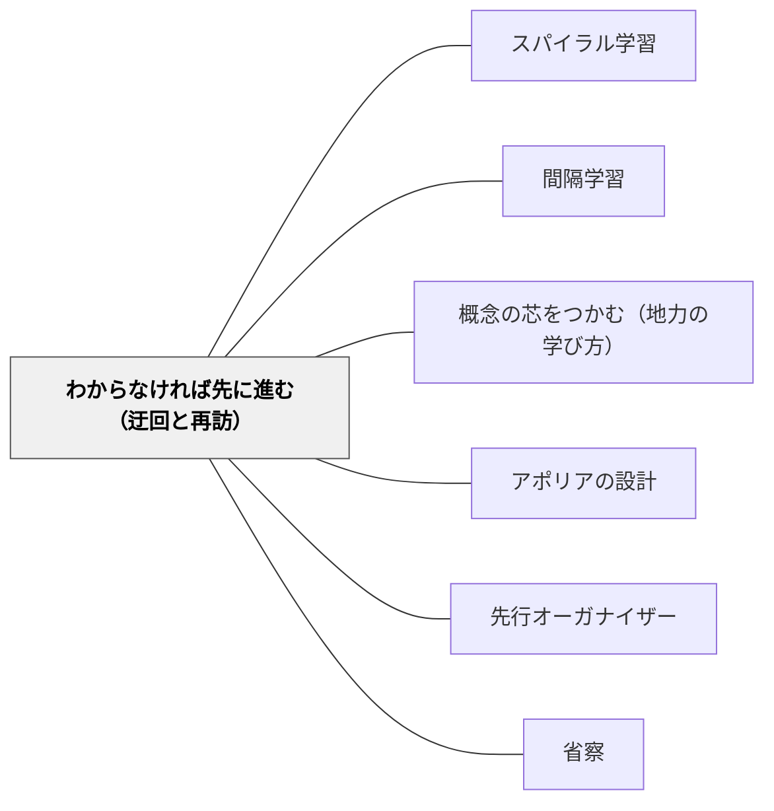

# わからなければ先に進む（迂回と再訪）

> 「この講義を読んでいてわからないところがあったなら、読者はひとまずそこを離れて先のほうに進み、少したってからまたその場所を読み返してみてください」——松坂和夫（まえがき）

---

## [Pattern Connection]

### 新装版 数学読本 1（松坂和夫, 1989）——「先に進んでから戻る」という読書戦略

まえがきの中で松坂は、読者への指針として次のことを二度繰り返す。

まえがきで：
> 「この講義を読んでいてわからないところがあったなら、読者はひとまずそこを離れて先のほうに進み、少したってからまたその場所を読み返してみてください」

√2が無理数であることの証明（第1章）を述べた直後：
> 「どうですか？この証明は少し難しかったでしょうか？もし読者が難しいと思われたならば、この本をしばらく先に進んでから、また読み直してみてください。そうすればきっと、今度はよくわかったと思われることだろうと思います」

また、省略可能な節については：
> 「読んでみてわからなかったなら、省略して、後日また立ち戻ってみてください。この注意は他の一般の個所にも通用します」

**なぜ先に進むと戻ったときにわかるのか：**

後の内容を読むことで「文脈が積まれる」——つまり、先の節・章で得た概念・例・証明が、戻った時点での理解の道具になっているからである。最初にわからなかった記述が、後から得た知識のフィルターを通すと「これはあのことを言っていたのか」と見える。これは間隔（時間の経過）の効果だけでなく、「後続の文脈が先行箇所の読み方を変える」という理解の非線形性による。

**既存パタンとの関連：**
- [[パタン/スパイラル学習]] との構造的接続——スパイラル学習が「同じ概念を深さを増して繰り返す」カリキュラム設計であるのに対し、「わからなければ先に進む」は学習者が自律的に螺旋を描く戦略。カリキュラムに組み込まれた螺旋と、読者が自分で使う螺旋の、実践レベルでの対応。
- [[パタン/間隔学習]] との接続——時間をおいて戻ることは間隔学習の構造を持つが、間隔学習が「記憶の強化」を目的とするのに対し、本パタンは「文脈の蓄積による理解の解凍」を目的とする。忘れかけた頃の想起ではなく、「後の文脈を得た後の再読」という点で区別される。
- [[パタン/概念の芯をつかむ（地力の学び方）]] との接続——小林（2024）の「わからないことを育てる」は、困惑をそのまま保持する戦略。本パタンは「先に進む」という積極的行動を介するが、困惑を切り捨てずに後日戻る点で共通する。

**補強された点：**
- [[パタン/アポリアの設計]] へのフィードバック——アポリア（知的困惑）は設計できるが、その解消を急ぐ必要はない。「先に進んで後で戻る」という時間軸の設計が、アポリアを単なる挫折でなく「後から解消する問い」として機能させる。

**他のパタンへの波及：**
- [[パタン/省略の設計（読み飛ばし許可）]] — 授業設計における「とりあえずこのまま先に進んでいい」という許可の設計
- [[パタン/熟慮的配列]] — 「先に読むとわかる」という非線形な配列設計

→ [[文献/新装版 数学読本 1（松坂和夫）]]

---

## 背景（Context）

数学の本や授業を読み進めていると、理解が止まる場所が必ず出てくる。概念の定義が理解できない、証明のある一歩が飛躍に見える、抽象的な記号が現実に接地しない——そういう場所が存在する。

慣習的な対処は「理解するまでそこで立ち止まる」である。しかし、理解はしばしば非線形に訪れる。後の文脈を積んだ後で前の箇所を読み直すと、突然わかる——という経験は、数学を深く学んだことのある人には馴染み深い。

問題は、多くの学習者がこの「先に進む」という選択肢を知らないこと、あるいは「理解してから次に進む」が正しい学び方だと信じていることである。

## 問題（Problem）

わからない箇所で学習者が「立ち止まり続ける」と：

- 一つの壁で全体の進行が止まり、その先にある理解の機会を失う
- 「わからない」という状態が「自分には無理だ」という自己効力感の低下に転化する
- 時間と集中力を消耗し、全体の文脈を見失う
- 実は後続の内容が前の理解の鍵になっているのに、その機会を得られない

## 力のかたち（Forces）

- 「順序通りに理解してから進む」という信念は教育文化に深く根ざしており、変えにくい
- 「先に進む」という許可がないと、学習者は「わからないまま進むのは不誠実だ」と感じる
- 先に進んでも「戻る」という意図がなければ、最初の困惑は置き去りにされる
- 「後で戻る」という意図を持ちながら先に進むことと、わからないまま放棄することは、全く異なる行為
- 理解はしばしば「後から積まれた文脈によって解凍される」——これは個人の経験では感得されにくい

## 解決（Solution）

**「わからない箇所に出会ったとき、立ち止まり続けるのではなく、ひとまず先に進み、後日意図的に戻ってくる」という戦略を、学習者に明示的に教え、授業・教材・読書にその設計を組み込む。**

---

### 三つの実践形態

**1. 学習者への明示的な許可：**
「わからなければ先に進んでいい」という言葉を、教師が明確に伝える。「後でわかる」という見通しを一緒に示す——「今わからなくても、後の章を読んでから戻ると、きっとわかるようになるよ」。

**2. 教材設計における「後から解凍される問い」の設置：**
意図的に「今は完全にわからなくてもよい」区間を設計し、後の単元で自然に参照させる。「第3章の最初に出てきた○○の意味、今ならわかりますか？」という回帰の設計。

**3. 「迂回の意図」を持つ読書ノート：**
「ここはわからなかった、後で戻る」という記録を残すことで、困惑を捨てず、戻る意図を保持する。疑問のリストが「後で理解する目標」になる。

---

### 具体例

**例1: 算数「かけ算の意味」（2年）**
「3×4＝4×3がなぜ成り立つか」は2年生には難しい。「今は成り立つことを覚えておこう。なぜかは後で図を使って確かめよう」と先に進む。後に面積の学習で「縦×横=横×縦」が視覚的に見えるとき、自然に「あの約束の理由」として戻れる。

**例2: 数学「命題のp→q真理表」（高校）**
松坂の例通り——「pが偽のときp→qが真」という結果が不思議に思える。「今は取りきめとして受け入れて先に進もう。論理学を深く学ぶと自然に見えてきます」と許可する。

**例3: 国語「主題を問う」（小学校）**
物語を初めて読んだとき「この話は何を言いたいのか？」はわからなくてよい。全体を読み終わってから戻ってくる。「最初にわからなかった問いに、今なら答えられますか？」という振り返りが、「迂回と再訪」の一周になる。

**例4: 岩井の数学デイリー（自己教育実践）**
難問に詰まったとき、別の問題に移って後で戻ると解けることがある。「詰まった問題」のリストを作り、数日後に再訪する。この非線形な進み方が、特定の問題への固着より高い学習効率を生む。

## 結果（Consequences）

- 「わからない」を「立ち止まる命令」でなく「後で戻るしるし」として使えるようになる
- 困惑が蓄積する代わりに、問いのリストが蓄積される
- 後続の内容が前の理解の鍵になる非線形な学習が、実際に起こりやすくなる
- 「先に進んでよかった、今ならわかる」という経験が積まれると、自律的な学習スタイルが育つ
- ただし：「戻る意図」を持たずに先に進むことは単なる放棄になる。「迂回」と「放棄」の区別を明確にすることが必要

## 関連パタン

- [[パタン/スパイラル学習]] — 同じ概念を深さを増して繰り返すカリキュラム設計
- [[パタン/間隔学習]] — 時間をおいての再学習（想起練習）との接続
- [[パタン/概念の芯をつかむ（地力の学び方）]] — 「わからないことを育てる」
- [[パタン/アポリアの設計]] — 意図的な困惑設計と迂回・再訪の関係
- [[パタン/先行オーガナイザー]] — 全体像を先に示すことで「どこに戻るか」の地図になる
- [[パタン/省察]] — 戻ったときの「今度はわかった」という気づきが深い省察になる
- [[文献/新装版 数学読本 1（松坂和夫）]] — 本パタンの出典

---

## クラスター図

## Actionable Insight

- 授業の難所に差し掛かったとき「今日はわからなくていい、後でわかる」と声に出して伝える——「わからないまま先に進む許可」を教師が明示する。
- 単元末に「単元の最初で出会った問いに今なら答えられますか？」という振り返りを入れる——意図的な「再訪」の設計。
- 学習記録に「ここわからなかった欄」を作る——困惑を捨てず、戻る意図を可視化する道具として機能させる。

---

## 出典

松坂, 和夫（1989）.『新装版 数学読本 1』岩波書店. まえがき・第1章.

> 「この講義を読んでいてわからないところがあったなら、読者はひとまずそこを離れて先のほうに進み、少したってからまたその場所を読み返してみてください」——松坂和夫（まえがき）

> 「もし読者が難しいと思われたならば、この本をしばらく先に進んでから、また読み直してみてください。そうすればきっと、今度はよくわかったと思われることだろうと思います」——松坂和夫（第1章）
