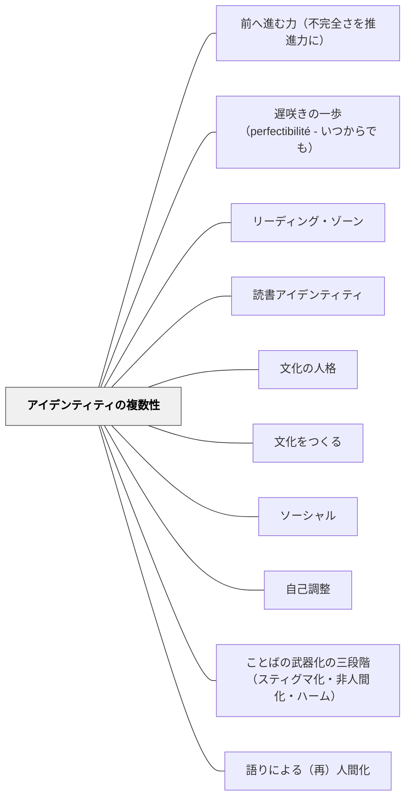

# アイデンティティの複数性

## 背景（Context）

現代社会では、文化・民族・性別・宗教・国籍・職業など、多様なアイデンティティの軸が交差している。グローバル化とネットワーク社会の進展により、個人は複数の共同体に同時に属するようになったが、それによって逆に「何をもって自分なのか」が見えにくくなっている。

学校教育においても、画一的な「理想の生徒像」への同調が求められ、自己の一面だけが強調されやすい。複数の文化・文脈をまたぐ子どもたちは、自己の断片化や疎外感を抱きやすい。

## 問題（Problem）

「本当の自分」や「自分らしさ」を、一つの所属や性質に限定しようとする圧力がある（国籍・性別・成績・家庭環境など）。この単一化の圧力が、多様性の受け止めを困難にし、自己や他者を狭く判断する基盤になる。

## 力のかたち（Forces）

- アマルティア・センの指摘：アイデンティティを単一に定義する「帰属の幻想（solitarist illusion）」が暴力や差別の温床になる（『アイデンティティと暴力』）
- マキシン・グリーン：「想像力（imagination）」を通じて自己と他者の間に橋をかけることが教育の使命。自己の複数性や未決定性を生きることが「自由になる」こと
- ドナルド・キーンの事例：東日本大震災を契機に日本に帰化。「私は日本文学を研究してきただけではなく、日本文化を生きてきた」——アイデンティティは選択と経験を通じて形成され続ける動的なもの

## 解決（Solution）

「私とは何者か」という問いに対して、単一の属性や役割に還元されない、多面的で流動的な自己を引き受ける。他者の多様性を受け止めるためにも、自己の中の多様な側面に開かれる感受性を育む。

- 「私は多くのことのひとつである（I am one among many things）」という感覚を持つ
- 物語的な自己理解や表現を通して、異なる文脈における自己を肯定的に再構成する
- 多様な文化的実践や視点に触れることで、自己の枠組みを相対化し、対話を可能にする
- アイデンティティを「選び取り、つくりなおす」プロセスとして捉える

## 結果（Consequences）

子どもが「自分は○○だから△△だ」という固定した枠から外に出て、他者の多様な在り方を受け止められるようになる。同時に、「自分でもよくわからない部分」を抱えたまま対話できる力が育つ。

## 関連パタン
- [[パタン/前へ進む力（不完全さを推進力に）]]
- [[パタン/遅咲きの一歩（perfectibilité - いつからでも）]]
- [[パタン/リーディング・ゾーン]]
- [[パタン/読書アイデンティティ]]

- [[パタン/文化の人格]] — 自然の個性を文化の人格へと育む
- [[パタン/文化をつくる]] — 自分と他者の間に新たな意味や実践を創造する
- [[パタン/ソーシャル]] — 複数の関係性の中で自己を立ち上げていく経験
- [[パタン/自己調整]] — 文脈に応じて自分のふるまいや理解を調整する力
- [[概念/世界市民教育とパタン・ランゲージ]] — カント・牧口の世界市民論
- [[パタン/ことばの武器化の三段階（スティグマ化・非人間化・ハーム）]] — スティグマ化は単一属性への強制帰属（solitarist illusion）から始まる。複数性の教育が対抗実践になる（Pentón Herrera, 2026）
- [[パタン/語りによる（再）人間化]] — 自分の語りが単一のラベルを超えた複数の自己を示す実践になる（Pentón Herrera, 2026）

## クラスター図

## Actionable Insight

- 「あなたはどんな側面を持っているか」を複数の観点（好き・得意・所属・大切にしていること）から書かせる——一つの属性に還元されない多面的な自己への気づきを促す
- 異なる文化的背景を持つ登場人物・事例・人物を取り上げ「この人のどの側面が自分と似ているか」を問う——他者の複数性への想像力が自己の複数性の受け止めにつながる
- 「自分を一言で表すとしたら？」の後に「それ以外の自分は？」と続けて問う——一つの属性の後に開かれた問いが単一化への圧力を相対化する

## 出典

- パタン集/アイデンティティの複数性.md
- アマルティア・セン（2011）『アイデンティティと暴力―運命は幻想である』勁草書房
- Greene, M. (1995). *Releasing the Imagination: Essays on Education, the Arts, and Social Change*. Jossey-Bass.（邦訳なし；教育哲学・想像力論）
