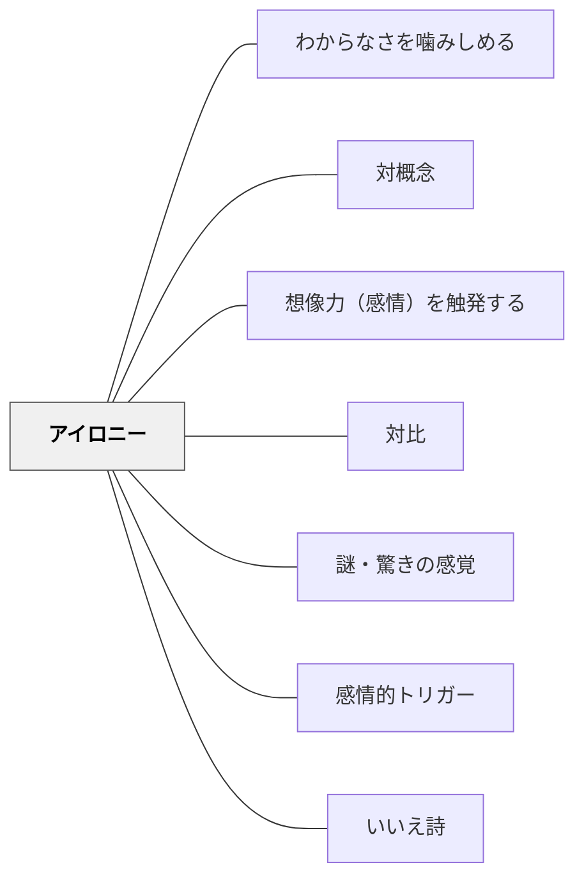

# アイロニー

> 対比的な配置が生む緊張が、感情を深く揺さぶる

## 背景（Context）

教師が学習内容を単に「説明」するだけでは、学習者の感情は動かない。内容に感情的な引力をもたせるための工夫が必要である。

## 問題（Problem）

学習者が情報を受け取っても、それが感情と結びつかない場合、記憶にも残りにくく、深い理解へ至らない。どうすれば表面的な理解を超えた、感情を伴う学びを生み出せるか。

## 力のかたち（Forces）

- 人間は矛盾・対立・逆説に強く反応し、注意を向ける
- 単純な情報よりも、「ずれ」や「意外性」を含む情報のほうが記憶に残りやすい
- 言葉・映像・配置における対比（白黒、寒暖色、静動など）は、それだけで感情的なトーンをつくり出す
- アイロニーは言語だけでなく、視覚・状況・構造にも現れる

## 解決（Solution）

授業の素材や語りにアイロニー（皮肉・逆説・対比的な配置）を意図的に盛り込む。相反するもの——たとえば「豊かさと貧しさ」「平和と暴力」「科学と迷信」——を並置し、その緊張から感情的な問いを引き出す。視覚的には、対比する色・構図・素材を使って「感情的コントラスト」を視覚化する。

## 結果（Consequences）

- 学習者が内容に感情的に引きつけられ、思考が活性化される
- 「なぜこんな矛盾が存在するのか」という問いが自然に生まれる
- 過度に使うと刺激過多となり、学習者が疲弊する恐れがある

## 関連パタン
- [[パタン/わからなさを噛みしめる]]
- [[パタン/対概念]]

- [[パタン/想像力（感情）を触発する]]
- [[パタン/対比]]
- [[パタン/謎・驚きの感覚]]
- [[パタン/感情的トリガー]]
- [[パタン/いいえ詩]] — アイロニーの子ども向け実装。「いいえ」で事実を否定して新イメージを生む詩の技法

## クラスター図

## Actionable Insight

- 社会科や歴史の授業で「豊かな国と貧しい国」「平和な時代と戦争の時代」を並置した資料を見せ「なぜこんなギャップがあるのか」と問う——対比の緊張が感情的な問いを自然に引き出す
- 科学の授業で「常識とされていたことが実は間違いだった事例」を導入に使う——逆説的な事実が「なぜ？」という知的な引力をつくる
- 詩や短文で「対比する二つのイメージ」を学習者に書かせる——対比を自分でつくる経験がアイロニーという修辞の構造を体感的に理解させる

## 出典

キアラン・イーガン（2010）『想像力を触発する教育――認知的道具を活かした授業づくり』北大路書房
