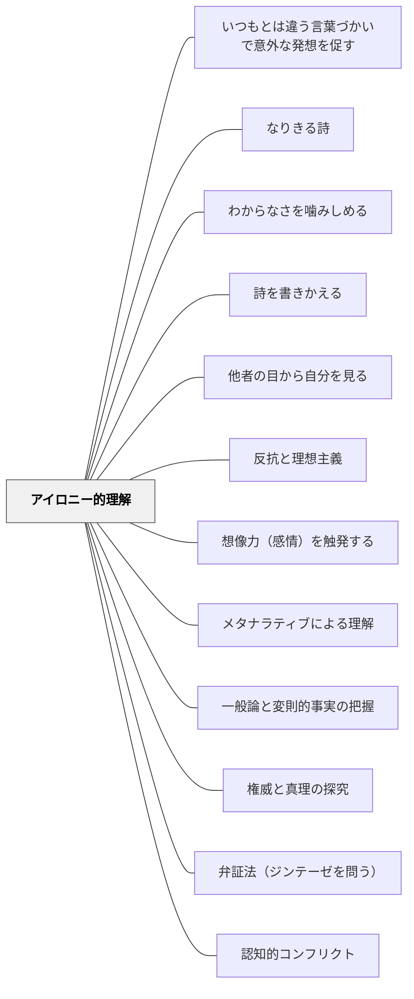

# アイロニー的理解

> 意味の不確定性・逆転可能性を受け入れ、より成熟した認識へと至る

## 背景（Context）

アイロニー（皮肉・逆説）的な理解とは、あるものが文脈によって正反対の意味をもつことへの感覚である。薬は量や状況によって毒になる。自由は別の自由を制約する。英雄は別の側から見れば侵略者である。デリダの脱構築が示すように、意味は常に不確定であり、文脈によって変容する。

## 問題（Problem）

単純な二項対立（善・悪、正・誤、原因・結果）による理解は、成熟した認識の手前で止まる。「絶対的な正解がある」という思い込みのまま育つと、複雑な現実への対処能力が育たない。

## 力のかたち（Forces）

- 現実の多くの問題は、単純な正誤では判断できない複雑さをもつ
- アイロニー的感覚は、異なる立場・文脈・解釈への想像力を育てる
- しかし意味の不確定性を強調しすぎると、相対主義・虚無主義に陥る危険がある
- アイロニー的理解は、より高次の統合（ジンテーゼ）への通路でもある

## 解決（Solution）

授業の中に「逆転の構造」を意図的に組み込む。「薬と毒」「英雄と悪役」「規則と自由」のように、文脈によって意味が反転する事例を提示し、「どちらが正しいか」ではなく「どんな条件でどちらになるか」を問う。

同じ出来事・テキスト・現象を複数の解釈枠組みで読み解く活動を設ける。この不確定性への不安を「知的な興奮」として経験できるよう、安心できる学習環境の中で行う。

## 結果（Consequences）

学習者はより成熟した、複雑さに耐えられる認識力を育む。多様な立場への共感的理解が深まる。ただし、十分な土台なしにアイロニー的理解を求めると、混乱や思考の麻痺を招くことがある。

## 関連パタン
- [[パタン/いつもとは違う言葉づかいで意外な発想を促す]]
- [[実践/詩歌の授業（詩を書く・詩を読む）]]
- [[パタン/なりきる詩]]
- [[パタン/わからなさを噛みしめる]]
- [[パタン/詩を書きかえる]]
- [[パタン/他者の目から自分を見る]]
- [[パタン/反抗と理想主義]]

- [[パタン/想像力（感情）を触発する]]
- [[パタン/メタナラティブによる理解]]
- [[パタン/一般論と変則的事実の把握]]
- [[パタン/権威と真理の探究]]
- [[パタン/弁証法（ジンテーゼを問う）]]
- [[パタン/認知的コンフリクト]]

## クラスター図

## Actionable Insight

- 社会科・道徳で「英雄・悪役・規則・自由」などを扱う際に「別の立場から見るとどう見えるか」と問う——視点を転換する経験が「どちらが正しいか」から「条件によって変わる」という成熟した認識へ育てる
- 文学の授業で同じ登場人物を「主人公視点」と「悪役視点」それぞれから読み直す活動をする——一つの行為が文脈によって正反対に見えることへの気づきが複雑な現実への理解力を育てる
- 「薬は量が多すぎると毒になる」「自由が多すぎると別の自由を制限する」などの逆転事例を日常から探させる——身近な逆説が意味の不確定性への感覚を具体的に育てる

## 出典

キアラン・イーガン（2010）『想像力を触発する教育――認知的道具を活かした授業づくり』北大路書房
