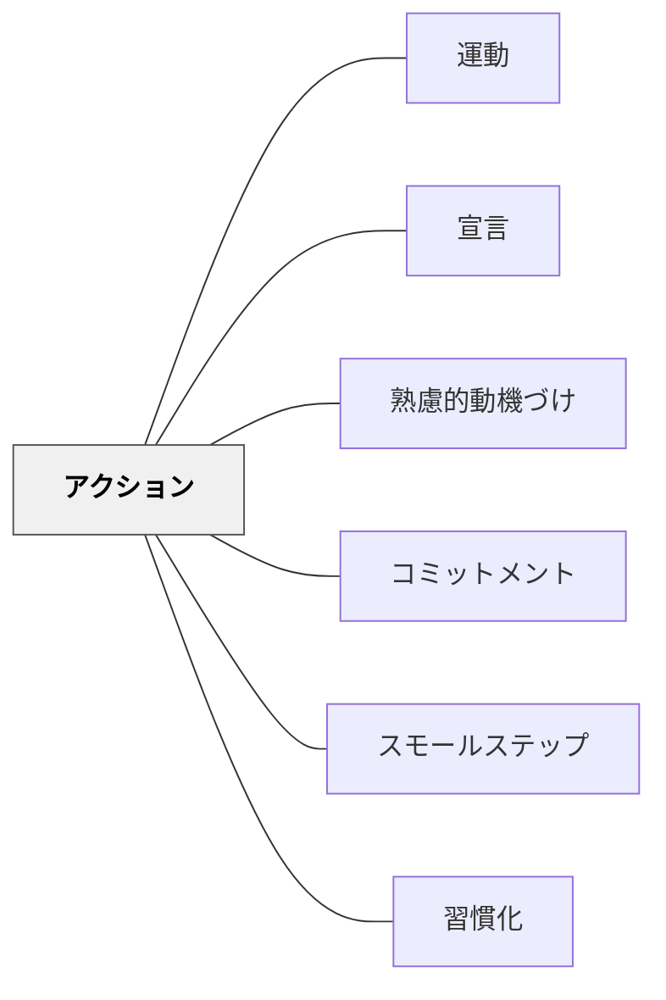

# アクション

> やる気が出るのを待つのではなく、まず動く。行動がやる気を生む。

## 背景（Context）
やる気と行動の関係は、「やる気→行動」だけでなく「行動→やる気」という双方向のループがある。心理学的には、行動することで感情・認知・動機が後からついてくる現象が知られている。「5分だけやってみる」という小さなアクションが、継続の入り口になる。

## 問題（Problem）
「やる気が出たらやろう」という態度では、永遠にやる気が出ないことが多い。特に困難な課題や長期的なプロジェクトでは、行動の前のハードルが高くなりすぎる。待っている間に機会を逃すことにもなる。

## 力のかたち（Forces）
- 着手のハードルを下げることで行動が始まりやすくなる
- 行動の最初の数分で気持ちが高まることが多い（作業興奮）
- 完璧主義は行動の障壁になる
- 環境（物理的・時間的）が行動の開始に影響する

## 解決（Solution）
**「まず始める」という姿勢を設計に組み込み、最初の行動ハードルを最小化することで、やる気を行動から生み出す。**

「2分ルール」「タイマーを5分セットする」「道具を出すだけ」など、超小さな行動から始めることを促す。最初の行動が起きれば、作業興奮（ツァイガルニク効果）が続きへの動機を生む。環境を整えることで行動の開始を後押しする。

## 結果（Consequences）
- 行動の開始が容易になり、継続につながる
- 完璧な準備を待たずに学習が始められる
- 行動の積み重ねが自己効力感を高める

## クラスター図

## Actionable Insight

- 「やる気が出たら始めよう」ではなく「タイマーを2分セットして、とにかく始めてみよう」と促す——小さなアクションが作業興奮を引き出し続きへの動機を生む
- 学習の最初に「まず道具を出す・ノートを開く」という超小さな行動から始めさせる——着手のハードルを最小化することで行動が始まりやすくなる
- 「完璧に準備してから」より「まず2分やってみよう」を合言葉にする——行動の積み重ねが自己効力感を高める

## 出典

- 一つの教育のパタン・ランゲージ（岩井輝久）

## 関連パタン
- [[パタン/運動]]
- [[パタン/宣言]]
- [[パタン/熟慮的動機づけ]] — 親パタン
- [[パタン/コミットメント]] — 行動の意図を高めるパタン
- [[パタン/スモールステップ]] — 行動ハードルを下げるパタン
- [[パタン/習慣化]] — 継続的な行動パターンの形成
