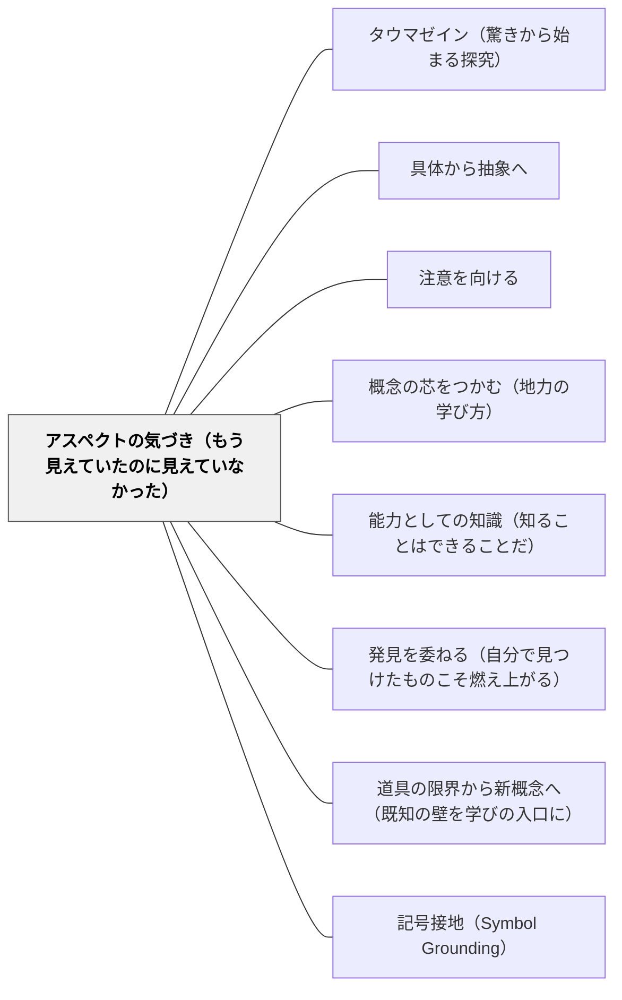

# アスペクトの気づき（もう見えていたのに見えていなかった）

> 「見ること」の意味を、前もって知っていると思わないでほしい。使い方があなたに意味を教える。——ウィトゲンシュタイン（PPF 250）  
> わかった瞬間は、新しい情報を受け取った瞬間ではなく、すでにそこにあったものを別のアスペクトで見た瞬間だ。

## [Pattern Connection]

### Kern（2026）——アスペクト知覚と他者の心：「見る」の二つの用法

Andrea Kern *Wittgenstein and Skepticism*（2026、Ch.3）は、ウィトゲンシュタインのアスペクト知覚論（PPF 111–138）を「他者の心の懐疑論」への応答として再解釈する。

**「見る」の二つの用法（PPF 111）：**

ウィトゲンシュタインは「見る」という動詞の二つの用法を区別する：

- **第一の用法**：「庭に鳥がいる」——見たものを記述する。対象は共有可能・報告可能で、「知識の対象」として他者と共有できる。
- **第二の用法**：「二つの顔の中に類似を見る」——アスペクトを見る。対象が知覚者に現れる・示される受動的な認識。対象は変わっていないが、その対象が自分に現れる仕方が変わる。

**アヒル-ウサギの図（PPF 118–138）：**

最初はアヒルに見えていた図が、突然ウサギに見える——「これまでとは違う見え方」が突然生じる。対象（紙の線）は変わっていない。変わったのは、その対象が知覚者に「現れる（sich zeigen）」仕方である。このとき、知覚者は「すでにそこにあったもの（ウサギとして見られる可能性）」を「はじめて見た」のである。

> 「それが変わっていないこと、そして私がそれを違う見方で見ること、を私は見た」（PPF 113）

**アスペクト知覚と教育：**

Kernはアスペクト知覚論を用いて、「他者の心へのアクセス」を説明する：笑顔の中に親しみやすさを「見る」ことは、「笑顔を観察して親しみやすさを推論する」のではなく、親しみやすさが笑顔を通して知覚者に「現れる」という受動的な認識である。

これは授業設計に転換できる：
- 数学のパターンが「見えてくる」体験は、情報の追加ではなく既にそこにあった潜在性の発動
- 物語の主題が「見えてくる」体験は、新しい情報の受け取りではなくアスペクトの転換
- 「この感じ」がわかる体験は、説明された後ではなく使いながら突然来る

**「使い方があなたに意味を教える」（PPF 250）：**

> 「見ることの状態がここで何を意味するか、前もって知っていると思わないでほしい！使い方があなたに意味を教える。」（PPF 250）

「説明を聞いた後で意味が分かる」のではなく、「使いながら、使う中で意味が現れる」——この順序が教育設計の原理になる。

**既存パタンとの関連：**

- **補強点**：[[パタン/タウマゼイン（驚きから始まる探究）]] におけるタウマゼインの感覚論的側面を補う——驚きは「未知のものに出会う体験」だけでなく「すでに知っていたものが突然別のアスペクトで現れる体験」でもある
- **補強点**：[[パタン/概念の芯をつかむ（地力の学び方）]] における「気づく」体験の現象論的根拠を与える
- **波及するパタン**：[[パタン/具体から抽象へ]] — アスペクト転換は具体から抽象への移行に際して起きる；[[パタン/注意を向ける]] — アスペクトを気づかせるための注意の誘導；[[パタン/能力としての知識（知ることはできることだ）]] — アスペクト転換は能力の完全発動が突然起きる瞬間

---

## 背景（Context）

学習における「わかった」という体験は均質ではない。「先生から説明を聞いてわかった」という体験と、「問題を解いている最中に突然わかった」という体験は、現象学的に異なる。後者の体験は：

- 説明を受けたわけではなく「突然わかった」
- 対象（問題・テキスト・素材）は変わっていないのに「見え方」が変わった
- 「前からそこにあったのに気づかなかった」という感覚を伴う

ウィトゲンシュタインはこの体験を「アスペクトを見る（seeing an aspect）」として哲学的に記述した（PPF 111–138）。アヒル-ウサギの図でアヒルがウサギに見える瞬間——この体験は「新しい情報の取得」ではなく「すでにそこにあった潜在性の発動」である。

## 問題（Problem）

「わかった体験」を「新しい情報の受け取り」として設計すると、アスペクト転換型の学びを引き起こせない。

- 説明を詳しくすれば「わかる」はずという前提で授業を設計する
- 「わからない」学習者に同じ説明をより詳しく繰り返す
- 学習者自身も「もっと説明してもらえば分かる」と感じ、受動的姿勢になる
- 「わかった瞬間」が来るまで待てず、「わかったことにする」形式的な処理に終わる

## 力のかたち（Forces）

- アスペクト転換は「起こすことができない」——設計できるのは「起きやすい条件」だけである
- 同じ素材でもアスペクトが見えるまでの時間は学習者によって異なる
- アスペクト転換の後は「なぜそれ以前に見えなかったのか」が不思議になる——この不思議さがさらなる探究へつながる
- 「使いながら意味が現れる」（PPF 250）——使用の文脈を作ることがアスペクト転換を誘発する

## 解決（Solution）

**学習者がすでに持っている理解・感覚・経験に、新しいアスペクトで光を当てる。説明よりも使用を優先し、使う中でアスペクトが現れる条件を設計する。「わかった瞬間」を急がせず、見えるまでの時間を保護する。**

---

### 設計原則①：使用を先に、説明を後に

アスペクト転換型の学びでは、「説明→理解→使用」の順ではなく「使用→見えてくる→確認」の順が有効。

❌「まず対称の意味を説明する。次に対称な図形を描く」  
✅「折ってぴったり重なる図を探す→何が共通しているか→それを『対称』と呼ぶ」

---

### 設計原則②：複数の入口から同じものを見る

アスペクト転換は強制できない。学習者がさまざまなアングルから素材を見られる「余地」を作る：

- 同じ問題を複数の方法で解く体験
- 「もし〜だったら」という仮定を入れた問い
- 異なる学習者の「見え方」を共有する場（「Aさんにはこう見えているらしい、あなたはどう見える？」）

---

### 設計原則③：「わかった瞬間」の後に「前はなぜ見えなかったか」を問う

アスペクト転換が起きた後、「前はなぜ見えなかったか」を問うことで：

- 転換の構造が学習者自身に見える
- 次のアスペクト転換を準備する感度が育つ
- 「見えなかった自分」を責めるのでなく「見えるようになった自分」を観察する姿勢が育つ

---

### 具体例①：算数「図形の見え方」

正方形を斜めに置いた図（◆）を見せる。「これは何？」と問うと「ひし形」と答える子も多い。正方形の定義（四辺等辺・四角直角）を確認した後、もう一度◆を見せると「あ、正方形だ！」とアスペクト転換が起きる——図形は変わっていないが、「見え方」が変わった。

---

### 具体例②：国語「物語の主題」

物語を読み終えた後「何の話だった？」と問うと「Aくんが〜した話」と出来事レベルで答える。「主人公は何に気づいたか」を問い、さらに「それはあなたの生活でどんな場面にある？」と問うと、「この物語は○○についての話なんだ」というアスペクト転換が起きる。

---

### 具体例③：掛け算の意味

「3×4」という式を「3が4つ」として理解している子に、「これは1本が3円のジュースを4本買った代金はいくら？」と問うと、「あ、これ掛け算だ！」というアスペクト転換が起きる——掛け算の「見え方」が増える。

---

### 自己教育への適用

数学の自己学習において：
- 「何度読んでもわからない」とき、より詳しい説明を求めるのではなく「別の入り口から同じものを見る」試みをする——類書・具体例・視覚化・図示
- 「わかった瞬間」の後に「前の自分がどこで詰まっていたか」を書き留める——次回の阻害点の予測になる
- 「使いながら意味が現れる」を信頼して、完全に理解できていない段階でも実際に問題を解き始める

## 結果（Consequences）

- 「説明を繰り返せばわかるはず」という思い込みから解放され、「使用の文脈を作る」という授業設計の視点が生まれる
- 学習者が「まだ見えていない」状態を「失敗」ではなく「転換前の状態」として受け取れるようになる
- 「わかった瞬間」の後に「なぜ前は見えなかったか」を問うことで、メタ認知的な学習姿勢が育つ
- ただし：アスペクト転換を待ちすぎると学習者が迷走する——「まだ見えていない」状態が続くとき、「何が見えているか」を確認して足場を与える必要がある

## 関連パタン

- [[パタン/タウマゼイン（驚きから始まる探究）]] — タウマゼインはアスペクト転換を伴う驚き
- [[パタン/具体から抽象へ]] — アスペクト転換は具体→抽象の移行に際して起きる
- [[パタン/注意を向ける]] — アスペクトを気づかせるための注意の誘導
- [[パタン/概念の芯をつかむ（地力の学び方）]] — 概念の芯が見えるのはアスペクト転換による
- [[パタン/能力としての知識（知ることはできることだ）]] — アスペクト転換は能力の完全発動が突然起きる瞬間
- [[パタン/発見を委ねる（自分で見つけたものこそ燃え上がる）]] — アスペクト転換型の発見こそ最も深く燃え上がる
- [[パタン/道具の限界から新概念へ（既知の壁を学びの入口に）]] — 既知の道具が「限界」として見えること自体がアスペクト転換
- [[パタン/記号接地（Symbol Grounding）]] — アスペクト知覚は記号が具体に接地する瞬間
- [[文献/Wittgenstein and Skepticism（Kern）]] — 本統合の出典

## クラスター図

## Actionable Insight

- 授業で「説明してからやってみる」ではなく「やってみてから言語化する」順番を試してみる——「使いながら意味が現れる」体験を先に作る
- 学習者が「わかった！」と言った後、「さっきまでどこが見えていなかった？」を問う——アスペクト転換の構造が言語化される
- 同じ概念を「別の入り口」から見せる素材（別の文脈・別の形式・逆側から）を1つ以上用意する——多面的な見え方がアスペクト転換の条件を作る

## 出典

Kern, A. (2026). *Wittgenstein and Skepticism*. Cambridge Elements: The Philosophy of Ludwig Wittgenstein. Cambridge University Press.  
DOI: https://doi.org/10.1017/9781009592567

> "Just don't think you knew in advance what the 'state of seeing' means here! Let the use teach you the meaning." ——Wittgenstein, Philosophy of Psychology – A Fragment, §250
