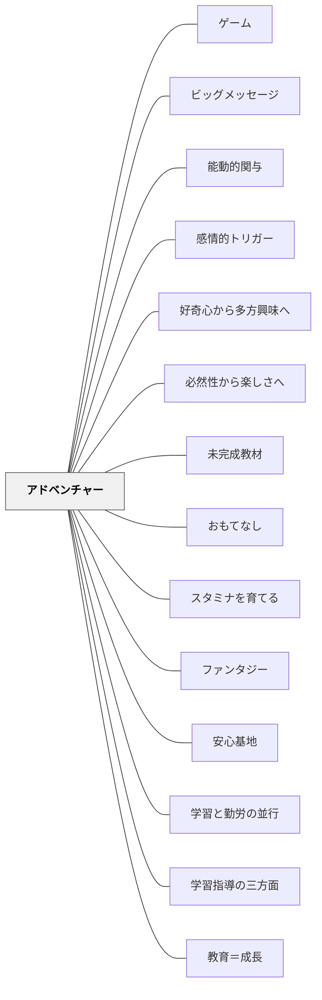

## [Pattern Connection]

### Dewey（1916）——遊びと仕事の連続性

**補強された点**：Dewey（1916, Ch.15）は「遊びと仕事は対立しない」という命題で、アドベンチャー教育の哲学的根拠を与える。Deweyにとって遊びと仕事の違いは**時間スパン**と意図した結果の明確さの違いにすぎない——アドベンチャーが「ちょっと先にある達成」を見越した挑戦であることとまさに一致する。

|            | 遊び                       | 仕事                       | アドベンチャー           |
| ---------- | -------------------------- | -------------------------- | ------------------------ |
| 関心の向き | 活動そのものへの直接的関与 | 長期的な結果への持続的努力 | 両者の統合               |
| 時間スパン | 短い・流動的               | 長い・方向がある           | 適度な延伸               |
| 意義       | 柔軟性・可塑性の源         | 社会的責任の練習           | ストレッチゾーンでの本気 |

> "Work which remains permeated with the play attitude is art—in quality if not in conventional designation."（Dewey, 1916, Ch.15）

**「遊びの態度を保った仕事＝芸術」**：Deweyのこの定式は、アドベンチャー教育が目指す学習体験の質を言い当てている。金時山登山・ナイフワーク・火起こし——これらが本物のアドベンチャーになるのは、遊びの態度（楽しさ・没頭・全身関与）と仕事の構造（目的・リスク・達成）が統合されているから。

**修正・拡張された点**：Deweyは「学校活動が社会的な起源と用途をもつとき（active occupations having a social origin and use）」に最も豊かな学びが生まれると言う。アドベンチャーを設計するとき、課題が社会的意味をもつか（単なる技術練習でなく本物の問題か）を問うことが、Dewey的な視点からの補強になる。

**他のパタンへの波及**：Deweyの「知識の3段階（やり方→情報→科学）」は、アドベンチャーを通じた学びが「①やり方の知識（how to do）」から始まることを根拠づける。調理・木工・野外活動が「本物の学びの入口」である理由がここにある。

---

### 深田浩嗣（2012）再統合（2026-05-20）

深田（2012）の「ゴール」（LEVEL 5）と「上級者向け」（LEVEL 4）は、アドベンチャーパタンの核心概念を外側から照らし、より鮮明に説明する。

- **既存パタンとの関連**：具体例②のカップラーメン事例は、深田のゴール理論の完璧な実例である。箸を作る・火を起こすが「目標」（具体的行動）であり、カップラーメンを食べることが「ゴール」（深い動機）だ。このパタンの「ゴールがあるからリスクが生まれ、リスクがあるからこそ本気になれた」という結論は、深田の理論と完全に一致する。
- **補強された点**：深田の「ゴール」概念が、なぜ課題を連結させることが重要なのかを理論的に説明する。ゴールなき目標の積み上げは「われに返る」（内発的動機の消失）を生む。課題設計では「学習者にとっての深いゴールは何か」を先に問うことが起点となる。
- **修正・拡張された点**：「上級者向け」（LEVEL 4）は、ストレッチゾーンの個別化チューニングと接続する。全員に同一負荷を与えるのではなく、熟達度に応じてストレッチゾーンを調整することが、アドベンチャーを持続させる。
- **他のパタンへの波及**：[[パタン/おもてなし]] の「学習者のゴールを理解する」は、アドベンチャー設計の起点と重なる——学習者がどこへ向かいたいか（ゴール）を知らずにリスクを設計することはできない。[[パタン/ゲーム]] の目標とゴールの区別も参照。

### 目標 vs ゴール（深田, 2012）× アドベンチャー対応表

| 深田の区別                                 | アドベンチャーでの対応          |
| ------------------------------------------ | ------------------------------- |
| 目標：具体的行動（箸を作る、火を起こす）   | ストレッチゾーンの個別課題      |
| ゴール：深い動機（カップラーメンを食べる） | 課題を連結する共通のゴール      |
| ゴールなき目標 → われに返る                | リスクなき課題 → 退屈・離脱     |
| ゴールに向かう目標 → 本気になれる          | ゴールがあるリスク → 本気・協力 |

# アドベンチャー

**一文でいうと**：挑戦・冒険・遊びの感覚を学習に入れ、本気で関わる状況を作る。

## 使いどころ・使いすぎ注意

| 観点         | 内容                                         |
| ------------ | -------------------------------------------- |
| 使いどころ   | 挑戦や未知への関与を高めたいとき。           |
| 使いすぎ注意 | 刺激が強すぎると、学習の焦点が遊びに流れる。 |

> 身体的にも精神的にもリスクを負う時、人は本気になる。学習体験をアドベンチャーにせよ。アドベンチャーは教材分析・教材開発・共同学習を貫く大パターンである。

## 背景（Context）

> 「大人が子供たちに考え方を強いるのは間違っている。しかし経験を強いるのは義務である。」——クルト・ハーン

> 「口びに微笑みを、心に冒険を。」——甲斐崎博史

このパターンは2023年末に行われた甲斐崎博史先生（以下、カイさん）の講座を受けて記述したものだ。カイさんは岩井の恩師であり、アドベンチャー教育をライフワークとして続けてきた実践者である。

プロジェクトアドベンチャー（PA）はアメリカ発祥のアドベンチャー教育プログラムで、アウトワードバウンドの系譜に連なる。カイさんはその実践と理論を日本の学校教育に根付かせることに長年取り組んできた。

課題が簡単すぎるとワクワクしない。難しすぎるとやる気が起きない。適切な負荷のある学習体験——それがアドベンチャーだ。

## 問題（Problem）

課題が易しすぎれば退屈する。難しすぎれば心が折れる。いずれも内発的動機は育たない。そもそも子供たちの日常的な学習体験は、本当のアドベンチャーになっているだろうか。

## 力のかたち（Forces）

- リスクを負うと人は本気になり、本音を語り、本能的に協力・助け合い・勇気づけ合う
- リスクを負うと明確な目標が生まれ、メンバーに共有しやすくなる
- リスクを克服することで達成感が生まれ、プロセスは次や他に生かせるようになる
- コンフォートゾーンがなければチャレンジはできない——安心の土台が挑戦を支える
- 体験から得たものは、先生の説話を聞くより道徳の副読本を読むよりはるかに深く子供の心に刻まれる

## 解決（Solution）

**アドベンチャーの3本柱で学習体験を設計し、学習者がストレッチゾーンにある課題に挑戦できるようにせよ。**

---

### アドベンチャーの3本柱（甲斐崎）

**① フルバリューコントラクト（Full Value Contract）**

自分も含めてチームのメンバー全員の存在を最大限に尊重するという約束ごとのこと。このコントラクトがあることで、チームの中にコンフォートゾーンが生まれる。

**② チャレンジバイチョイス（Challenge by Choice）**

自分自身の意思によって、やるのかやらないかを含めてチャレンジのレベルを選択できるという考え方。参加しないという選択も、外から見るという選択も、チャレンジの一形態として認められる。

**③ 体験学習サイクル（Experiential Learning Cycle）**

コルブ（Kolb）の体験学習モデルをアドベンチャー教育に採用したもの。

```
活動（体験する）
    ↓
振り返り（体験を振り返る）
    ↓
一般化（気づきを一般化する）
    ↓
適用（日常生活に生かす）
    ↓（次の活動へ）
```

目標を設定してやってみて、振り返り、一般化し、日常に生かす——このサイクルを回していくことが体験学習法（アドベンチャーラーニング）の核心だ。

---

### アドベンチャーの定義（甲斐崎）

> アドベンチャーとは、身体的にも精神的にもリスクを負うことすべてである。

**チャレンジとは**：

- リスクを回避するのではなく排除すること
- リスクテーカーであること
- 一歩踏み出すこと——ちょっと頑張ればなんとかなりそうなところへ
- ちょっとした負荷がかかる
- 新しい何かと出会うチャンス
- 1人の力で、時に仲間のサポートを受けながら乗り越えていくもの

チャレンジを乗り越えることで：

1. 新しい知識・価値観・考え方を体験の中から自ら構成する
2. 学び方・方法を身につけてサイクルとして自分たちで回せるようになる

---

### 3つのゾーン

```
パニックゾーン（負荷大きすぎ・崩壊）
    ↑
ストレッチゾーン（チャレンジ・成長）← ここを目指す
    ↑
コンフォートゾーン（安心・安全・土台）← 必須の基盤
```

**コンフォートゾーン**とは、自分にとって負荷がかからず安心していられる、いつでも戻ってこられる場のことだ。コンフォートゾーンがなければチャレンジすることはできない。

- **縦糸**：先生と子供の間のコンフォートゾーン（最低でも必要）
- **横糸**：子供同士のコンフォートゾーン（理想はクラス全体）

コンフォートゾーンばかりにいても成長はない。ストレッチゾーンにチャレンジすることで成長し、コンフォートゾーンが少しずつ広がっていく。

---

### コンフォートゾーンをつくる5つの要素

アイスブレイクやアクティビティを通して遊ぶことで、チームやクラスにコンフォートゾーンを作ることができる。その際、次の5つの要素を持つアクティビティを行う：

| 要素         | 内容                                 |
| ------------ | ------------------------------------ |
| ① 温める     | 場を和ませ、緊張をほぐす             |
| ② 知り合う   | 互いのことを知る機会をつくる         |
| ③ 群れて遊ぶ | チームとして動く体験をする           |
| ④ 概念を崩す | 固定観念や先入観をゆるめる           |
| ⑤ 抑制を取る | 自分を表現することへの抑制をゆるめる |

詳細は甲斐崎（2013）を参照。

---

### 体験学習法のクラス作りへの意味

体験から得たものは、先生の説話や道徳の副読本よりはるかに子供の心に刻み込まれる体験的な学びとなる。カイさんによれば、クラス作りのベースとして体験学習法には次の意味がある：

- 共有しやすく、自分ごとになる（チームで同じ体験をしているから）
- 子供たちがクラス作りに参画するようになり、オーナーシップを持てる
- 信頼関係の構築ができる
- 大切にしたいこと・ビジョンの共有につながる

---

### 教科教育への応用

体験学習法を国語・算数など教科教育に応用すると：

- 目的がはっきりして学習者全員がそれを共有できる
- 学習者が互いにリソースとなって個人の学習目的を尊重しながら学び合える
- 学習プロセス（体験学習サイクル）を通して学び方を学べる
- 学習を自分たちで評価し次へと生かしていける
- 全員が課題達成に責任を持ち、全員の課題達成を目的とするようになる
- 知識の習得・情報の獲得だけでなく、創造的に新しい知見・考え方・価値観・情報を作り出す

---

### 課題調整：アドベンチャーにするための設計

非教育者の学習体験はワクワクするアドベンチャーになっているか——これを常に問いかけながら課題を調整する。

- **負荷が足りなければ**：負荷のかけ方を考え、さらに負荷をかける
- **負荷が大きすぎれば**：チャレンジできるギリギリのところを考えて負荷を減らす

このような課題調整が教育設計には不可欠だ。

---

### 具体例①：金時山日の出登山（LAFT2023冬合宿より）

カイさんの講座には「金時山日の出登山」というプログラムがあった。朝の暗闇の中をヘッドライトをつけて登るというものだ。

**もし昼間の登山だったら**——負荷が小さく、リスクを負わない。アドベンチャーにはならなかっただろう。

**日の出前の暗闇、ヘッドライト、地図を読んでルートを確認し、自分たちの力で登る**——この課題設定だからこそアドベンチャーになった。

4〜5人のチームで金時山を登り、頂上まで到達して下山した後、「体験の共有」が行われた。これは振り返りとは少し違って、同じ体験をしたメンバーが1人1人順番に「感じたこと」を話していくものだ。次の目標設定ではなく、その体験そのものを言葉にして共有する時間だった。

---

### 具体例②：ナイフワーク×火起こし×カップラーメン（LAFT2023冬合宿より）

カイさんの講座には2つのプログラムが連結していた。

**ナイフワーク（1日目午後）**：木材を2本渡され、ナイフ1本で箸を作る。うまく作れなくても、食べられるレベルに仕上げないと翌日のカップラーメンが食べられない——そのリスクを負いながら箸を作った。周りの人と比べると不格好な箸になってしまったが、カップラーメンが食べられるレベルにはなんとか仕上げた。

**火起こしワーク（2日目昼前）**：2人組でファイアスターターを使って簡易焚き火台に火を起こす。これがめちゃくちゃ難しくて全然火がつかない。しかし火を起こせなければカップラーメンが食べられない——カップラーメンを食べるために必死に火起こしをした。なんとか火を起こして湯を沸かし、自分で作った箸を使ってカップラーメンを食べた時の達成感は格別だった。旅館の若旦那が作ってくれた豚汁もめちゃくちゃ美味しかった。

**ポイント**：この2つのプログラムは「カップラーメンを食べる」という共通のゴールで繋がっていた。そのゴールがあるからこそリスクが生まれ、リスクがあるからこそ本気になれた。課題を連結させ、リスクを設計することでアドベンチャーが生まれる。

---

### 具体例③：LAFT2023冬合宿への参加体験（課題調整としての講座設計）

講座3日前、カイさんからメールが届いた。その内容がすでにアドベンチャーの始まりだった：

- 速乾性のベースレイヤー（化学繊維）必須
- ウール・フリースなどのミドルレイヤー必須
- 防水・防風性のアウターレイヤー必須
- 帽子・手袋は必須
- **ヘッドライト必須**

「ヘッドライトなんて持ってない」——すぐAmazonで調べて注文した。「レイヤーって何だ」——昔の野外講座の経験を思い出しながら準備した。レインコートを出したら防水機能が失われていたので防水スプレーで復活させた。当日は荷造りもしていなかったので午前2時に起きて荷作りをし、朝食の準備をしながら出発までの時間を過ごして箱根へ向かった。

このメールを受け取った時点でもうアドベンチャーが始まっていた——これこそが課題設計の妙だ。

---

### 具体例④：算数の研究授業での課題調整（岩井の実践）

最近の算数の研究授業で最も心を砕いたのは課題調整だった。

子供たちの注意が持続するように、心が折れないギリギリのところになるように、教材の負荷の大きさを考えた。教材作りに失敗したら学習が成立しなくなる。子供たちがその教材で遊んでいる時にいくら失敗しても構わないが、注意を持続してもらえないと学習が成立しない——それだけ子供たちを引きつけるものにしなければならなかった。

教育材料となるものの開発・調整に最も心を砕いたのは、プロジェクトアドベンチャーで「目標や課題は簡単すぎても難しすぎてもいけない」ということを早くから体験的に学んでいたからだと思う。

---

### 具体例⑤：ブッククラブ読書会での課題調整（岩井の実践）

数年前のブッククラブの読書会の授業研究でも、最も心を砕いたのは課題調整だった。どの本を選んでチームになっても価値のある学習体験になるように、子供たちの状況から考えて本を選んだ。これもアドベンチャー教育を無意識に生かしていたのかもしれない。

参照：岩井輝久（2018）「パタン　ブッククラブ −パタンを重ねていくことについてー」『一つの教育のパタン・ランゲージ』あんどん出版

---

### 具体例⑥：宿泊学習の自然散策

宿泊学習で「自然散策をしよう」となった時、全員でぞろぞろ歩くだけでは子供たちに考える余地がなく、アドベンチャーにならない。

**負荷をかける設計**：グループで制限時間内に戻ってくる、地図を読んでルートを考えるなど。これだけで負荷が生まれ、チームで判断する必然性が生まれる。

歩く場所が変化に乏しければ課題そのものを見直す——金時山の登山がそのモデルになる。工夫によってよりよい課題に調整することはどの教育場面でも可能だ。

---

### アドベンチャーと共同学習の接続

ジョンソン（Johnson）らは共同学習がうまくいく時の構造を明らかにした。4つの構造を示しているが、そこにアドベンチャーが加わると岩井は考えている。アドベンチャーにすることで人はリスクを負い、本能的に協力する状況になる——これはジョンソンらが明らかにした構造だけでは説明しきれない重大な要素だ。

**問い**：「この活動はアドベンチャー（ストレッチゾーン）になっているか」——これが共同学習を設計する際の重要な視点となる。

---

### アドベンチャーは大パターン

アドベンチャーは教材分析・教材開発・共同学習などを貫く**大パターン**である。

- 国語・算数などあらゆる教科の学習
- 社会科見学・宿泊学習などの校外学習
- 掃除・給食の準備などの日常活動
- プロジェクト学習・総合的な学習

これら全てで「学習体験はアドベンチャーになっているか」を問う視点が働く。特別な場面に限らず、日常的に意識し続けたいパターンだ。

## 結果（Consequences）

- リスクを克服することで達成感と自己効力感が生まれる
- 協力・助け合い・勇気づけ合いが自然に生まれる
- 体験学習サイクルにより学びが次の実践に生かされ、学び方を学ぶことができる
- 体験は共有しやすく自分ごとになる——クラスのオーナーシップと信頼関係が育まれる
- 教材開発・課題設計に明確な視点が生まれる（簡単すぎず難しすぎず）

## 関連パタン
- [[学級経営/学級経営で使えるパタン]]
- [[特別支援/特別支援で使えるパタン]]
- [[学級経営/心理的安全性]]
- [[パタン/ゲーム]]
- [[パタン/ビッグメッセージ]]
- [[パタン/能動的関与]]
- [[教科/算数・数学で使うパタン]]
- [[パタン/感情的トリガー]]
- [[パタン/好奇心から多方興味へ]]
- [[パタン/必然性から楽しさへ]]
- [[パタン/未完成教材]]
- [[パタン/おもてなし]]
- [[パタン/スタミナを育てる]]
- [[パタン/ファンタジー]]
- [[パタン/安心基地]]
- [[パタン/学習と勤労の並行]]
- [[パタン/学習指導の三方面]]
- [[パタン/教育＝成長]]
- [[パタン/経験の質を問う]]
- [[パタン/作業活動の時間]]
- [[パタン/失敗を組み込む]]
- [[パタン/熟慮的動機づけ]]
- [[パタン/多様な演習レベル]]
- [[パタン/統合単元]]
- [[パタン/非カリキュラムタスク（考える文化をつくる問い）]]
- [[パタン/豊かな課題]]
- [[パタン/問題解決的教材研究]]

- [[パタン/環境調整]] — 課題調整は教育環境調整の核心
- [[パタン/自己調整]] — 体験学習サイクルは自己調整の学習ループと重なる
- [[パタン/心理的安全性（コンフォートゾーン）]] — コンフォートゾーンはアドベンチャーの土台
- [[パタン/ボトルネック]] — 課題のボトルネックを調整してアドベンチャーにする
- [[パタン/フィードバック]] — 体験の振り返りとフィードバックの統合
- [[パタン/文化をつくる]] — アドベンチャーはクラス文化形成を支える
- [[パタン/内発的動機づけ]] — 挑戦体験が自律性・有能感・つながりを育てる
- [[パタン/課題の調整]] — 難易度調整でストレッチゾーンを意図的につくる
- [[パタン/切実性（必要感）]] — 本物の挑戦には「自分に必要だ」という実感が先にある
- [[パタン/算数シンキング・タスク]] — 低い床・高い天井のタスクはアドベンチャーの構造を持つ
- [[パタン/コミュニティをつくる]] — 挑戦と助け合いがコミュニティの絆を育てる
- [[パタン/フィールドワークの段取り]] — 未知の専門家への訪問は子どもにとってのアドベンチャー

## このパタンが働く実践

| 実践パタン                | どのようにアドベンチャーをつくるか                         |
| ------------------------- | ---------------------------------------------------------- |
| [[パタン/ブッククラブ]]   | 読み応えのある本を仲間と読み切り、語り合う挑戦を設計する   |
| [[パタン/ナンバートーク]] | 一つの問題に複数の道があることを発見する知的な挑戦をつくる |

## クラスター図



## Actionable Insight

- 次の活動を設計するとき「この課題はアドベンチャー（ストレッチゾーン）になっているか」と問う——簡単すぎず難しすぎずが動機の核心
- 授業や活動の前に「コンフォートゾーンをつくる5要素（温める・知り合う・群れて遊ぶ・概念を崩す・抑制を取る）」のうち1つを意図的に入れる
- 活動後に全員が輪になって一言ずつ「感じたこと」を言う時間を設ける——体験の共有が学びを次へ生かすサイクルの起点

## 出典

クルト・ハーン（アウトワードバウンド創設者）「経験を強いるのは義務である」  
Kolb, D. A. (1984). _Experiential Learning: Experience as the Source of Learning and Development_. Prentice-Hall.  
甲斐崎博史（2013）『クラス全員がひとつになる学級ゲーム&アクティビティ100』ナツメ社  
甲斐崎博史（2023）『LAFT2023冬合宿 KAIさん教育実践から学ぶ』学習サークルLAFT  
岩井輝久（2018）「パタン　ブッククラブ −パタンを重ねていくことについてー」『一つの教育のパタン・ランゲージ』あんどん出版  
岩井輝久「パタン　アドベンチャー（動画記録）」https://youtu.be/G91c5vfKXOc  
Dewey, J. (1916). _Democracy and Education_. Macmillan. (Ch.15) → [[文献/Democracy and Education（Dewey）]]
