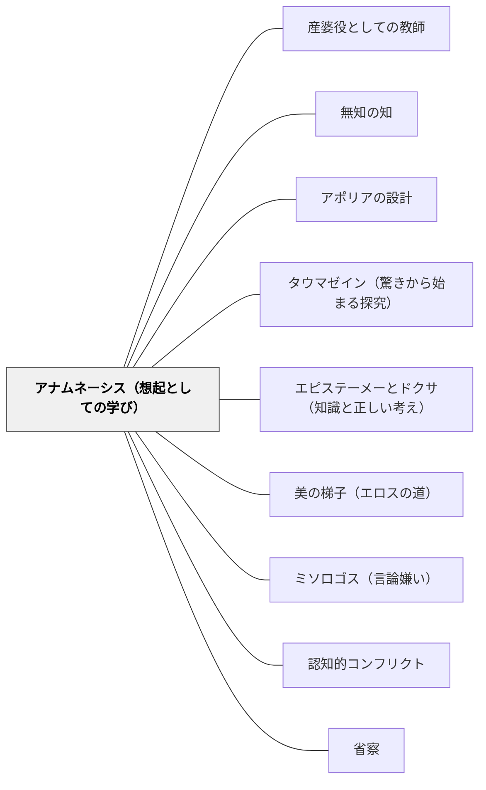

# アナムネーシス（想起としての学び）

> 「学ぶ」とは知らないことを初めて受け取ることではなく、すでに内側にある知識を思い出すことである。感覚が「欠けたもの」を示す瞬間に、欠けていないもの（イデア）への想起が起動する。

## [Pattern Connection]

### プラトン『パイドン』（前380年頃）——想起説の完全展開（72e–77a）

プラトン『メノン』（81a〜86b）で提示された想起説（アナムネーシス）が、『パイドン』（72e〜77a）では最も詳細・体系的に展開される。

**想起の5例（73c–74c）：**

| 例 | 甲（見るもの） | 乙（思い浮かぶもの） | 想起の種類 |
|---|---|---|---|
| 1 | 恋人の竪琴 | 恋人 | 類似からの想起（非同一） |
| 2 | シミアスの姿 | ケベス | 隣接からの想起 |
| 3 | 描かれた馬 | 人間 | 類似からの想起（異種） |
| 4 | 描かれたシミアス | ケベス | 類似からの想起（別人） |
| 5 | 描かれたシミアス | シミアス本人 | 欠如からの想起（像は本物に欠ける） |

例5が核心：「描かれたシミアス（像）」は「シミアス本人」に「欠けるところがある（エンデイン）」。その欠如を認識したとき、欠けていない本物（本人）を「想起する」。

**等しさのイデアへの適用（74a–75d）：**

等しい石や木を見ると「等しさそれ自体（to ison auto）」——等しさのイデア——を思い浮かべる。しかし感覚的な等しいものは、時に等しく見え、時に等しく見えない。イデアと違い「欠けて」いる。

→ 感覚する以前から「等しさそれ自体」の知識を持っていたはず。
→ それは生まれる以前に獲得された（アナムネーシス）。

> 「私たちが『学ぶ』と呼んでいることは、自分の本来の知識を再び得ることなのではないか。きっと、これを『想起する』と言うのが、正当な言い方ではないか。」（75e）

**イデアと魂の前世存在は「等しい必然性」にある（76e–77a）：**
> 「これらイデアも実在するように、そのように私たちの魂も私たちが生まれる以前から存在していたというのが必然なのである。それらが存在するということと、私たちの魂が私たちの生まれる以前にも存在していたということは、等しい必然性にあるのではないか。」

**「欠如（エンデイン）」が学習を起動する構造：**

```
感覚経験（欠けたもの）
    ↓ 欠如に気づく
「これは本物に欠けている」
    ↓ 想起
本物（イデア）の知識が目覚める
    ↓
より深い認識への前進
```

**補強点**：「学びとは想起である」という命題の哲学的根拠が、「欠如」という具体的な認識論的メカニズムで説明される。教育実践への含意：学習者が「この感覚的なものは何かに欠けている」と感じる体験を設計することで、潜在的知識の想起が起動する。

**波及するパタン**：[[パタン/産婆役としての教師]] — 産婆役はアナムネーシスを助ける技術；[[パタン/無知の知]] — 「知らない」の自覚がアナムネーシスの起動条件；[[パタン/アポリアの設計]] — アポリア体験がイデアへの想起を促す欠如の感覚を生む；[[文献/パイドン（プラトン）]] — 本統合の出典

---

### プラトン『メノン』（前387年頃）——想起説の初出と実演（81a–86b）

メノンのパラドクス（「知らないものは探せない。知っているなら探す必要はない」）への応答として、ソクラテスは想起説を提示する。

> 「私たちにとって学びとはまさに想起にほかならないという説で、これに従えば、私たちが今想い出すことを、私たちはいつか過去の時にどこかで学んでしまっているというのが必然なのです。」（72e相当）

少年との幾何学問答（82a–86b）がアナムネーシスの実演：字も習っていない少年が、問いかけのみで正方形の面積問題を自力で解く。ソクラテスは「教えない——問うのみ」（84c）。

**補強点**：アナムネーシスが「知識伝達の否定」として実践的に示される。パイドンがその哲学的機序（欠如→想起）を詳細に与える。

**波及するパタン**：[[パタン/アポリアの設計]] — 少年の問答はアポリアの設計の最古の実演；[[文献/メノン（プラトン）]] — 本統合の出典

---

## 背景（Context）

「学ぶ」という言葉は多くの場合、外から情報を受け取ることをイメージさせる。教師が持っている知識を生徒に移す——コップからコップへの水の移し替えのように。しかし実際には、同じ授業を受けても学習者によって理解の深さは大きく異なる。同じ情報を受け取ったはずなのに、なぜ「分かった瞬間」の体験は学習者の内側から来るのか。

プラトンは『パイドン』と『メノン』で、学びとは情報の受け取りではなく「想起（アナムネーシス）」であるという洞察を展開した。魂はすでに生前に知識を持っていたが、生まれるときに忘れてしまった。教育とはその知識を「思い出させる」プロセスである。

## 問題（Problem）

教師が「情報の供給者」として立つとき、学習者は受動的にならざるをえない。説明を聞いて「わかった気分」になるが、時間が経つと忘れる——これは「想起（本物の理解）」が起きていないからである。一方で「内側から引き出す」ことを意識すると、「何をどう引き出せばいいのか」という設計の問いが生じる。

## 力のかたち（Forces）

- 人間は生まれながらに「知識の種（潜在的な認識能力）」を持っている——これが学びを可能にする
- 知識は「受け取るもの」ではなく「思い出すもの」——教師の説明は想起の「きっかけ」にはなるが、想起そのものではない
- 「欠如（エンデイン）」の認識が想起を起動する——感覚的なものがイデアに「欠けている」と気づいたとき、欠けていないもの（本物）への認識が開く
- 感覚経験なしに想起は起きない——具体的な体験がアナムネーシスの出発点である
- 想起は「突如として」起こることがある（エクサイフネース）——段階的な積み上げの末に「わかった！」が来る

## 解決（Solution）

**学習者が感覚的な体験から「これは何かに欠けている」「もっと本物がある」と感じる瞬間を設計することで、より深い認識（イデア的な概念）への想起を促す。**

アナムネーシスを設計するための手順：

1. **具体的な体験から始める**——イデアへの想起は必ず「一つの具体」から出発する。感覚で触れられる素材・現象・問いを用意する
2. **欠如を感じさせる**——「この例だと…なんかうまく説明できない」「これとこれ、似てるけど何かが違う」という違和感・ずれを体験させる
3. **「本物」への問いを投げる**——「では全部のこういうものに共通するものがあるとしたら？」「本当の○○とは何か？」という問いで、感覚の向こうにある概念へ向かう
4. **想起を確認する**——「それはどこかで知っていた気がしない？」「初めて知った感じ？それとも思い出した感じ？」と内省を促す

---

**具体例1：算数「等号の意味」**

「3+4＝7」と「7＝3+4」を並べて見せる。「これは同じ意味？それとも違う？」と問うと多くの子供は「違う気がする（左が答えで右が問題みたい）」という感覚を持つ。「じゃあ等号って本当は何を意味してるんだろう」——この「欠如」から「等しさそれ自体」への想起が始まる。

**具体例2：国語「語り手と作者の違い」**

「この文章を書いているのは誰ですか？」という問いに、「作者の○○さん」と答える子供に「でも、作者は物語に出てこないよね。だとすると『私は〜思った』と書いているのは誰？」と問い返す。「語り手（ナレーター）」という概念への想起が「欠如」から起動する。

**具体例3：理科「重さと質量」**

月で体重計に乗ったら体重が変わるという事実を提示する。「体重って本当は何？」「変わらない『私の重さ』はどこにある？」——感覚的な「重さ」が欠如を示し、「質量（変わらない量）」という概念への想起を促す。

## 結果（Consequences）

- 学習者が「教わった」ではなく「思い出した」「気づいた」という内側からの感覚を持てる
- 概念が「情報（覚えていれば言える）」ではなく「知識（使える・応用できる）」として定着する
- 「欠如の発見」がさらなる探究の起点になり、自発的な問いが生まれやすい
- 抽象的な概念（イデア的なもの）への接近が、具体的な体験を通じて自然に起こる
- 時間が経っても忘れにくい——本当の想起は感覚的記憶ではなく概念的認識として定着するから

## 関連パタン
- [[パタン/産婆役としての教師]] — アナムネーシスを助けるのが産婆役の本務；「問うのみで教えない」の哲学的根拠
- [[パタン/無知の知]] — 「知らない」の自覚がアナムネーシスの出発点
- [[パタン/アポリアの設計]] — アポリア（欠如体験）がアナムネーシスを起動する
- [[パタン/タウマゼイン（驚きから始まる探究）]] — 驚きがアナムネーシスの感情的出発点
- [[パタン/エピステーメーとドクサ（知識と正しい考え）]] — アナムネーシスで到達するのはエピステーメー（本物の知識）
- [[パタン/美の梯子（エロスの道）]] — 美の梯子の上昇はアナムネーシスの段階的深化
- [[パタン/ミソロゴス（言論嫌い）]] — アナムネーシスの失敗（想起できない経験）が重なるとミソロゴスになりうる
- [[パタン/認知的コンフリクト]] — 感覚的なものの欠如・矛盾がアナムネーシスの認知的条件
- [[パタン/省察]] — 「何を思い出したか」「どこで気づいたか」の振り返りがアナムネーシスを強化する

## クラスター図



## Actionable Insight

- 単元の「核心概念」を最初から教えず、その概念が適用されるべき感覚的な事例を複数提示して「何かが違う」「共通するものは何か」と問うことから始める——欠如からの想起を設計する
- 「今日学んだことは初めて知ったことか、それともどこかで感じていたことか」を授業の終わりに問う——想起と新規情報の区別に気づかせることで、学びの質を内省させる
- 子供が「なんか変だ」「これと違う気がする」と言ったとき、その違和感を丁寧に言語化させる——これがイデアへの想起の入り口であることを意識して場を作る

## 出典

プラトン（納富信留訳）（2019）『パイドン——魂について』光文社古典新訳文庫（Bフ 2-6），pp.72e–77a.
プラトン（渡辺邦夫訳）（2022）『メノン——徳について』光文社古典新訳文庫（Bフ 2-2），pp.81a–86b.

> 「私たちが『学ぶ』と呼んでいることは、自分の本来の知識を再び得ることなのではないか。きっと、これを『想起する』と言うのが、正当な言い方ではないか。」——ソクラテス（パイドン 75e）
