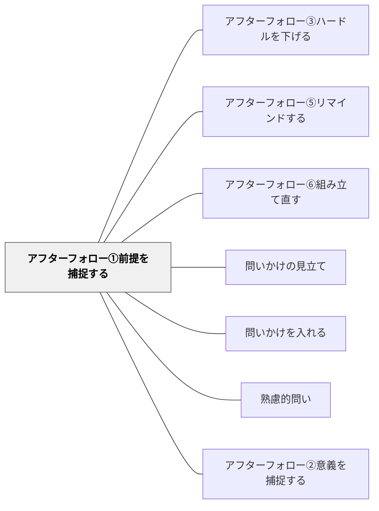

# アフターフォロー①前提を捕捉する

> 問いかけの後に「この問いの背景は〇〇です」と前提・文脈を補足する

## 背景（Context）
問いを投げかけた後に沈黙が続くとき、その原因は問いへの無関心ではなく、問いの前提や文脈の理解不足であることが多い。ファシリテーターが問いの背景にある状況・知識・仮定を補足することで、学習者は問いに正しく向き合うための足場を得られる。問いのアフターフォローは、問い自体と同じくらい重要な技術である。

## 問題（Problem）
問いを一度投げかけただけでは、学習者がその問いを立てた理由や文脈を理解していない場合がある。前提となる知識や状況認識が共有されていなければ、問いは宙に浮いてしまい、思考が始まらない。ファシリテーターが問いっぱなしにすると、学習者は何を考えてよいかわからなくなる。

## 力のかたち（Forces）
- 問いの開放性 vs 文脈の共有
- 学習者の自律的思考 vs ファシリテーターの誘導
- 前提の明示 vs 問いの答えを先取りするリスク
- 問いの明確化 vs 多様な解釈の余地

## 解決（Solution）
問いを投げかけた後、「この問いは〇〇という状況を想定しています」「背景として△△を前提にしています」のように、問いの文脈・前提・意図を一文か二文で補足する。例えば「なぜ学校に行くのか、と問いました。ここでは義務教育という制度の存在を前提にしています」のように、前提を可視化することで議論の出発点を揃える。

## 結果（Consequences）
- 学習者が問いの意図を正しく理解し、思考が始まりやすくなる
- 前提の違いに気づいた学習者が、前提そのものを問い直す深い議論につながる
- 問いの文脈を共有することで、議論が拡散せず焦点が定まる

## 関連パタン
- [[パタン/アフターフォロー③ハードルを下げる]]
- [[パタン/アフターフォロー⑤リマインドする]]
- [[パタン/アフターフォロー⑥組み立て直す]]
- [[パタン/問いかけの見立て]]
- [[パタン/問いかけを入れる]]
- [[パタン/熟慮的問い]] — 親パタン
- [[パタン/アフターフォロー②意義を捕捉する]] — 前提と意義の両面から問いの根拠を整える兄弟手法——「何を前提に問うか」と「なぜ問うか」のペア

## クラスター図

## Actionable Insight

- 問いを投げかけた後、「この問いは○○という状況を想定しています」と文脈を一言添える——前提を可視化することで議論の出発点が揃い思考が始まりやすくなる
- 「背景として△△を前提にしています」と述べた上で、「この前提自体に疑問がある人は？」と問い返す——前提の共有が前提そのものを問い直す深い議論につながる
- 問い立ての授業で「この問いはどんな前提の上に成り立っているか」を問う——前提を意識する習慣が批判的思考の基盤になる

## 出典
- [[文献/熟慮的問いのパターンリスト（動画記録）]]
