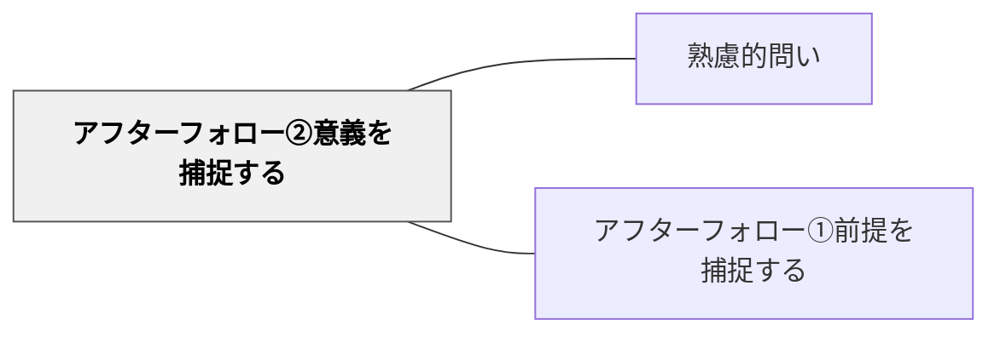

# アフターフォロー②意義を捕捉する

> 「なぜこの問いが大切か」を伝える

## 背景（Context）
問いへの動機づけは、問い自体の面白さだけでなく、「この問いに向き合うことがなぜ重要か」という意義の感覚からも生まれる。問いかけた後にその意義を伝えることで、学習者は問いを自分ごととして引き受けやすくなる。意義の補足は、問いを「こなすべき課題」から「向き合いたい問い」へと変換する。

## 問題（Problem）
学習者が問いに向き合う意欲が生まれない原因の一つは、「この問いが自分の生活や社会とどうつながるのかわからない」ことである。問いの意義を伝えないまま議論を促しても、表面的な回答しか引き出せない。ファシリテーターが問いの「なぜ大切か」を自明視していると、学習者との間に温度差が生まれる。

## 力のかたち（Forces）
- 問いの意義の共有 vs 学習者の自律的な意味発見
- 動機づけの強化 vs 内発的関心の尊重
- ファシリテーターの意図の透明性 vs 問いの開放性
- 短期的な関心喚起 vs 長期的な探究心の育成

## 解決（Solution）
問いを投げかけた後、「この問いが大切なのは〇〇だからです」「この問いに向き合うことで、△△が変わるかもしれません」のように、問いの社会的・個人的な意義を一文で補足する。意義は押しつけにならないよう、可能性の形（「〜かもしれない」「〜につながる」）で表現するとよい。

## 結果（Consequences）
- 学習者が問いを自分ごととして受け取り、思考への動機が高まる
- 問いの背景にある価値観や問題意識が共有される
- 問いへの向き合い方が表面的な回答から深い探究へと変わる

## 関連パタン
- [[パタン/熟慮的問い]] — 親パタン
- [[パタン/アフターフォロー①前提を捕捉する]] — 意義と前提の両面から問いの根拠を整える兄弟手法——「なぜ問うか」と「何を前提に問うか」のペア

## クラスター図

## Actionable Insight

- 問いを投げかけた後、「この問いが大切なのは○○だからです」と一文で意義を補足する——学習者が問いを自分ごととして受け取り、思考への動機が高まる
- 意義は「〜かもしれない」「〜につながる」という可能性の形で表現する——押しつけにならず、学習者が意義を自ら感じる余地を残せる
- 「この問いに向き合うことで、△△が変わるかもしれません」と具体的な変化の可能性を示す——問いへの向き合い方が表面的な回答から深い探究へと変わる

## 出典
- [[文献/熟慮的問いのパターンリスト（動画記録）]]
