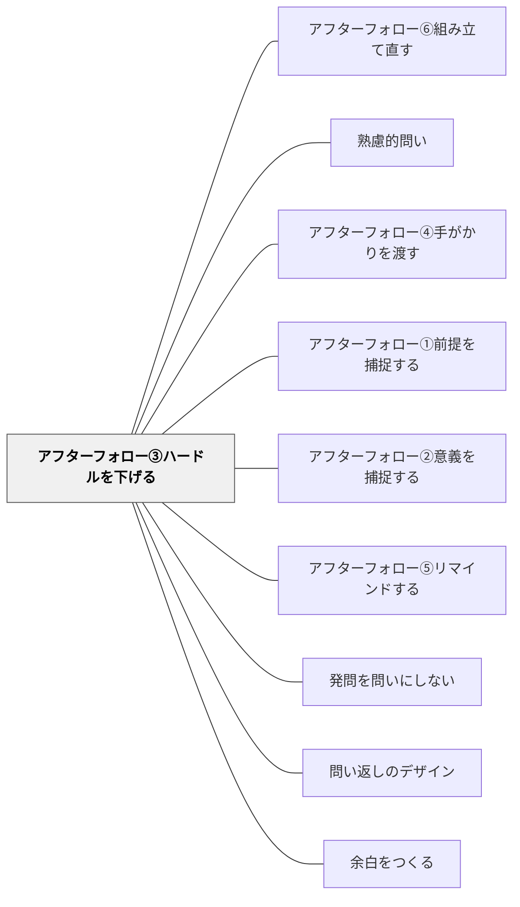

# アフターフォロー③ハードルを下げる

> 「何でも言っていいよ」「正解はないよ」と安心感を与える

## 背景（Context）
問いに答えることへの心理的障壁は、「間違えたら恥ずかしい」「正しい答えを言わなければいけない」という思い込みから生まれることが多い。ファシリテーターが明示的に「正解はない」「何でも歓迎する」と伝えることで、学習者は安心して自分の考えを表現できるようになる。心理的安全性の構築は、深い対話の前提条件である。

## 問題（Problem）
学習者が問いに沈黙で応じるとき、その原因は問いへの無関心よりも、失敗への恐れや評価への不安であることが多い。教室や職場では、「正しいことを言わなければ」という暗黙の規範が発言を抑制する。ファシリテーターがこの障壁を意識せずにいると、表面的な沈黙が深い思考の欠如と誤解される。

## 力のかたち（Forces）
- 心理的安全 vs 誠実な評価への期待
- 発言の促進 vs 内省の時間の確保
- 安心感の提供 vs 思考の緊張の維持
- 開放的な雰囲気 vs 問いの真剣さ

## 解決（Solution）
問いを投げかけた後、「正解はありません」「思いついたことを気軽に言ってみてください」「間違っていても全然大丈夫です」のように、評価不安を解消する言葉を添える。さらに「最初は断片的でいい」「一言でも歓迎」と最低限のハードルを示すと、最初の発言が生まれやすくなる。

## 結果（Consequences）
- 発言への心理的障壁が下がり、より多くの学習者が参加する
- 未完成・断片的な思考も表現されるようになり、議論が深まる
- 失敗を恐れない学習文化の形成に貢献する

## 関連パタン
- [[パタン/アフターフォロー⑥組み立て直す]]
- [[パタン/熟慮的問い]] — 親パタン
- [[パタン/アフターフォロー④手がかりを渡す]] — どちらも答えられない学習者への介入手法——障壁を下げるか、思考の道具を渡すか
- [[パタン/アフターフォロー①前提を捕捉する]] — 問いへの参加の前提を整える第1手法
- [[パタン/アフターフォロー②意義を捕捉する]] — 問いの意義を伝えて動機づける兄弟手法
- [[パタン/アフターフォロー⑤リマインドする]] — 議論が止まったとき問いを蘇らせる手法
- [[パタン/発問を問いにしない]] — 問いの出し方・雰囲気そのものを変える関連手法
- [[パタン/問い返しのデザイン]] — 応答を次の思考へとつなぐ問い返し設計
- [[概念/動機づけ]] — 問いへの向き合いを促す動機付けの理論的背景
- [[パタン/余白をつくる]] — 問いかけの後に沈黙・余白を置くことで思考の深化を待つ

## クラスター図

## Actionable Insight

- 問いを投げかけた後、「正解はありません」「思いついたことを気軽に言ってみて」と添える——発言への心理的障壁が下がり、より多くの学習者が参加する
- 「最初は一言だけでいい」「断片的でも歓迎」と最低限のハードルを示す——最初の発言が生まれやすくなりその後の発言が続く
- 「間違っていても全然大丈夫です」と明示的に伝える——失敗を恐れない学習文化の形成に貢献する

## 出典
- [[文献/熟慮的問いのパターンリスト（動画記録）]]
