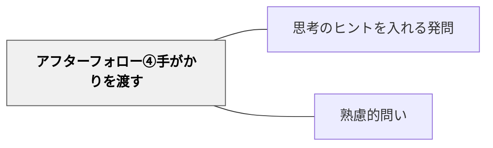

# アフターフォロー④手がかりを渡す

> ヒント・足場がけを提供して思考を助ける

## 背景（Context）
問いに向き合うためには、ある程度の「取っかかり」が必要である。スキャフォールディング（足場がけ）の理論が示すように、学習者の最近接発達領域に合わせた支援が、自律的な思考を促す。問いかけの後にヒントや例示を提供することは、問いの答えを与えることではなく、思考を始めるための起点を作ることである。

## 問題（Problem）
問いが難しすぎると、学習者はどこから考えてよいかわからず思考が始まらない。問いっぱなしの状態が続くと、沈黙が長くなり場の雰囲気が重くなる。「ヒントを出すと考える力が育たない」という誤解から、支援を提供しないでいると、学習者は孤立無援で問いの前に立ちすくむことになる。

## 力のかたち（Forces）
- 足場がけの支援 vs 自律的思考の促進
- ヒントの量 vs 問いの開放性
- 思考の起点の提供 vs 答えの先取り
- 学習者の多様な出発点 vs 支援の均一性

## 解決（Solution）
問いを投げかけた後、「例えば〇〇という視点から考えてみるのはどうでしょう」「△△という事例を参考にしてみてください」「まず××から考えてみると入りやすいかもしれません」のように、思考の足場を提供する。ヒントは答えを示すのではなく、考えるための「入口」を複数用意するイメージで提示する。

## 結果（Consequences）
- 問いへの参加の障壁が下がり、思考が始まりやすくなる
- 多様な入口を提供することで、異なる背景を持つ学習者が同じ問いに向き合える
- 足場を外すタイミングを意識することで、段階的な自律性の育成につながる

## 関連パタン
- [[パタン/思考のヒントを入れる発問]]
- [[パタン/熟慮的問い]] — 親パタン

## クラスター図

## Actionable Insight

- 問いを投げかけた後、「例えば○○という視点から考えてみるのはどうでしょう」と足場を提供する——思考の入口を複数用意することで多様な学習者が同じ問いに向き合える
- 「まず××から考えてみると入りやすいかもしれません」と最初のステップを示す——問い始めの足場が思考を起動させる
- ヒントを出す際に「これが答えではなく、考えるための入口です」と添える——足場かけが自律的思考を促すものだという認識を学習者と共有する

## 出典
- [[文献/熟慮的問いのパターンリスト（動画記録）]]
