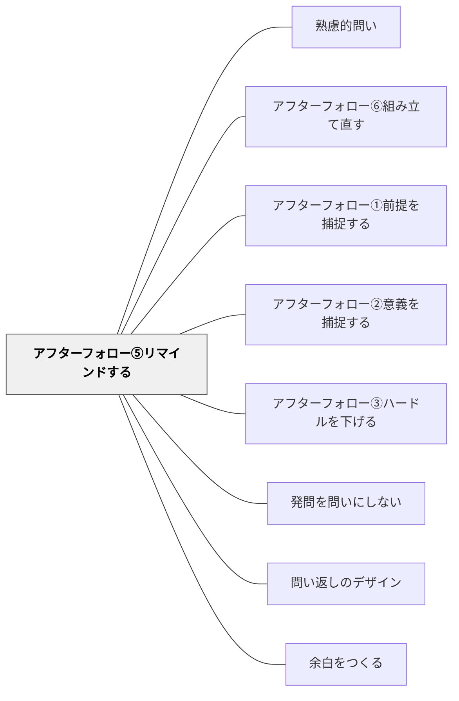

# アフターフォロー⑤リマインドする

> 問いを繰り返す・再提示することで意識を戻す

## 背景（Context）
問いは一度投げかけただけでは意識から薄れていく。特に長い議論やグループ活動の中では、最初の問いから離れて話が脱線したり、問いの本質が忘れられたりすることが多い。問いを適切なタイミングで再提示することは、思考の方向性を維持し、議論の焦点を取り戻すための重要なファシリテーション技術である。

## 問題（Problem）
議論が活発になるにつれ、最初の問いから離れた方向へ流れていくことがある。参加者が問いの原点を見失うと、議論は豊かであっても問いへの答えには近づかない。ファシリテーターが問いの再提示をしなければ、問いは形骸化し、議論のための議論になってしまう。

## 力のかたち（Forces）
- 問いへの集中 vs 自由な議論の流れ
- リマインドの適切なタイミング vs 議論の妨げ
- 問いの維持 vs 問いの発展・更新
- ファシリテーターの介入 vs 自律的な学習者の問い直し

## 解決（Solution）
議論の途中や活動の節目で、「最初の問いに戻ると、〇〇でした」「ここで改めて問いを確認すると…」のように、元の問いを繰り返す。板書・スライド・カードなどに問いを可視化しておくと、言葉でのリマインドなしに問いへの意識を維持しやすい。完全に同じ表現でなくても、問いの本質を保ちながら再提示することで、議論の枠組みを取り戻す。

## 結果（Consequences）
- 議論の焦点が維持され、問いへの答えに向かって思考が深まる
- 脱線した議論が問いの文脈で再評価され、新たな洞察が生まれることがある
- 問いを繰り返す行為そのものが、問いの重要性を参加者に印象づける

## 関連パタン
- [[パタン/熟慮的問い]] — 親パタン
- [[パタン/アフターフォロー⑥組み立て直す]] — どちらも止まった議論を蘇らせる手法——問いを繰り返すか、問いを作り直すか
- [[パタン/アフターフォロー①前提を捕捉する]] — 問いへの参加の前提を整える第1手法
- [[パタン/アフターフォロー②意義を捕捉する]] — 問いの意義を伝えて動機づける手法
- [[パタン/アフターフォロー③ハードルを下げる]] — 参加障壁を下げる兄弟手法
- [[パタン/発問を問いにしない]] — 問いの出し方・雰囲気そのものを変える関連手法
- [[パタン/問い返しのデザイン]] — 応答を次の思考へとつなぐ問い返し設計
- [[概念/動機づけ]] — 問いへの向き合いを促す動機付けの理論的背景
- [[パタン/余白をつくる]] — 問いかけの後に沈黙・余白を置くことで思考の深化を待つ

## クラスター図

## Actionable Insight

- 議論の途中や活動の節目で「最初の問いに戻ると、○○でした」と問いを繰り返す——脱線した議論が問いの文脈で再評価され、焦点が戻る
- 板書・スライド・カードに問いを可視化しておく——言葉でのリマインドなしに問いへの意識を維持できる
- グループ活動の最後に「最初の問いへの答えを一文で」と問う——問いへの回帰が議論を締める力になる

## 出典
- [[文献/熟慮的問いのパターンリスト（動画記録）]]
