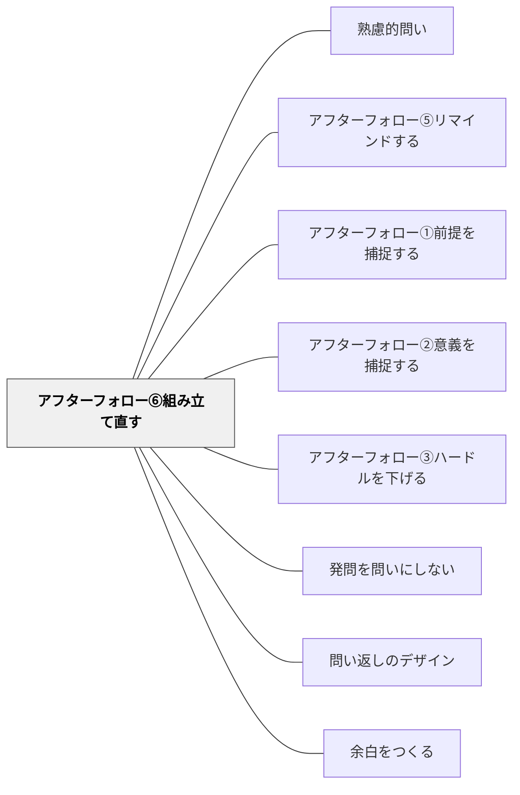

# アフターフォロー⑥組み立て直す

> 問いを言い換え・再構成して別角度から再提示する

## 背景（Context）
同じ問いを繰り返すだけでは、思考が進まないことがある。問いの表現や切り口を変えて再提示することで、固まった思考に新しい入口を作ることができる。問いの言い換えは、単なる繰り返しではなく、問いの本質を保ちながら異なる角度から照射する創造的なファシリテーション技術である。

## 問題（Problem）
ある問いの表現が特定の学習者には響かないことがある。また、議論が進む中で、最初の問いの設定では捉えきれない新しい視点や論点が浮上することもある。問いを固定したまま議論を続けると、問いそのものが思考の制約になってしまう。問いは動的に更新されるべきものであるという認識が、ファシリテーターには必要である。

## 力のかたち（Forces）
- 問いの安定性 vs 問いの更新
- 別角度からの再提示 vs 問いの一貫性の維持
- ファシリテーターの介入 vs 学習者による問いの発展
- 問いの多様な表現 vs 問いの本質の保持

## 解決（Solution）
「少し違う言い方をしてみると、〇〇ということかもしれません」「この問いを別の角度から見ると、△△という問いになります」のように、問いを言い換えて再提示する。議論から浮上した新しい視点を取り込んで問いを更新することも有効である。重要なのは、言い換え後も問いの核心的な意図が保たれていることである。

## 結果（Consequences）
- 問いに行き詰まった学習者に新しい思考の入口が開かれる
- 議論の展開に合わせて問いが深化し、探究が次の段階に進む
- ファシリテーターと学習者が協働で問いを育てる文化が生まれる

## 関連パタン
- [[パタン/熟慮的問い]] — 親パタン
- [[パタン/アフターフォロー⑤リマインドする]] — どちらも止まった議論を蘇らせる手法——問いを作り直すか、問いを繰り返すか
- [[パタン/アフターフォロー①前提を捕捉する]] — 問いへの参加の前提を整える第1手法
- [[パタン/アフターフォロー②意義を捕捉する]] — 問いの意義を伝えて動機づける手法
- [[パタン/アフターフォロー③ハードルを下げる]] — 参加障壁を下げる兄弟手法
- [[パタン/発問を問いにしない]] — 問いの出し方・雰囲気そのものを変える関連手法
- [[パタン/問い返しのデザイン]] — 応答を次の思考へとつなぐ問い返し設計
- [[概念/動機づけ]] — 問いへの向き合いを促す動機付けの理論的背景
- [[パタン/余白をつくる]] — 問いかけの後に沈黙・余白を置くことで思考の深化を待つ

## クラスター図

## Actionable Insight

- 議論が行き詰まったとき、「少し違う言い方をしてみると、○○ということかもしれません」と問いを言い換えて再提示する——問いに行き詰まった学習者に新しい思考の入口が開かれる
- 議論から浮上した新しい視点を取り込んで「今の議論を踏まえると、問いはこう変わるかもしれません」と提示する——探究が次の段階に自然に進む
- 「この問いを別の角度から見ると、△△という問いになります」と複数の切り口を示す——問いの多面性が思考を豊かにする

## 出典
- [[文献/熟慮的問いのパターンリスト（動画記録）]]
