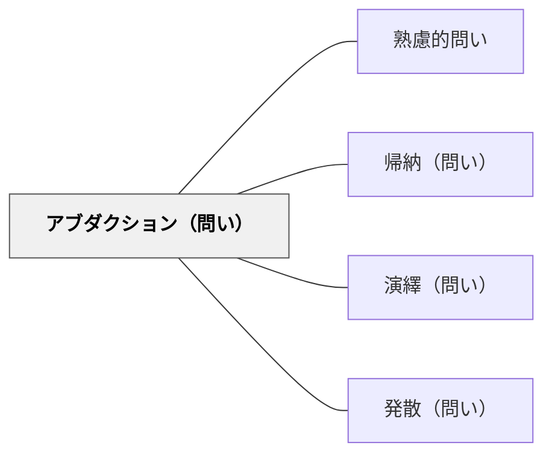

# アブダクション（問い）

> 「なぜこんなことが起きたのか？最良の説明仮説は？」と驚くべき事実から仮説を形成する。

## 背景（Context）
帰納と演繹だけでは説明できない推論がある。
予期しない事実・不思議な現象・説明できない出来事に出会ったとき、人は「なぜ？」と問う。
チャールズ・サンダース・パースが定式化したアブダクション（仮説形成）は、「驚くべき事実Cが観察される。もしHが真なら、Cは当然起こる。ゆえにHが真である可能性がある」という推論だ。
科学的発見や創造的思考の多くはアブダクションから始まる。
関連：[[メタパタン/アブダクション（仮説形成）]]。

## 問題（Problem）
学習者が不思議な事実や予期しない現象に直面したとき、最もよく説明できる仮説を生成・選択する力をどう育てるか。

## 力のかたち（Forces）
- 驚きや違和感は思考の入口だが、放置すると無視されてしまう。
- 「最もよい説明」を問うことで、複数の仮説を比較・評価する論理的思考が促される。
- 仮説は検証可能でなければならないという科学的態度と結びつく。
- アブダクションは創造性と論理性が交差する推論であり、育てる価値が高い。

## 解決（Solution）
「なぜこんなことが起きたと思いますか？」「どんな理由が考えられますか？」「一番うまく説明できる仮説はどれですか？」と問いかける。
複数の仮説を出させてから、それぞれの説明力・一貫性・検証可能性を比較させる。
「もし〇〇が原因なら、他に何が起きているはずか？」と演繹的検証へとつなげる。
「最初に思いついた説明だけでなく、別の説明を考えてみよう」と促すことで思考の幅を広げる。

## 結果（Consequences）
説明仮説を生成・選択・検証する力が育ち、科学的思考の基盤が作られる。
驚きや疑問を思考の出発点にする姿勢が生まれる。
「最良の説明」を追求する過程で、批判的・創造的思考が同時に働く。
仮説形成に慣れると、日常的な問題でも原因を論理的に考える習慣が育つ。

## 関連パタン
- [[パタン/熟慮的問い]] — 親パタン
- [[パタン/帰納（問い）]] — 複数の観察から仮説の素材を集める
- [[パタン/演繹（問い）]] — 仮説から予測を導き検証する
- [[パタン/発散（問い）]] — 複数の仮説案を広く生成する

## クラスター図

## Actionable Insight

- 理科の授業で予期せぬ実験結果が出たとき「なぜこうなったと思う？考えられる説明を3つ挙げよう」と問う——驚きを仮説形成の起点にすることが科学的思考の基盤をつくる
- 複数の仮説を出させた後「この中でどれが一番うまく説明できる？その理由は？」と比較させる——仮説の選択と理由づけが批判的・論理的思考の練習になる
- 「もし○○が原因なら、他に何が起きているはずか？」と演繹的な検証へつなぐ問いを続ける——アブダクションから演繹への連鎖が科学的推論の全体を学習者が体験する機会になる

## 出典
- [[文献/熟慮的問いのパターンリスト（動画記録）]]
