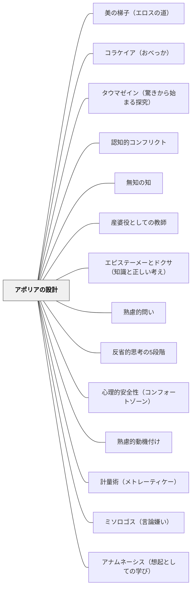

# アポリアの設計

> 知っていると思っていた状態から「わからない」へ——この転落が、本物の学びの始まりである。アポリア（困惑）は失敗ではなく、前進の証である。

## [Pattern Connection]

### プラトン『メノン』（前387年頃）——ソクラテスのエレンコスとアポリアの教育的構造

プラトン『メノン』（82a〜86b）の「召使いの少年との幾何学問答」は、アポリアの設計の最も精密な実演である。ソクラテスは字も計算も習っていない少年に正方形の面積問題を問答のみで解かせる。

**段階の構造（82a〜86b）：**

| 段階 | 少年の状態 | ソクラテスの行為 |
|------|-----------|----------------|
| 1. 自信ある誤答 | 「2倍の辺」と答える（誤り） | 問い返すのみ（教えない） |
| 2. 再誤答 | 「3倍の辺」と答える（誤り） | さらに問い返す |
| 3. アポリア | 「わかりません」 | 「難問に入ったことは害ではない」と評価 |
| 4. 補助線ヒント | 対角線に気づく | 最小のヒントのみ与える |
| 5. 自己発見 | 正しい答えに至る | 「内側にあった」知識を「想起」した |

ソクラテスは段階3でこう述べる：

> 「われわれはかれを難問で悩ませ……それでわれわれがこの子に何か害を与えたわけでもないのだろうね？（84a〜b）」
> 「したがってこの少年は、自分が知らなかったことがらについて、いまは以前よりもよりすぐれた状態にあるのではないだろうか？（84a）」

アポリアに入ること——「知っているつもり」から「わからない」への転落——が、前より優れた状態である。なぜなら、以前は「知っているつもりでいた」誤った自信があったからだ。アポリアはその誤った自信を打ち砕き、正直な探究の起点をつくる。

**エレンコス（論駁）の構造（71e〜79e）：**
1. 学習者が自信を持って答える
2. 反例・類比で矛盾を示す（教えるのではなく問う）
3. 学習者がアポリア（困惑）に陥る
4. 「難問に入ったことは前より優れた状態」と教師が評価する
5. 次の探究へ進む

**補強点**：[[パタン/認知的コンフリクト]] に既に記述されている「コンフリクト→探究」の構造の哲学的原型がここにある。Deweyの「困惑（perplexity）」（1916）が認知的コンフリクトの教育哲学的根拠を与えるとすれば、ソクラテスのエレンコス（前387年）は、教師が意図的に困惑を設計する「問答法の操作的手順」を与える。

**波及するパタン**：[[パタン/産婆役としての教師]]——「わたしのほうではかれに問うのみで教えない」（84c）はアポリアの設計が産婆役の核心であることを示す；[[パタン/無知の知]]——アポリアは「知らないことを知る」状態への移行点；[[パタン/エピステーメーとドクサ（知識と正しい考え）]]——アポリアを経て「なぜそうなるか」まで問うことがエピステーメーへの道；[[文献/メノン（プラトン）]] — 本統合の出典

### プラトン『プロタゴラス』（前387年頃）——立場の逆転エピローグ：アポリアの最高形態

プロタゴラス対話の結末（361a〜362a）は、アポリアの設計の最も深い実例を提供する。

対話の始まり：
- プロタゴラスは「徳は教えられる」と主張する
- ソクラテスは「徳は教えられないのでは？」と問いを立てる

対話の結末（逆転）：
- ソクラテスは「徳は知識だから、教えられるはずだ」と論証し終わる
- プロタゴラスは「徳は知識ではないかもしれない（だから教えられないかも）」と言いかける

| 対話の冒頭 | 対話の結末 |
|---------|---------|
| プロタゴラス：「徳は教えられる」 | プロタゴラス：「徳は知識ではないかも（教えられないかも）」 |
| ソクラテス：「徳は教えられないのでは？」 | ソクラテス：「徳は知識だ（教えられるはず）」 |

ソクラテスはこの逆転を認識し、こう言う：
> 「（徳が教えられるかどうかを確かめるには）まず徳そのものが何であるかを明らかにする必要がある。」（361c〜d）

この「立場の逆転」は、両者が「知っているつもりだったこと（徳は教えられるか）」が実は「知っていなかった（徳とは何かがわかっていなかった）」ことを露わにする——これはアポリアの設計の最高形態。問いが解かれるのでなく、より深い問い（「徳そのものとは何か」）が現れる。

**教育への示唆**：授業設計でアポリアの最高の形は、「答えが出た」ように見えた時点で「でも本当の問いはこちらではないか」という新たな謎が開くこと。単元の締めくくりに「今日の答えを出したことで、むしろわからなくなったことは何か」を問うことが、このパターンの実践形態。

**補強点**：アポリアの設計パタンに「単なる困惑」だけでなく「立場の逆転」というアポリアの最高形態が加わる——よく考えた結果、最初の確信が崩れて逆の立場になる体験。

**波及するパタン**：[[パタン/省察]] — 立場が逆転したとき「自分はなぜ最初そう思っていたか」を省察する機会が生まれる；[[文献/プロタゴラス（プラトン）]] — 本統合の出典

---

### プラトン『テアイテトス』（前369年頃）——対話自体がアポリアの最大の実演（210c）

『テアイテトス』は「知識とは何か」という問いを対話の中心に置き、三つの定義をすべて論駁してアポリアに終わる——この対話篇そのものがアポリアの設計の最大の実例である。

> 「わたしの技術はこの程度のことのみをおこないうるのであり……きみは健全な精神を示して、自分が知らないものを知っているとは思わないことだろう。」（210c）

> 「もしきみが将来さらに懐妊して満ちるところがあれば、それはわれわれがいま考察したことのおかげで、もっとよりすぐれたものになるだろう。」（210b）

**「対話篇自体が教材」としての読み方：**
『テアイテトス』は「知識とは何か」を教えない。読者は対話を追うことで三つの定義が次々と崩れるアポリアを体験する——この体験そのものが産婆術の実践である。テキストが「答えを与える」のでなく「アポリアを経験させる」ように設計されている。

**自己言及的アポリア（メタ・アポリア）：**
「知識とは何か」を問う対話が「知識の定義を得られなかった」で終わる——これは「知識についての知識が得られなかった」という自己言及的な構造を持つ。しかしこの「失敗」は最高水準のアポリアの設計——「何も分からなかった」より「何が分からないかが明確になった」状態。

**補強点**：アポリアの設計パタンに「テキスト自体をアポリアの設計として読む」という視点が加わる——授業の「良いテキスト」とは、答えを与えるテキストでなく、読者がアポリアを経験できるテキストかもしれない。

**波及するパタン**：[[パタン/産婆役としての教師]] — 対話の終わりで「将来の懐妊のために役立った」と言うソクラテスは産婆役の完成形；[[パタン/無知の知]] — アポリアの結末は「知らないことを知る」の実演；[[文献/テアイテトス（プラトン）]] — 本統合の出典

---

### プラトン『パイドン』（前380年頃）——ミソロゴス警告と第二の航海：アポリア設計の裏側（88c–91c, 99c–100a）

パイドンはアポリアの設計に関して、最も重要な**危険信号（ミソロゴス）**と**回復方法（第二の航海）**を与える文献である。

**ミソロゴス（言論嫌い）：アポリア過多のリスク（88c–91c）：**

シミアスとケベスが強力な反論で以前の議論を崩したとき、弟子たちが深い動揺に陥った。ソクラテスはこれを「ミソロゴス（言論嫌い）」と診断し、**アポリアの設計において最も避けるべき結果**として警告する：

1. 特定の議論への不信 → 2. 言論すべてへの不信 → 3. 考えること自体への不信 → 4. 世界への不信

> 「言論嫌いにならないように、ということだ。ちょうど、人間嫌いになるのに似てね。そう言うのも、人には言論を嫌うよりも大きな害悪を寝ることはないのだから。」（89d）

**アポリアの設計とミソロゴスの関係：**

| アポリア設計の段階 | ミソロゴスへの陥落リスク |
|---|---|
| アポリアが適切に設計されている | 「わからない」→探究の起点（健全） |
| アポリアが連続・強すぎる | 「わからない」→「わかるはずがない」（ミソロゴスの入口） |
| アポリア後に前進がない | 「やっぱりダメだった」→言論一般への不信 |
| ミソロゴスを認識して処方した | 責任は自分の評価技術にある、と立て直す |

→ アポリアを設計するときは、必ずその後の「前進（発見・探究）」とセットで設計しなければならない。

**第二の航海（deuteros plous）：アポリア後の探究方法（99c–100a）：**

ソクラテスは自然学的な原因探究（感覚による直接調査）がことごとく失敗した後、新しい方法へと転換する——「言論（ロゴス）という写しの中で真理を考察する」こと。

> 「言論へと避難して、あるものの真理をその場所で考察しなければならないと思われた。」（99d）

この「第二の航海」は、アポリア後に学習者を導く探究の方向を与える：感覚的・直観的な把握が行き詰まったとき、「ロゴス（言葉・概念・論証）を使って考え直す」という方法転換が有効である。

**ヒュポテシス法（仮説から始める探究）（99d–102a）：**

第二の航海の具体的方法が「ヒュポテシス（仮設）から始める」こと：「最も強い（整合的な）前提を選び、その前提から帰結を導いて、帰結が整合するかを確かめる」。アポリアで「わからなくなった」後に、「ではこれを前提としたら何が言えるか」という仮説演繹的な探究に入る。

**補強点**：アポリアの設計パタンに「ミソロゴスへの陥落リスク」と「陥落後の回復方法（第二の航海・ヒュポテシス法）」が加わる。アポリアを設計するとき、その「出口（探究の前進）」を同時に設計することが必須条件であることが明確になる。

**波及するパタン**：[[パタン/ミソロゴス（言論嫌い）]] — アポリア後の言論嫌いへの対処；[[パタン/エピステーメーとドクサ（知識と正しい考え）]] — 第二の航海とヒュポテシス法がエピステーメーへの道；[[文献/パイドン（プラトン）]] — 本統合の出典

---

### プラトン『ソクラテスの弁明』（前399年・執筆前390年代）——政治家・詩人・職人への問答：アポリア設計の最大規模の実例（21b–22e）

『ソクラテスの弁明』の「三種の知者への問答」は、アポリアの設計の**実社会規模での最大の実践例**である。ソクラテスは教室内ではなく、政治家・詩人・職人という三つの社会的階層全体に対して問答を実施し、その都度「知っているつもり」のアポリアを生み出した。

**三者への問答の設計構造（21b–22e）：**

| 対象 | アポリアの設計 | 生まれたアポリア |
|---|---|---|
| 政治家 | 「何を知っているか」を問い返す | 「徳について語れるが、なぜそれが正しいかは言えない」——政治的知識の根拠のアポリア |
| 詩人 | 「詩の意味を説明してください」と問う | 「自分の書いたものを自分で説明できない」——創造知識の根拠のアポリア |
| 職人 | 「他のことは？」と問い広げる | 「技術知識はあるが、それが全知の根拠にはならない」——専門知識の限界のアポリア |

**「知らないと思っている」という最後の立場（21d）：**

三種の問答の結果として、ソクラテスは自分の立場をこう総括する：

> 「私のほうは、知らないので、ちょうどそのとおり、知らないと思っている。とどうやら、なにかそのほんの小さな点で、私はこの人よりも知恵があるようだ。」（21d）

これは「アポリアの設計の後に教師は何を言うか」のモデル——「自分もわからない」を正直に保持することが、アポリア後の探究文化を支える。

**アポリアの社会的拡張：一人ではなく社会全体へ：**

メノンの少年（1対1）→テアイテトスの問答（師弟間）→政治家・詩人・職人（社会的階層全体）——アポリアの設計は個人から社会へと拡張できる。「この分野の専門家（知者）がアポリアに陥る」事実が観察可能になるとき、学習者は「自分がわからないのは当然」と感じやすくなる。

**補強点**：アポリアの設計は教室内の1対1問答だけでなく、「複数の専門家が同じ問いで困惑する」という設計もありうることが明らかになる。「徳の専門家（政治家・詩人・職人）でさえ徳を説明できない」という事実がアポリアを共有財産にする。

**波及するパタン**：[[パタン/パレーシア（真実を語る勇気）]] — 問答の中で「知らない」を正直に認める勇気；[[パタン/無知の知]] — 問答の結果として「知らないと思っている」という状態に至る；[[文献/ソクラテスの弁明（プラトン）]] — 本統合の出典

---

## 背景（Context）

「わかった」「知っている」という感覚は、しばしば本物の理解ではなく、表面的な記憶や慣れによる偽の自信である。学習者が「すでに知っている」と感じているとき、新しい情報は表面的に処理されるだけで、既有概念の組み替えは起きない。

プラトン『メノン』で、字も計算も習っていない少年がソクラテスに幾何学の問いを受ける。少年は最初、自信を持って誤った答えを出す。ソクラテスが問い返すたびに誤りが露わになり、少年はついに「わかりません」というアポリアの状態に入る。ソクラテスはこの瞬間を「以前より優れた状態」と評価する。偽の自信が崩れ、本当の探究が始まったからだ。

## 問題（Problem）

「知っているつもり」の学習者に情報を与えても、真の概念構成は起きない。教師が誤りをすぐに訂正するだけでは、学習者は「情報を上書きされた」だけであり、「なぜ誤っていたか」「なぜ正しいのか」を自ら構成していない。表面的な正解は得られるが、それは逃げやすい「正しい考え（ドクサ）」であり、安定した知識にはなりにくい。

## 力のかたち（Forces）

- アポリアは、誤った自信がある学習者にこそ設計する価値がある——最初から「わからない」と思っている学習者には別の設計が必要
- 問うのみで教えないことが、学習者自身のアポリアへの到達を可能にする——教師が先に答えを言えばアポリアは生まれない
- アポリアが強すぎると不安・あきらめになる。アポリアの後に探究・発見の体験が続くことが必須
- 心理的安全性がなければ、「わからない」を表明できず、アポリアが内側に隠れる
- アポリアを「失敗」として評価するクラス文化では、学習者はアポリアを避けるようになる

## 解決（Solution）

**学習者が自信を持って答えた後、問い返すことで自分の答えの矛盾に気づかせ、「わからない」というアポリアの状態を経験させる。教師はアポリアを「前より優れた状態」として肯定し、次の探究への足場を与える。**

アポリアの設計の手順：

1. **予測・確認を先に引き出す**——「これはどうなると思う？」「まず自分の答えを言ってみて」と問い、誤った自信を表明させる
2. **問い返すだけで訂正しない**——「それはなぜ？」「こういう場合はどう？」と関連する問いを投げ、矛盾が自然に露わになるのを待つ
3. **アポリアを肯定する**——「わからなくなった」という状態を「今ちょうど大切な場所にいる」と言葉にする。この一言がアポリアを恥から探究の入口へと変える
4. **最小限のヒントを与える**——自己発見を可能にする最小の足場（問い・図・例）だけを提供する。答えは与えない
5. **発見を学習者のものにする**——「自分でわかった」という体験を妨げない

---

**具体例1：算数「大きい数のかけ算」**

「23×4はいくつ？」に「92」と答えた後、「じゃあ23×40は？」と問う。「40倍」「420？」と誤答が出る。さらに「23×4が92なら、23×40はそれの何倍かな？」と問うと、かけ算の意味のアポリアが生まれる。

**具体例2：理科「水の沸騰」**

「水を100℃以上に熱したらどうなる？」と聞くと多くの子どもは「蒸発する」と答える。「じゃあ沸騰している水は100℃より熱い？」と問い返すと、「熱いはず……でも違うの？」というアポリアが生まれる。

**具体例3：道徳・社会「ルールの意味」**

「このルールは必要だと思う？」に「必要」と答えた後、「でも誰も守っていなかったらどうなる？」「ルールがなかった時代はどうだった？」と問い返すと、「なぜルールがあるのか」への本質的な問いに入る。

## 結果（Consequences）

- 学習者が「知っているつもり」から「本当に理解する」へと移行する体験を積む
- アポリアを「失敗」でなく「学びの入口」として受け取れるようになると、困難な問いへの耐性と探究心が育つ
- 「なぜ？」「本当にそうか？」と問い続ける習慣が生まれ、メタ認知的な学習姿勢が育つ
- 教師が「答えを与えない」ことへの学習者の初期不満が、時間とともに「自分で気づく喜び」に変わる
- アポリアを設計しすぎると、不安や無力感が強まる——発見体験（アポリア後の前進）とセットで設計することが必須

## 関連パタン
- [[パタン/美の梯子（エロスの道）]]
- [[パタン/コラケイア（おべっか）]]
- [[パタン/タウマゼイン（驚きから始まる探究）]]
- [[パタン/認知的コンフリクト]] — アポリアはソクラテス版の認知的コンフリクト；コンフリクトの設計構造と共通する
- [[パタン/無知の知]] — アポリアへの到達は「知らないことを知る」状態の具体的な体験
- [[パタン/産婆役としての教師]] — 「問うのみで教えない」というアポリアの設計が産婆役の中核
- [[パタン/エピステーメーとドクサ（知識と正しい考え）]] — アポリア後の探究が「なぜか」まで達するとエピステーメーになる
- [[パタン/熟慮的問い]] — アポリアを生む問いが熟慮的問いの一形態
- [[パタン/反省的思考の5段階]] — アポリア（段階①困惑）の後に続くDeweyの全プロセス
- [[パタン/心理的安全性（コンフォートゾーン）]] — アポリアが探究になるには安全な場が必要
- [[パタン/熟慮的動機付け]] — 親パタン
- [[パタン/計量術（メトレーティケー）]] — プロタゴラスの計量術：立場の逆転もアポリアの一形態——近い確信が測り直されて反転する
- [[パタン/ミソロゴス（言論嫌い）]] — アポリアの連続・過剰がミソロゴスを生む；アポリアと発見がセットであることが必須（パイドン88c-91c）
- [[パタン/アナムネーシス（想起としての学び）]] — アポリア（欠如体験）がアナムネーシスを起動する
- [[パタン/パレーシア（真実を語る勇気）]] — アポリア設計者は「知らない」を正直に認めるパレーシアを実践する
- [[文献/ソクラテスの弁明（プラトン）]] — 政治家・詩人・職人への問答（21b–22e）という社会規模のアポリア実践の出典

## クラスター図

## Actionable Insight

- 学習者が誤った答えを出したとき、すぐに訂正せず「それはなぜ？」「こういう場合はどうなる？」と問い返す——学習者が自分で矛盾に気づく3〜5分間が、アポリアへの道
- 「わからなくなりました」という声を聞いたとき、「今ちょうど大切な場所にいる」と言う——アポリアを失敗でなく前進として位置づける一言が学習文化を変える
- 単元の導入で「自分が知っていると思うことを書き出させる」→単元の途中で「その考えは今も正しいか？」と問い返す——設計されたアポリア体験が単元構造に組み込まれる

## 出典

プラトン（渡辺邦夫訳）（2022）『メノン——徳について』光文社古典新訳文庫（Bフ 2-2）, pp.82a–86b, 84a, 84c.
プラトン（渡辺邦夫訳）（2022）『プロタゴラス——あるソフィストとの対話』光文社古典新訳文庫（Bフ 2-1）, pp.361a–362a.
→ [[文献/プロタゴラス（プラトン）]] — 立場の逆転エピローグ（361a-362a）：アポリアの最高形態
プラトン（渡辺邦夫・立花幸司訳）（2022）『テアイテトス』光文社古典新訳文庫（Bフ 2-5）, pp.210b–c.
→ [[文献/テアイテトス（プラトン）]] — 対話自体がアポリアの実演（210c）

> 「したがってこの少年は、自分が知らなかったことがらについて、いまは以前よりもよりすぐれた状態にあるのではないだろうか？」——プラトン『メノン』84a
