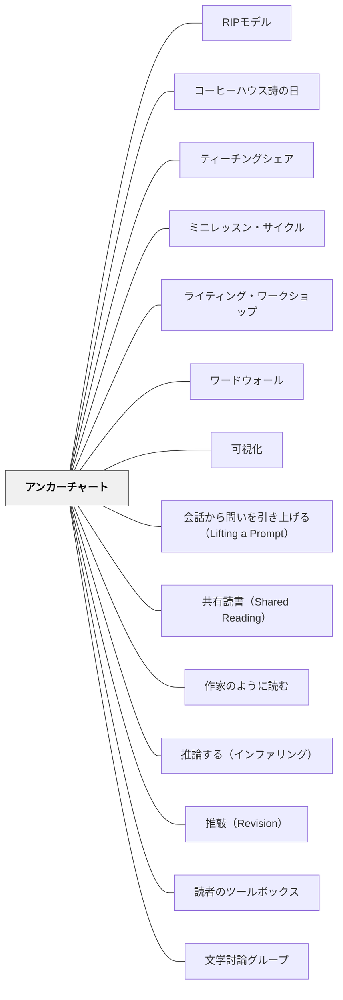

# アンカーチャート

> 「今日の授業の記録」ではなく、「一年を通じて参照し続ける、思考の錨」。

## [Pattern Connection]

Debbie Miller（2002）の **Reading with Meaning** は、読解ストラテジー指導において「アンカーチャート（Anchor Charts）」を中心的な実践ツールとして位置づける。指導後に教師と子どもが共同でチャートを作り、それを教室の壁に掲示し続ける——「今日何を学んだか」ではなく「私たちが考え続けていること」として機能させる。

- **補強点**：[[パタン/思考の可視化]] に「学習後もクラス全体の参照点として機能し続ける」という時間軸を加える。可視化は1回限りでなく、年間を通じた成長のドキュメントになる
- **拡張点**：[[パタン/シンクアラウド]] の「思考の見える化」を教室の物理空間に固定し、子どもたちが自律的に参照・追記できる形にする
- **他のパタンへの波及**：[[パタン/リーディング・ワークショップ]]・[[パタン/不思議を育てる]]・[[パタン/読みとつながる]]・[[実践/カンファリング（読書会議）]]

Miller の代表的なアンカーチャート「Thinking about Reading」は、**デコーディング（語の解読）** と **読解（意味の構築）** を2列で並べた一枚のチャート。子どもたちが「読むことには2種類の仕事がある」と視覚的に理解し、年間を通じて追記していく。

**Boushey & Moser（2014）統合（2026-05-15）——I-チャート：**

Daily 5 の **I-チャート（I-Chart）** はアンカーチャートの特殊形として位置づけられる。Miller のアンカーチャートが「思考内容（ストラテジー）」を記録するのに対して、**I-チャートは「行動期待値」を記録する**——「生徒はどう見えるか・どう聴こえるか」「教師はどう見えるか・どう聴こえるか」を2列で示す：

| 生徒の仕事（Students） | 教師の仕事（Teacher） |
|---|---|
| 本を目で追っている | 静かに観察する |
| 体が静止している | スタミナを計測する |
| 声を出さない | 邪魔しない |

**最重要の差異**：I-チャートも Miller のアンカーチャートも「**必ず生徒と一緒に作る**」——事前に教師が作ってラミネートしたものは「教師のルール」になり、生徒の帰属感が生まれない。この「共同作成」原則は両者に共通するアンカーチャートの核心だ。

**拡張された点**：アンカーチャートの用途が「学習内容の記録」から「期待される行動の共同合意」へと広がった——思考だけでなく、学習行動の文化そのものをチャートで育てられる

**Dorn & Soffos（2005）統合（2026-05-19）——ワークショップ全体の参照基盤：**

Dorn & Soffos はアンカーチャートを「**リーディング・ワークショップの記憶（memory of the workshop）**」として位置づける。ミニレッスンで教えた方略・言語・思考の痕跡をチャートに残し、独立読書・文学討論グループ・小グループ指導のすべてで参照される「共有の足場」として機能させる。

- **ミニレッスンとの接続**：Dorn & Soffos の5ステップ・ミニレッスン（[[パタン/ミニレッスン・サイクル]]）の最初のステップは「アンカーチャートの確認」。前回のレッスンで作ったチャートを参照することで、子どもたちは学びの蓄積の上に新しい指導ポイントを積み重ねる
- **文学討論グループとの接続**：[[パタン/文学討論グループ]] では、討論のルール（「もっと話してくれますか？」「証拠を教えて」）や討論で発見した「リテラル言語（Literate Language）」の表現をチャートに蓄積する。討論の前に「今日の討論で使いたい言葉」をチャートから探す習慣が、討論の質を高める
- **共有読書との接続**：[[パタン/共有読書（Shared Reading）]] の後に、子どもたちが気づいたことをチャートに追記する——Holdaway の「易しさと挑戦のリズム」を体験した後の発見が、読書方略のチャートに積み重なっていく
- **拡張された点**：アンカーチャートの「作る場面」が、ミニレッスン（ストラテジー指導）・共有読書（テキスト体験後）・文学討論グループ（討論の言語の蓄積）と多様化した。同じチャートが異なるワークショップコンポーネントをつなぐ「結節点」として機能する

**Collins（2004）統合（2026-05-24）：**

*Growing Readers* は**Reader's Toolbox アンカーチャート**という具体的なチャート形式を示す——「詰まったときに試すこと」リストを教室の目立つ場所に子どもの目の高さで掲示する。

- **補強された点（独立読書中の参照）**：ミニレッスンで紹介したストラテジーをチャートに加えていくことで、独立読書中に「詰まったとき」に子どもが自分でチャートを見て試せる。教師を呼ぶ前にチャートを確認する習慣が読書の自律性を育てる
- **拡張された点（成長の記録）**：年間を通じて「今日加えたストラテジー」がチャートに積み重なる——9月は2つだったものが3月には8つになっている。このチャートが「クラスが一年で学んだこと」の証拠になり、読書アイデンティティを育てる
- **他のパタンへの波及**：[[パタン/読者のツールボックス]] — ツールボックスの内容を常時掲示する物的環境として機能する

---

## 背景（Context）

読解ストラテジーの指導は、一度「教えた」だけでは身につかない。子どもたちは「今日の授業でこんなことを学んだ」という経験を、翌週の読書に自然には転移させない。教室に「学びの痕跡」が残っていないと、ストラテジーは揮発してしまう。

また、学習の成果物が「ノート」の中にしまわれると、他者と共有され、参照され、追記される機会がなくなる。読解ストラテジーは、「個人の習得」より先に「クラスの文化」になることが重要である。

## 問題（Problem）

授業で学んだストラテジーが、次の読書場面で使われない。教師が毎回「今日のポイントは…」と説明し直すことになる。学びが蓄積されず、クラス全体の知的文化が育たない。

## 力のかたち（Forces）

- 「学んだこと」を壁に残すだけで、子どもが自律的に参照し始める
- 教師と子どもが共同で作ると、子どもの「自分たちのチャート」という帰属感が生まれる
- チャートに追記できる余白があると、学習の「続き」が可視化される
- 捨てられるチャートより、年間使い続けるチャートの方が価値が高い
- 字が大きく読みやすいこと、教室の「生活空間」に存在することが参照を促す

## 解決（Solution）

**読解ストラテジーを指導した後、教師と子どもが共同でチャートを作り、教室の壁に一年間掲示し続ける。チャートは更新・追記が可能な「生きたツール」として機能させる。**

---

具体例①：「Thinking about Reading」チャート（Miller の代表的実践）

チャートを2列に分割する：

| デコーディング（語の解読） | 読解（意味の構築） |
|---|---|
| 文字と音のルールを使う | 自分の体験とつなげる（TS） |
| 知っている単語を探す | 別の本とつなげる（TT） |
| 前後の意味から推測する | 世界の知識とつなげる（TW） |
| 絵を手がかりにする | 頭の中でイメージを作る |
| 大きな声で読み直す | 「Huh?」のまま読み続けてみる |
| 部分に分けて考える | 推論する（書いていないことを考える） |

授業が進むたびに「右側の列」に新しい項目が加わる。子どもたちが自分の読書体験から「こんなことも読解だと気づいた」を持ち寄ると、チャートが育つ。

---

具体例②：「何がわかった？何がまだわからない？」チャート

ストラテジー指導の後：

- 紙を2つ折りにして「わかったこと」「まだわからないこと・気になること」に分ける
- 一週間後に「わかったこと」が増えたか確認する

---

具体例③：ストラテジー別チャートを並べて「読解の地図」にする

年間を通じて各ストラテジーのチャートを1枚ずつ追加する：

- Making Connections（つながり）
- Visualizing（視覚化）
- Inferring（推論）
- Determining Importance（重要なことを決める）
- Synthesizing（統合・合成）
- Questioning（問いを立てる）

学年末には6枚のチャートが教室の壁を彩り、「私たちの一年の読み方」の地図になる。

---

## 結果（Consequences）

- ストラテジーが「授業で教えたこと」から「教室の文化」になる
- 子どもたちが読書中に自分でチャートを参照し始める
- チャートへの追記が「学びが続いている」という視覚的な証拠になる
- 教師が「今日のまとめ」を繰り返す必要が減り、授業の時間が解放される
- 年度末に「一年間でこんなに学んだ」という積み重ねが見える

## 関連パタン
- [[実践/ライティング・ワークショップ年度初め]]
- [[実践/思考の記録サイクル]]
- [[実践/書き出しのクラフト]]
- [[パタン/RIPモデル]]
- [[パタン/コーヒーハウス詩の日]]
- [[パタン/ティーチングシェア]]
- [[パタン/ミニレッスン・サイクル]]
- [[パタン/ライティング・ワークショップ]]
- [[パタン/ワードウォール]]
- [[パタン/可視化]]
- [[パタン/会話から問いを引き上げる（Lifting a Prompt）]]
- [[パタン/共有読書（Shared Reading）]]
- [[パタン/作家のように読む]]
- [[パタン/推論する（インファリング）]]
- [[パタン/推敲（Revision）]]
- [[パタン/読者のツールボックス]]
- [[パタン/文学討論グループ]]
- [[パタン/問いをもつ（クエスチョニング）]]

- [[パタン/思考の可視化]] — アンカーチャートの理論的基盤
- [[パタン/シンクアラウド]] — チャートはシンクアラウドで生まれた思考を定着させる
- [[パタン/リーディング・ワークショップ]] — アンカーチャートが機能する授業構造
- [[パタン/不思議を育てる]] — Wonder Box と組み合わせると問いのチャートが生まれる
- [[実践/カンファリング（読書会議）]] — カンファリングで得た子どもの言葉をチャートに加える
- [[パタン/読みとつながる]] — TS/TT/TW チャートの具体的内容
- [[パタン/メタ認知的モニタリング]] — 「わかった・わからない」を可視化するモニタリングツール

## クラスター図

## Actionable Insight

- 次の読み語りの後、模造紙1枚に「今日気づいたことをみんなで書き出そう」と提案する——教室の壁に貼り続けるだけで、子どもが自然に参照し始める
- チャートに「追記できる余白」を意図的に作る——下部10cmを空白にして「続きを書いていい場所」と伝えると、子どもが主体的に更新する
- チャートを年度末まで捨てない——学年末に「一年前のチャート」と今を比べる活動が、成長の可視化になる

## 出典
- [[文献/Teaching for Deep Comprehension（Dorn & Soffos）]]

Miller, D. (2002). *Reading with Meaning: Teaching Comprehension in the Primary Grades*. Stenhouse Publishers.

> "Anchor charts are not a record of what was taught today; they are a living tool that children refer to, add to, and change over the course of the year."

[[文献/Reading with Meaning（Miller）]]
