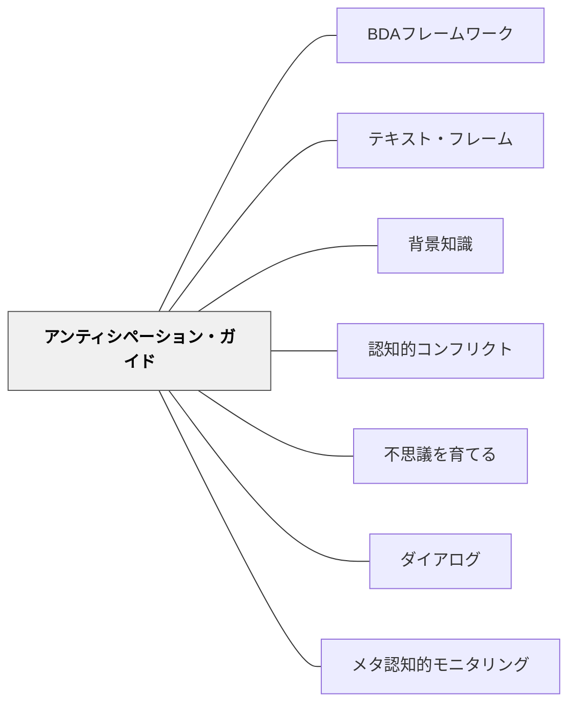

# アンティシペーション・ガイド

> 読む前に「あなたはこれに賛成ですか？」と問う——先入観を明示化し、テキストとの「認知的葛藤」を作ることで、どんな読者も目的を持って読み始める。

---

## Pattern Connection

**出典**: Buehl, D.（2017）*Classroom Strategies for Interactive Learning* (4th ed.). Stenhouse Publishers.

- **既存パタンとの関連**: [[パタン/BDAフレームワーク]] の Before フェーズの代表的方略。[[パタン/背景知識]] の「既有知識を活性化する」という目的を授業内の具体的な操作に落とし込んだツール。[[パタン/不思議を育てる]] の「問いと先入観」の文化と補完的に機能する
- **補強された点**: 「背景知識を活性化する」という曖昧な指示が、アンティシペーション・ガイドという具体的な操作として実現できるようになった。「読む前に問う」ことで読む目的が生まれる
- **修正・拡張された点**: アンティシペーション・ガイドは読む「前」だけでなく「後」にも戻る——Before と After の両方に機能する二重ツールとして設計される
- **他のパタンへの波及**: [[パタン/認知的コンフリクト]] — 先入観とテキスト情報の不一致が深い思考を生む。[[パタン/ダイアログ]] — ガイドへの回答をペア・全体で話し合うことで対話が生まれる。[[パタン/メタ認知的モニタリング]] — 「読む前と読んだ後で考えが変わったか」という振り返りがメタ認知を育てる

---

## 背景（Context）

Buehl（2017）が提唱するアンティシペーション・ガイド（Anticipation Guide）は、テキストのトピックに関する5〜8の「記述文」に、読む前に賛否や真偽を判断させ、読んだ後に改めて見直す戦略だ。

人は「何か問いを持っているとき」に最も深く読む。逆に「何も知らない・何も考えていない」状態でテキストに向かうと、文字を追っても意味が入らない——これが「読んだのに何も残らない」状態の正体だ。

アンティシペーション・ガイドはこの問題に構造的に応える：**先入観を明示化し、テキストとの「認知的葛藤（cognitive conflict）」を意図的に作ること**で、読む動機と目的が自然に生まれる。

記述文として書くことで「正しいかどうか」を確かめる意識が読みを引っ張り、読んだ後に「自分の考えが変わった・変わらなかった・補強された」という体験が学びの実感になる。

## 問題（Problem）

「今から○○について書かれた文章を読みましょう」という導入では、子どもたちは指示に従って読むが、**何を確かめるために読むのか**という内発的な目的がない。

先入観や誤概念（misconception）はテキストを読んでも消えない場合がある——「知識は更新された」はずなのに「自分が最初に思ったこと」が残り続ける。これは先入観が明示化されていないため、テキストとの衝突が起きないからだ。

## 力のかたち（Forces）

- 先入観はテキストと出会うだけでは変わらない——先入観が明示化されてはじめて衝突が起きる
- 認知的葛藤（「自分が思っていたことと違う！」）は、最も強い記憶・理解のきっかけになる
- 「賛否を書く」という軽い操作が「読む目的」を瞬時に作る——準備にかかる時間は少ない
- 読んだ後に同じガイドに戻ることで「考えが変わったかどうか」が自然に振り返れる
- 「正しい答えがない記述文」を使うと、多様な考えを尊重する文化につながる

## 解決（Solution）

**テキストのトピックに関する5〜8の記述文に、読む前に賛否・真偽を判断させる。読んだ後に同じガイドに戻り、考えが変わったか・テキストはどう言っているかを確認する。この「前後の往復」が読みの目的と深い思考を生む。**

---

### アンティシペーション・ガイドの設計

**記述文を選ぶコツ**：

1. **テキストの核心的な内容に関係する**：「知識として知ってほしいこと」ではなく「テキストが伝えようとしていること」を記述文にする
2. **先入観・誤概念に当たる**：子どもたちが持ちやすい誤った思い込みを記述文にすると、認知的葛藤が生まれやすい
3. **簡単には答えられない**：「もちろんそうだ」ではなく「どっちだろう？」と迷う記述文が理想
4. **読んだ後に答えられる**：テキストを読めば答えが見えてくる記述文にする

**記述文の例（理科：水の3つの状態）**：
```
水を100度以上に加熱すると「水蒸気」になる。     （賛成 / 反対）
コップの外側につく水滴は、コップの中の水が漏れ出たものだ。  （賛成 / 反対）
氷は水よりも密度が高いから水に沈む。          （賛成 / 反対）
雲は水蒸気でできている。               （賛成 / 反対）
```

**記述文の例（社会：江戸時代の暮らし）**：
```
江戸時代の人々はほとんど旅行をしなかった。      （賛成 / 反対）
江戸時代には今と同じくらいリサイクルが盛んだった。  （賛成 / 反対）
江戸時代の大都市・江戸は当時世界最大級の都市だった。  （賛成 / 反対）
```

---

### 授業での使い方（BDAに沿って）

**Before（読む前）**：
1. ガイドを配布（または板書・プロジェクター）
2. 「まだ読む前に、自分の考えで答えてください」
3. 個人で記入（1〜2分）
4. ペアで「自分はどう答えたか」を話し合う（2〜3分）
5. 「さて、テキストはどう言っているか、読んで確かめましょう」

**During（読む間）**：
- ガイドの記述文を意識しながら読む
- 「この記述文について、テキストにはどう書いてある？」と問い続ける

**After（読んだ後）**：
1. 同じガイドに戻る：「テキストを読んで、あなたの答えは変わりましたか？」
2. 個人で再記入・メモ追加（1〜2分）
3. ペア・全体でシェア：「変わった」「変わらなかった」「テキストには〇〇と書いてあった」

**最も重要な問い（After）**：
> 「テキストを読んで、自分の考えが変わったところはどこですか？なぜ変わりましたか？」

これが最も深い学びのトリガーになる。

---

### バリエーション

| バリエーション | 場面 |
|---|---|
| **True/False 形式** | 「正しい・正しくない」を書く——理科・社会の事実確認テキスト向き |
| **Agree/Disagree 形式** | 「賛成・反対」を書く——意見・立場が分かれる内容向き（価値観の違いも引き出せる） |
| **1〜5スケール形式** | 「1（全く思わない）〜5（強く思う）」で段階評価——意見の温度差を可視化できる |
| **グループ記入** | 個人ではなくグループで合意形成——対話が主目的のとき |

---

## 結果（Consequences）

- 「何を確かめるために読むか」という目的を持つ読者が育つ——文字を追うだけの読みから脱する
- 誤概念・先入観がテキストとの衝突によって修正される——「教えられた」ではなく「自分で確かめた」という学びの実感
- 読んだ後に「考えが変わった」という体験が、批判的思考・知識の更新の学習観をつくる
- ペアでの話し合いがガイドを通じて自然に起きる——対話の「種」になる
- ただし、記述文の質が低い（簡単すぎる・テキストと無関係）と効果が低い——設計に時間がかかる
- 「答えが一つでない」記述文を使うと、「正解を確かめる」読みから「自分の考えを深める」読みへ移行できる

## 関連パタン

- [[パタン/BDAフレームワーク]] — Before フロントローディングの代表的方略として位置づけ
- [[パタン/テキスト・フレーム]] — Before フェーズで使う別のフロントローディング手法
- [[パタン/背景知識]] — アンティシペーション・ガイドが既有知識を活性化する理論的根拠
- [[パタン/認知的コンフリクト]] — 先入観とテキストの衝突が深い学びを生む
- [[パタン/不思議を育てる]] — 「本当にそうかな？」という問いを事前に引き出す文化
- [[パタン/ダイアログ]] — ガイドへの回答を巡る対話がクラスの思考を深める
- [[パタン/メタ認知的モニタリング]] — 「自分の考えが変わったか」という自己観察

---

## クラスター図



## Actionable Insight

- 次の説明文の授業で、内容に関する3〜4の記述文を「読む前に賛否を書く」として出す——準備に5分かかるだけで、読む目的が変わる
- 「この記述文、読んだ後に答えが変わった人は？」と授業の終わりに手を挙げさせる——「変わった」体験の称賛が批判的思考の文化を育てる
- 理科の単元の最初に「先入観チェック」として使う——「実は間違っていた！」という認知的葛藤が単元への興味をつくる出発点になる

---

## 出典

Buehl, D. (2017). *Classroom Strategies for Interactive Learning* (4th ed.). Stenhouse Publishers.

> 「アンティシペーション・ガイドはテキストの主要なアイデアを予告する——読者の思考と先入観を活性化する記述文を通じて。」——Buehl（2017）
