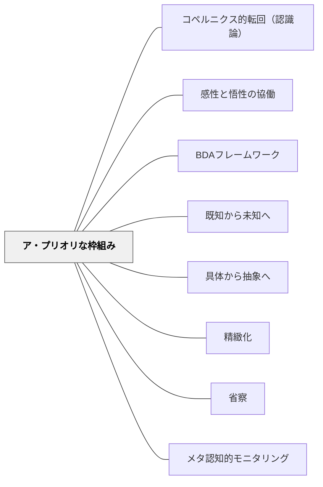

# ア・プリオリな枠組み

> 経験が認識を作るのではない。認識の形式が、経験を可能にする。——カント的発想を教育へ

---

## [Pattern Connection]

**カント（1781/1787）統合：**

- **哲学的基盤の提供**：[[パタン/先行オーガナイザー]]（オーズベルの先行組織化）が「先行知識の活性化が新しい学習を助ける」と主張することの哲学的根拠として、カントの「ア・プリオリな認識形式」が機能する。学習者は経験以前から認識の枠組みを持っており、この枠組みが新しい経験を「経験」として成立させる。
- **補強する既存パタン**：[[パタン/BDAフレームワーク]] のBefore（前段階）は、この枠組みの活性化・確認そのものである。
- **修正・拡張**：「先行知識を確認する」という実践論を超えて、「学習者には経験より前から概念的な枠組みがある」という認識論的な洞察を加える。誤概念もまた「ア・プリオリな（学習者がそれまでに構成した）枠組み」であり、単なる「欠如」ではなく「積極的な構造」である。
- **波及するパタン**：[[パタン/感性と悟性の協働]]、[[パタン/コペルニクス的転回（認識論）]]、[[パタン/具体から抽象へ]]

---

## 背景（Context）

カント（1781）は経験論（ロック：心はタブラ・ラサ＝白紙）と合理論（ライプニッツ：生得的観念）の両方を批判的に継承した。カントの答えは：**認識の内容は経験から来るが、認識の形式は経験に先立って（ア・プリオリに）備わっている**。

時間・空間は経験から学んだものではなく、経験を可能にするための感性のア・プリオリな形式である。カテゴリー（量・質・関係・様相）は経験から抽出したものではなく、経験を「経験」として統一する悟性のア・プリオリな形式である。

これを教育的文脈に読み替えると：**学習者は授業に来る前から、その教科の現象を解釈するための枠組み（直観・誤概念・類推の構造）を持っている**。この枠組みが「新しい学習内容をどのように受け取るか」を先に規定している。

## 問題（Problem）

教師は「学習者の頭は空白で、そこに知識を書き込む」という無意識のモデルで授業を設計しがちである。

しかし実際には：
- 「重い物ほど速く落ちる」（ガリレイが否定した誤概念）を子どもたちは既に持っている
- 「3/4 + 1/4 = 4/8」（分母も足す）という分数の誤概念は経験的に構成された枠組みである
- 「正の数に正の数をかけると増える」という枠組みがあるため、「0.5 × 0.5」の結果に驚く

枠組みを無視した指導は、枠組みと新情報が衝突しても学習者が気づかないまま終わる。あるいは新情報を枠組みに「誤吸収」する。

## 力のかたち（Forces）

- 学習者の枠組みはその子の経験の歴史から形成された——「間違い」ではなく「それまでの経験から合理的に構成した認識」である
- 枠組みを意識させないまま新しい情報を与えても、枠組みが変わらなければ知識は表面的に留まる（概念変容が起きない）
- 枠組みの把握には時間がかかる——しかし把握なしに始める授業は後で大きな修正を要する
- 枠組みは教科によって異なる（算数の枠組みと理科の枠組みは違う）
- 枠組みには個人差がある——同じクラスでも、全員の枠組みが同じではない

## 解決（Solution）

**授業の前に（または単元の冒頭で）、学習者が既に持っている枠組みを意図的に引き出し、可視化し、その枠組みを足場にして新しい学習内容を接地させる。**

---

### 実践①：枠組みの可視化（学習前の予測・推測活動）

新しい概念・現象を提示する前に、「これはどうなると思う？」「この問題の答えを予測してみて」と問う。

学習者の答えは「現在の枠組み」の外在化である。教師はこれを板書・分類・共有する——「みんなの予測は大きく分けてAとBの二種類ある。どちらが正しいか調べてみよう」。

---

### 実践②：誤概念の「構造」を理解する

誤った答えを「なぜそう考えたのか」と問う。「3/4 + 1/4 = 4/8 と考えた人は、どういう考え方をした？」——誤概念の論理を可視化することで、どこで枠組みを修正すべきかが見える。

「この答えは間違いだが、このように考えた理由はわかる」という姿勢が、学習者の枠組みを尊重しながら修正する態度。

---

### 実践③：「橋渡し比喩」で枠組みと新概念をつなぐ

学習者が既に持つ枠組み（先行知識）から、新しい概念へのアナロジー（類推）を作る。

- 「分数を『ピザを分ける』という枠組みで持っている学習者」→「分数の掛け算は『ピザの一部分の、さらに一部分』」という橋渡し
- 「速さの枠組みを持っている学習者」→「微分は『瞬間の速さ』という橋渡し」

枠組みを無視して新概念を押しつけるのではなく、枠組みを橋渡しとして新概念への道を設計する。

---

### 実践④：単元末の「枠組みの更新」を確認する

「単元の最初に思っていたことと、今の理解はどう変わったか？」という問いで、枠組みの変容を学習者自身が言語化する（[[パタン/省察]]）。

「最初は○○だと思っていたが、今は××とわかった。理由は……」という形式の省察が、深い概念変容の証拠になる。

---

## 結果（Consequences）

**成功した場合：**
- 枠組みの可視化によって誤概念が授業の「素材」になる——「あの子はなぜ間違えたのか」ではなく「この誤概念の構造を皆で調べよう」という学習文化が生まれる
- 新概念が学習者の既存枠組みに「接地」されることで転移可能な深い理解が生まれる
- 学習者が自分の認識過程を意識できる（メタ認知）

**留意点：**
- 「先行知識があれば何でも活かせる」という楽観論への注意——誤概念が強固すぎると新概念への「抵抗」になることもある。枠組みの修正には概念的衝突（認知的葛藤）が必要な場合がある
- 枠組みの把握は「クラス全体の平均的な枠組み」に留まりがち——個別の枠組みの把握には形成的評価・カンファリングが必要

## 関連パタン

- [[パタン/コペルニクス的転回（認識論）]] — 「対象が認識に従う」発想の根本。本パタンの基盤
- [[パタン/感性と悟性の協働]] — 枠組みは感性の形式（直観）と悟性の形式（カテゴリー）から成る
- [[パタン/BDAフレームワーク]] — Before（事前活性化）が本パタンの実践的形態
- [[パタン/既知から未知へ]] — 枠組みを足場として未知へ進む原則
- [[パタン/具体から抽象へ]] — 枠組みは具体的経験から形成される
- [[パタン/精緻化]] — 枠組みに新情報を精緻に結びつける
- [[パタン/省察]] — 枠組みの変容を自覚するプロセス
- [[パタン/メタ認知的モニタリング]] — 自己の枠組みを観察する能力
- [[文献/純粋理性批判 1（カント、中山元訳）]] — 出典

---

## クラスター図

## Actionable Insight

- 単元の初回授業で5分間「これについて今どう思っているか」を付箋に書かせる——学習者の枠組みの可視化が最初の一手
- 「なぜそう思った？」という問いを「間違い」の後に必ずつける——誤概念の構造を尊重する問い方
- 授業前に「この単元でよく見られる誤概念は何か」を自分で予測しておく——枠組みを先読みすることで指導がスムーズになる
- 単元末に「最初と今で、理解はどう変わったか1文で書いてみよう」と問う——枠組みの更新を学習者が確認する

---

## 出典

Kant, I. (1781/1787). *Kritik der reinen Vernunft* [純粋理性批判].  
中山元訳（2010）『純粋理性批判 1』光文社古典新訳文庫.

> 「わたしたちのすべての認識は経験とともに始まる。……このようにわたしたちのすべての認識が経験とともに始まるとしても、すべての認識が経験から生まれるわけではない」——序論001-002

→ 関連文献：[[文献/純粋理性批判 1（カント、中山元訳）]]
