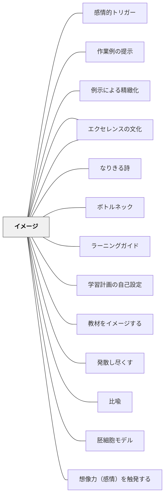

# イメージ

> 良いイメージを持てなければ、学習は成功しない。

## 背景（Context）

「エクセレンスの文化」とも深く関わるパタン。良いものを作ろうとしても、どんな良いものがあるのかというイメージがなければ目指すことができない。感情・想像力を触発する要素として、目指すべき具体的なイメージを持てることが不可欠である。

## 問題（Problem）

学習者がゴールや目指すべき姿のイメージを持てないまま学習すると、方向が定まらず意欲も上がらない。「どうなりたいのかわからない」「求められていることがわからない」状態では達成感が生まれない。

## 力のかたち（Forces）

- 具体的なイメージがあってこそ、到達するための方法を考えられる
- 良い事例（モデル）を見ることでイメージが豊かになる
- 想像できることは実現できる——イメージの力（棚橋弘至）
- 良いイメージは内発的動機を高め、目標設定を精緻にする

## 解決（Solution）

**学習者が目指すべき状態・完成形の良いイメージを持てるよう、具体的なモデル・事例・作品を提示する。**

- ジャンル学習では、複数の良い日記・俳句などの事例を読み比べてイメージを形成する
- 体育では、自分がやってみせる・できる人にやってもらう・動画を見せるなどしてイメージを共有する
- アンテナを張って良い事例（モデル）となる教材を収集し続ける

## 結果（Consequences）

- 学習者が目標を具体的にイメージでき、意欲が高まる
- 「こうなりたい」という方向性が明確になり、自己調整が働く
- 良いイメージが感情と想像力を触発し、学習への没入を生む

## 関連パタン
- [[パタン/感情的トリガー]]
- [[パタン/作業例の提示]]
- [[パタン/例示による精緻化]]
- [[パタン/エクセレンスの収集家]]
- [[パタン/なりきる詩]]
- [[パタン/ボトルネック]]
- [[パタン/ラーニングガイド]]
- [[パタン/学習計画の自己設定]]
- [[パタン/教材をイメージする]]
- [[パタン/発散し尽くす]]
- [[パタン/比喩]]
- [[パタン/胚細胞モデル]]

- [[パタン/想像力（感情）を触発する]] — 親パタン
- [[パタン/エクセレンスの文化]] — 良いものを目指す文化
- [[パタン/目標設定]] — イメージを目標に変換する
- [[パタン/最終イメージ（目指す具体の姿）]] — 指示における最終イメージの提示
- [[パタン/研究動機の先行執筆]] — 「おわりの姿を先にもつ」という原則の探究学習版
- [[パタン/問いと結論のタイトル化]] — タイトル（最後の姿）を先にイメージすることとの共鳴

## クラスター図

## Actionable Insight

- 単元の最初に「こんなことができるようになる」という具体例・実物・動画を見せる——良いイメージを先に持つことが学習者の方向性と意欲を変える
- 体育では自分がやって見せるか動画を使い、「動きのイメージ」を言葉より先に共有する——身体技能のイメージは言語より先に身体で受け取るほうが有効
- ジャンル学習で書く前に同ジャンルの優れた作品を2〜3本読み比べ「良さの条件」を言語化する——複数例の比較がイメージを豊かにする最も確実な方法

## 出典
- [[文献/一つの教育のパタン・ランゲージ]]

- キアラン・イーガン（2010）『想像力を触発する教育――認知的道具を活かした授業づくり』北大路書房
- 棚橋弘至（2013）『棚橋弘至はなぜ新日本プロレスを変えることができたのか』飛鳥新社
- [[文献/想像力を触発するパターンリスト（動画記録）]]
