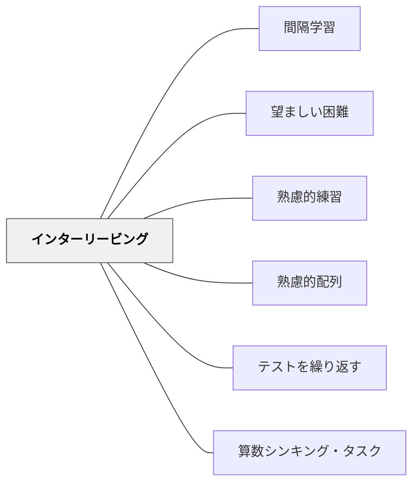

# インターリービング

> 同じ種類の問題をブロックで繰り返すより、異なる種類を混ぜて練習する方が「何を使えばいいかを判断する力」が育ち、長期的な学習効果が高い。

---

## Pattern Connection

**出典**: Weinstein, Y. & Sumeracki, M.（2018）*Understanding How We Learn*. Routledge.（統合：2026-05-14）

- **既存パタンとの関連**: [[パタン/熟慮的練習]] の「意図的な反復」に「何を混ぜ、どう配置するか」の次元が加わる。[[パタン/間隔学習]] と組み合わせると「異なる種類を混ぜる」ことで自然に各種類の間隔が生まれる。
- **新しい知見**: ブロック練習は学習中の感触が良い（「わかった感」）がテスト成績には弱い。インターリービングは練習中の感触が悪い（「難しい」）がテスト成績が優れる——これが「望ましい困難（Desirable Difficulties）」の典型例。
- **他のパタンへの波及**: [[パタン/熟慮的配列]] が「どの順序で問題を配置するか」という設計として機能する。[[パタン/間隔学習]] とセットで使うと相乗効果が高い。

---

## 背景（Context）

多くの教科書・ドリル・授業設計は「ブロック練習（Blocked Practice）」を採用している——足し算を20問解き終えたら引き算に進む、今日は三角形の問題だけ解く、という方式だ。これは直感的に合理的に見える。同じ種類の問題に集中することで「できた」という達成感が得られ、学習者も教師も「理解した」と感じやすい。

しかし認知心理学の研究（Rohrer & Taylor, 2007; Kornell & Bjork, 2008）は、ブロック練習が生む「流暢さ」が**学習の幻想（Illusion of Knowing）**だと示す。ブロック練習で流暢になった学習者は、問題の種類が混在したテストで——現実的な「いつこれを使うのかを判断しながら解く」状況——パフォーマンスが下がる。

インターリービング（Interleaved Practice）は、異なる種類の問題・内容・技能を混ぜて練習することで、**「何を使えばいいかを判断する力」** を育てる。これは単に記憶するだけでなく、文脈に応じて適切な方略を選ぶ高次の学習目標に対応する。

## 問題（Problem）

ブロック練習では次の問題が起きる：

- 「今は引き算の単元だから引き算を使えばいい」という**文脈依存の解決**が形成される
- 種類を判断する練習なしに次の種類に移るため、**弁別力（どれを使うか）**が育たない
- 単元テストでは良い点が取れても、後の混合テストや実際の問題解決ではつまずく
- 学習者は「できた」という感触を得るが、実際の定着は浅い

## 力のかたち（Forces）

- インターリービングは練習中に難しく感じる——学習者と教師が「非効率だ」と感じやすい
- しかしこの「難しさ」こそが望ましい困難であり、定着を強化する
- 初期学習（まだ一種類の内容を理解していない段階）ではブロック練習の方が適切
- インターリービングは「初期理解の後、弁別と転移を育てる段階」に効果を発揮する
- 現実の問題解決は常に「どの方法を使うか」の判断を含む——ブロック練習はこの現実に対応しない

## 解決（Solution）

**初期学習の後、練習段階で問題の種類を意図的に混ぜる。「今日は何の単元か」を手がかりにしなくても解けるよう、弁別と転移の力を育てる。**

---

### インターリービングが有効な場面

| 場面 | ブロック練習 | インターリービング |
|------|------------|-----------------|
| 算数の計算練習 | 足し算20問→引き算20問 | 足し算・引き算・かけ算を混ぜた20問 |
| 算数の文章題 | 面積の問題10問→周の問題10問 | 面積・周・体積を混ぜた問題10問 |
| 語彙学習 | 今週の語彙だけを練習 | 今週+先週+先々週の語彙を混ぜて練習 |
| 漢字練習 | 今日の漢字を10回書く | 今日+先週+先々週の漢字を混ぜてランダムに書く |
| 理科の実験問題 | 同じ単元の実験問題をまとめて解く | 複数単元の実験設計問題を混ぜて解く |

---

### 実装の手順

**Step 1: 初期学習はブロックで**
新しい内容・種類を導入するときは、まず集中して理解させる（ブロック練習）。「何をするのか」が分からない段階でインターリービングをしてもただの混乱になる。

**Step 2: 理解が安定したらインターリービングへ移行**
「一応解けるようになったら、混ぜた練習に切り替える」。移行のサインは「この種類の問題は手順がわかった」という学習者の感触。

**Step 3: 宿題・ドリルを混合にする**
宿題のラスト3問を「今までの単元から1問ずつ」にする。問題集を作るときは「今日の練習+過去の練習」の混合セットにする。

**Step 4: 学習者に「なぜ混ぜるか」を説明する**
「混ぜた練習は難しく感じるけれど、それが力になっている証拠です。種類を自分で判断する練習をしています」

---

### 算数での実例：練習問題の設計

❌ ブロック練習（一般的な宿題）:
```
面積を求めよう
1. たて4cm よこ6cmの長方形
2. たて3cm よこ8cmの長方形
3. 1辺5cmの正方形
...（面積ばかり10問）
```

✅ インターリービング（改良版）:
```
答えよう
1. たて4cm よこ6cmの長方形の面積は？
2. たて3cm よこ5cmの長方形の周は？
3. 面積が24cm²の長方形の辺の組み合わせは？
4. 1辺5cmの正方形の面積は？周は？
...（面積・周・組み合わせを混ぜた問題）
```

---

## 結果（Consequences）

- 「どの方法を使うか」の判断力（弁別力）が育ち、現実の問題解決に転移しやすくなる
- 長期的なテスト成績が、ブロック練習より優れる
- 学習中は難しく感じる——学習者は「今日は間隔より前の方がわかりやすかった」と感じる
- 実装には意図的な教材設計が必要——問題集の組み替え・宿題の再設計を伴う
- 「なぜこれをやるのか」の説明なしでは、学習者の動機が下がりやすい

## 関連パタン
- [[特別支援/身体と学習]]
- [[教科/算数]]
- [[教科/国語]]
- [[実践/リテラシー・ワークステーションの起動]]
- [[実践/書き出しのクラフト]]
- [[教科/算数・数学で使うパタン]]

- [[パタン/間隔学習]] — インターリービングは自然に間隔を生む
- [[パタン/望ましい困難]] — 「混ぜた練習が難しく感じる」のが望ましい困難の典型例
- [[パタン/熟慮的練習]] — 意図的な練習設計の上位パタン
- [[パタン/熟慮的配列]] — 学習経験の順序・配置を設計する
- [[パタン/テストを繰り返す]] — インターリービングされた問題での検索練習
- [[概念/認知負荷理論]] — 初期学習段階はブロック練習が適切な理由（内在的負荷の管理）
- [[パタン/算数シンキング・タスク]] — MildからSpicyの異なる種類を混ぜる設計
- [[実践/学習科学の6方略]] — インターリービングを含む6方略の授業実装ガイド
- [[文献/認知心理学者が教える最適の学習法（Weinstein & Sumeracki）]] — 一次資料

---

## クラスター図



## Actionable Insight

- **算数の宿題の最後の3問を「混合問題」にする**——今日の単元だけでなく、先週・先々週の問題から1問ずつ追加する。準備コストは低いが効果は大きい
- **「どの種類の問題か」を聞いてから解かせる**——「これは面積の問題？周の問題？どうやって判断した？」という問いを1回入れる。弁別の練習が始まる
- **「混ぜた練習が難しく感じるのは効いている証拠」と伝える**——これを言わないと、学習者は「わかりにくい授業だ」と感じて終わる

---

## 出典

Weinstein, Y., Sumeracki, M., & Caviglioli, O.（2018）. *Understanding How We Learn: A Visual Guide*. Routledge.

Rohrer, D., & Taylor, K.（2007）. The shuffling of mathematics problems improves learning. *Instructional Science*, 35, 481–498.

> "Interleaving is harder, it feels less productive, but the evidence consistently shows it leads to better long-term learning outcomes."
