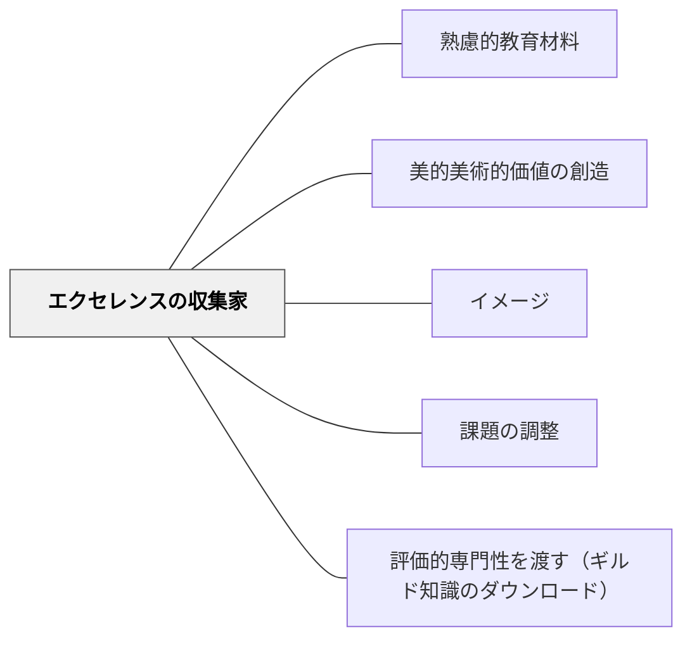

# エクセレンスの収集家

> 優れた作品・事例・実践（エクセレンス）を収集・分析することで、質の基準と感覚を育てる。

## 背景（Context）

学習者が「良いもの」の基準を内面化するために、優れた事例（エクセレンス）を収集・展示・分析する活動。イメージパタンとも関連し、棚橋弘至の「自分の中に"良いもの"の引き出しをつくる」という考え方に通じる。美的価値の創造・鑑賞教育でも核となる手法。

## 問題（Problem）

「良い仕事」「良い作品」の基準を言葉で説明しても伝わらない。実例のコレクションがなければ学習者に質の感覚が育たない。

## 力のかたち（Forces）

- 多様なエクセレンスの事例が質の幅と深さの感覚を育てる
- 自分でエクセレンスを探す過程が学習者を主体的にする
- 収集物が共有されると学習コミュニティが豊かになる

## 解決（Solution）

**優れた作品・実践・解決策の事例（エクセレンス）を収集・共有・分析する活動を学習に組み込む。「なぜ優れているか」を言語化するプロセスを通じて質の基準を内面化させる。**

## 結果（Consequences）

- 学習者が「良いもの」の基準を感覚的・言語的に内面化できる
- 高い目標に向かう動機が生まれる

## 関連パタン
- [[学級経営/学級経営で使えるパタン]]
- [[実践/言葉をよりすぐって俳句を作ろう]]
- [[実践/俳句と短歌を楽しもう]]
- [[学級経営/文化をつくる]]

- [[パタン/熟慮的教材教具]] — 親パタン
- [[パタン/美的美術的価値の創造]] — 美の感覚の育成
- [[パタン/イメージ]] — 良いイメージの収集
- [[パタン/課題の調整]] — エクセレンスを目標とした調整
- [[パタン/評価的専門性を渡す（ギルド知識のダウンロード）]] — 集めた実例は、教師の暗黙的な質の基準を学習者へ渡すための素材になる（Sadler, 1989）

## クラスター図

## Actionable Insight

- 単元の中で「素晴らしい作品・実践の事例を1つ探して持ってくる」課題を出す——自分でエクセレンスを探す過程が質の基準を感覚として身につける主体的な経験になる
- 収集した事例を全体で共有し「なぜこれが優れているか」を1分で言語化させる——「よさ」の言語化が内面の質の基準を育てる
- 教師自身が「これはエクセレンスだと思う」事例を意識的に授業に持ち込み続ける——教師が質の収集家である姿が学習コミュニティのエクセレンスへの志向をつくる

## 出典

- 鈴木克明（2002）『教材設計マニュアル――独学を支援するために』北大路書房
