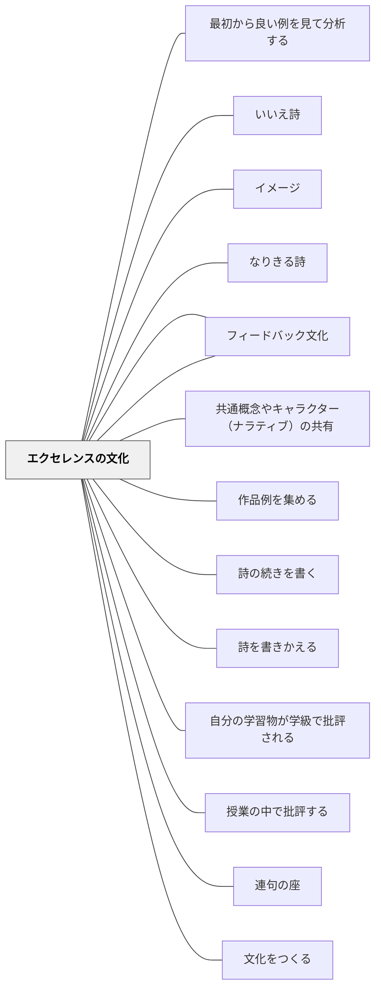

# エクセレンスの文化

> エクセレンスの秘密は、文化にあります。質の高い作品を生み出すことを期待し、支援を惜しまない文化があると、子どもたちはその文化に適応しようとするのです。— ロン・バーガー

## 背景（Context）

子どもたちは周囲の期待水準に適応する。「それで十分」という文化では「それで十分」な作品しか生まれず、「もっと良くできる」という文化では学習者は限界を超えようとする。

## 問題（Problem）

低い期待値が当たり前になると、学習者は「どうせ」という諦めを内面化し、卓越に向かうエネルギーを出せなくなる。逆に、卓越を強要すると恐れと萎縮を生む。

## 力のかたち（Forces）

- 卓越のモデル（一流の作品）を見ることで、内部の基準が上がる
- 「達成可能だ」という感覚がなければ、高い目標は意欲を下げる
- 批評は安全な関係の中でのみ成長の燃料になる

## 解決（Solution）

**高い基準を学習者と一緒につくり、卓越した作品のモデルを示し、批評と改善のサイクルを文化として育てる。**

ロン・バーガーの実践：
1. **成功基準・達成基準を学習者と共に作る**（外から押し付けない）
2. **優れた作品を見せる**（「これが可能だ」というビジョンを共有）
3. **批評のプロトコルを使う**（「温かく、具体的で、役立つ批評」）
4. **複数のドラフト**（最初の作品を最終版にしない）
5. **完成した作品を大切に扱う**（掲示・保存・発表）

## 結果（Consequences）

- 学習者が「自分の作品を誇りに思う」経験を積む
- 批評が攻撃ではなく贈り物として機能する文化が育つ
- 「最初は粗削りでいい、磨けばよくなる」という学習観が根付く

## 関連パタン
- [[パタン/最初から良い例を見て分析する]]
- [[パタン/いいえ詩]]
- [[パタン/イメージ]]
- [[パタン/なりきる詩]]
- [[パタン/フィードバック]]
- [[パタン/共通概念やキャラクター（ナラティブ）の共有]]
- [[パタン/作品例を集める]]
- [[パタン/詩の続きを書く]]
- [[パタン/詩を書きかえる]]
- [[パタン/自分の学習物が学級で批評される]]
- [[パタン/授業の中で批評する]]
- [[パタン/連句の座]]

- [[パタン/文化をつくる]] — 親パタン
- [[パタン/フィードバック文化]] — 批評をフィードバックとして使う
- [[パタン/一流から学ぶ]] — 卓越のモデルを外部から得る
- [[パタン/内部と外部それぞれの視点を取り入れる]] — 外部の基準が内部を高める
- [[パタン/間違いや失敗から学ぶ文化]] — 改善の前提としての失敗の受容

## クラスター図

## Actionable Insight

- 良い作品・良い実践を1つ「クラスの宝」として掲示・保存する——卓越のモデルを身近に置くことで内部の基準が上がる
- 「温かく・具体的で・役立つ批評」の3条件をクラスで1回確認してからピアフィードバックを行う——批評のプロトコルが安全な批評文化の土台
- 作品の「第2ドラフト」を1単元に1回取り入れる——最初の作品が最終版でないことが当たり前になると改善志向が育つ

## 出典

- Berger, R. (2003). *An Ethic of Excellence: Building a Culture of Craftsmanship with Students*. Heinemann.（邦訳（2023）『子どもの誇りに灯をともす』英治出版）
- 動画記録：[[文献/コミュニティオブプラクティスと文化をつくるパタン（動画記録）]]
