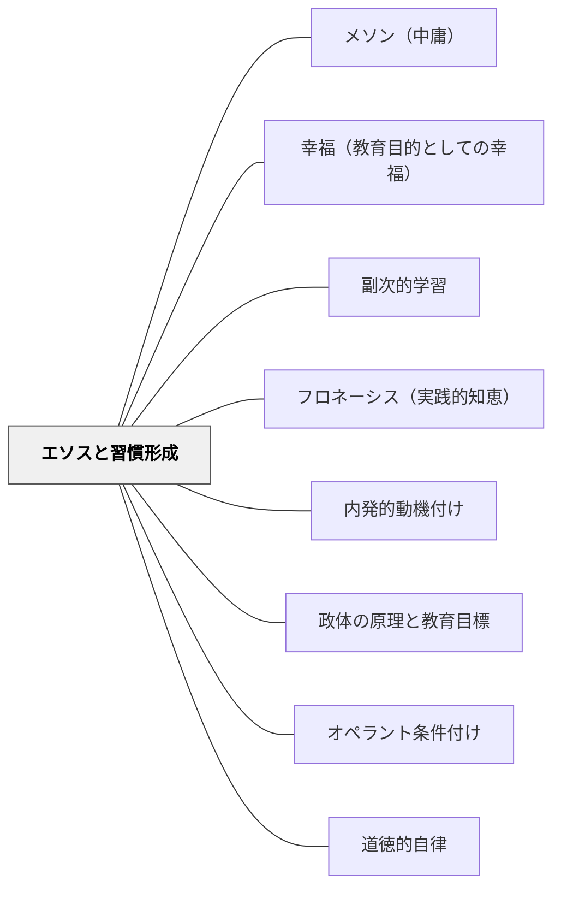

# エソスと習慣形成

> 「年少の頃からずっと『そのように』習慣づいているのと、『このように』習慣づいているのとで、相違は小さなものではなく、きわめて大きい。否、それどころか、それこそがすべてであると言うべきであろう。」——アリストテレス（第二巻第一章）

## Pattern Connection

### アリストテレス（前335年頃）——ニコマコス倫理学 第二巻第一章

「人柄の徳は[行為の]習慣から生まれるものである。この『エーティケー（人柄の）』という語も、『エトス（習慣）』から少し変化してできたものである。」

アリストテレスの洞察の核心：

> 「学んで為すべき事柄であれば、われわれはその事柄を実際に為しながら学ぶのである。それゆえ、たとえば人は、家を[実際に]建てることにより建築家になり、キタラを[実際に]奏しながらキタラ奏者になる。これと同様に人は、正しいことを[実際に]為しながら正義の人となり、節制あることを[実際に]為しながら節制の人となり、勇気あることを[実際に]為しながら勇気ある人となる。」

さらに、習慣の形成が逆方向にも働くことを示す：
「同じ活動から[徳も]生じ[悪徳の]消滅も起こる。上手く弾くことから上手いキタラ奏者が生まれ、下手に弾くから下手な奏者が生まれる。」

実践なき議論の空虚さ（第二巻第四章）：
> 「多くの人々はすぐれたことを為さないまま議論へと逃れて、自分は知恵を愛していると思い、そんなやり方ですぐれた人間になれると思っている。だがこれは、医者の言うことに注意深く耳を傾けながらも、医者が処方したことを何ひとつ実行しない患者と、同じようなことをしているだけなのである。」

- **既存パタンとの関連**：[[パタン/副次的学習]] が「行為の中で無意識に形成される態度・習慣」を記述するのに対し、本パタンはその習慣形成を意図的な設計として捉える視点を提供する——「どんな行為を反復するか」が「どんな人になるか」を決定する。
- **補強された点**：[[パタン/政体の原理と教育目標]] の「立法者は市民を習慣づける」という命題は、本パタンの倫理学的基盤を持つ。
- **他のパタンへの波及**：[[パタン/フロネーシス（実践的知恵）]]（実践から育つ判断力）・[[パタン/内発的動機付け]]（習慣化によって活動自体が快くなること）

---

## 背景（Context）

学校では「教えること（知識・技能の伝達）」と「習慣づけること（行為の反復設計）」が別々の活動として扱われることが多い。授業で「正しいことの大切さ」を教え、「正しいことを繰り返し行う」場面設計は後回しになる。

しかしアリストテレスは明確に言う——徳（よい性向）は「教えられる」のではなく「行為の反復によって形成される」。建築家になるには家を建てなければならない。キタラ奏者になるにはキタラを弾かなければならない。

## 問題（Problem）

「道徳の時間に正しいことを学んだ子どもが、日常の行為では無作法・不親切・不正直のまま」という現象は、知識と習慣の乖離を示す。知識（「正しいことは何か」）が性向（「正しいことを自然に選ぶ傾向」）になるには、実際の行為の反復が必要なのに、学校設計がその機会を十分に作っていない。

## 力のかたち（Forces）

- 徳は生まれつきでも偶然でもなく、**行為の反復によってのみ形成される**
- 「年少の頃からの習慣こそがすべて」——幼少期の習慣形成の影響は成人後まで持続する
- 良い習慣も悪い習慣も同じメカニズムで形成される——「どんな行為を反復させるか」の設計責任は大きい
- 徳のための行為には三条件が必要：①知っていること ②選択に基づいていること ③確固たる性向から為されること——知識だけでは①を満たすにすぎない
- 「実践なき議論」は最も多い誤り——知識を持ちながら実践しないことは徳の形成に貢献しない

## 解決（Solution）

**「何を教えるか」だけでなく「何を繰り返し行わせるか」を授業・学級設計の中心に置く。徳として育てたい性向（誠実さ・親切さ・勇気・協働など）を、具体的な行為として日常的に反復できる場面を意図的に設計する。**

### 実践の三層設計

**① 知る（知識）**：「何が善いことか」を理解する——道徳の授業・議論・物語

**② 選ぶ（選択）**：実際の場面で「善いことを選択する」機会を作る——グループ活動・日常の小さな判断場面

**③ 繰り返す（性向化）**：その選択を「当たり前」として繰り返す環境を設計する——挨拶・感謝・助け合いが習慣になる学級文化

### キタラ奏者の原理

- 「上手く弾くことから上手いキタラ奏者が生まれる」——「正しく行動することから正しい人が生まれる」
- だから「正しく行動できる小さな場面」を毎日用意することが最も根本的な教育設計である
- 失敗しても繰り返せる環境——「間違えたことへの恐怖」がなく、やり直せる安全性が習慣形成を支える

### 逆方向の警告

- 不正直を繰り返す環境に置かれた子どもは不正直な人になる
- 競争・比較が常態化した環境では、「他者を出し抜くことへの快感」が習慣になる
- 習慣の「向き」の設計こそが、長期的な教育成果を決定する

## 結果（Consequences）

- 教育設計が「知識の伝達」から「行為の反復機会の設計」へシフトする
- 道徳授業と日常生活の乖離が縮まる——授業で学んだことが日常の行為と連続する
- 「なぜこの子は分かっているのにやらないのか」という疑問に答えが生まれる：知識と性向は別物であり、性向化には行為の反復が必要
- 長期的視点での教育設計が促される——今日の行為の積み重ねが3年後の性向になる

## 関連パタン
- [[パタン/メソン（中庸）]]
- [[パタン/幸福（教育目的としての幸福）]]

- [[パタン/副次的学習]] — 習慣形成の無意識的・意図せざる側面（エソスの副次的版）
- [[パタン/フロネーシス（実践的知恵）]] — 習慣形成の結果として育つ実践的判断力
- [[パタン/内発的動機付け]] — 習慣化によって活動自体が快くなる（徳のある行為が快くなること）
- [[パタン/政体の原理と教育目標]] — 「立法者は市民を習慣づける」という政体と教育の連動
- [[パタン/オペラント条件付け]] — 習慣形成の行動科学的メカニズムとの比較
- [[パタン/道徳的自律]] — 習慣から自律的な徳への発展
- [[文献/ニコマコス倫理学（上）（アリストテレス）]] — 本パタンの出典

## クラスター図

## Actionable Insight

- 「今日の授業で子どもたちは何を**した**か」を問う——何を聞いたか・知ったかではなく、何を行為したかを確認する
- 学級で育てたい徳（例：「困った人を助ける」）を、具体的に行動として現れる場面（日常の小さな助け合い場面）として設計し、毎日それが起きる機会を作る
- 「道徳的な知識を持っているが実行しない」子どもには知識ではなく習慣の機会が必要——「やってみる小さな一歩」を設定する
- 自分の授業・学級で「どんな行為が日常的に反復されているか」を棚卸しする——反復している行為が、育てたい性向と一致しているかを確認する

## 出典

- アリストテレス（渡辺邦夫・立花幸司訳）（2015/2018）『ニコマコス倫理学（上）』光文社古典新訳文庫（第二巻第一章・第四章）
- [[文献/ニコマコス倫理学（上）（アリストテレス）]]
