# エピステーメーとドクサ（知識と正しい考え）

> 正しい答えを持つことと、その答えを知ることは、違う。正しい考えは逃げ出す——原因の推論で縛りつけるまでは。

## [Pattern Connection]

### プラトン『メノン』（前387年頃）——ダイダロスの彫像の比喩

プラトン『メノン』（97a〜98d）は、エピステーメー（知識）とオルテー・ドクサ（正しい考え）の区別を「ダイダロスの彫像」の比喩で示す。

> 「正しい考えもまた、ある程度の時間留まっていてくれる場合には、立派であり、あらゆる優れたよいことを成し遂げてもくれる。しかしそうした考えは、長期間留まってはくれないで人間の魂から逃げ出してしまうので、したがって人がこれらの考えを原因の推論によって縛りつけてしまうまでは、たいした価値はないのだ。」（97d〜e）

伝説の工匠ダイダロスの像は生きていて逃げ出してしまうため、縛りつけないと役に立たない。同様に、正しい考えも「なぜそうなるか」という原因の推論で縛りつけなければ、魂から逃げ出してしまう。

**エピステーメー（知識）とオルテー・ドクサ（正しい考え）の比較：**

| | エピステーメー（知識） | オルテー・ドクサ（正しい考え） |
|---|---|---|
| **根拠** | 原因の推論によって「縛られている」 | 根拠なし、偶然に正しい |
| **安定性** | 安定的・持続的・転移可能 | 「魂から逃げ出してしまう」文脈依存 |
| **実践上の有益性** | 有益 | 同等に有益（ラリサの道案内の比喩） |
| **新しい文脈での応用** | 応用可能 | 文脈が変わると機能しなくなる |

「ラリサへの道案内の比喩」（97a〜b）：道を「知っている」人も、正しく「推測できる」人も、どちらも道案内としては同等に役立つ。しかし道を知っている人はいつでも案内できるが、推測が正しかった人は次の道でも正しく推測できるとは限らない。

**エレンコスによる正しい考えの知識化**：召使いの少年（82a〜86b）の問答において、ソクラテスは少年が正解（対角線の長さ）にたどり着いた後も問い続けることで、正しい考えを知識へと引き上げようとする。「なぜそうなるか」を問うことが、ドクサをエピステーメーへ変換する作業である。

**補強点**：[[パタン/アポリアの設計]] がアポリアから正しい考えへの到達プロセスを示すなら、本パタンはその後の問い——「なぜ正しいのか」——によって正しい考えを知識へと深化させるプロセスを示す。

**波及するパタン**：[[パタン/省察]] — 「なぜそうなるか」を問う問いが省察の深化形式；[[パタン/熟慮的問い]] — 「原因の推論」を引き出す問いが熟慮的問いの核心；[[文献/メノン（プラトン）]] — 本統合の出典

---

### プラトン『テアイテトス』（前369年頃）——ワックスの塊・鳩小屋：ドクサとエピステーメーのメカニズム

『テアイテトス』は、「なぜドクサ（正しい考え）は逃げ出すのか」「なぜ知識の誤りが起きるのか」を二つの比喩で具体的に説明する。

**ワックスの塊（191c〜195b）——記憶の質と知識の誤り：**

> 「われわれの魂のなかに密蝋（ワックスの塊）のようなものがある、と想定しよう……記憶の中に刻み込まれたものが、感覚・思考と一致する場合は知識、一致しない場合が誤り。」（191c〜e）

「正しい考え」が「魂から逃げ出す」（メノン 97d〜e）のはなぜか——ワックスの質が悪いと印象が歪んで刻まれ、すぐ消えるからである：

| ワックスの質 | 知識への影響 |
|---|---|
| 深く柔らかい（良質） | 印象が鮮明・正確——エピステーメーに近づく |
| 硬すぎる | 新しい経験が入らない——固定した誤りが残る |
| 汚れている | 以前の経験と混同する——誤りが生まれやすい |
| 浅すぎる | 印象がすぐ消える——ドクサがすぐ「逃げ出す」 |

**鳩小屋（197a〜200d）——知識の「保有」と「使用」の区別：**

> 「ある意味においてその人は鳥を『つねにもっている』と言ってかまわない……しかし、また別の意味においては、この人は、どの鳥をも『現にもっているわけではない』」（197a〜b）

「知識の保有（ヘクシス）」と「知識の使用（クテーシス）」の区別——鳩小屋に鳥がいても（知識を習った）、今つかんでいるとは限らない（使えるとは限らない）。

**授業での含意：**
テストで答えられる（＝鳩小屋に鳥がいる）ことと、実際の問題場面で知識を使える（＝今鳥をつかめる）ことは違う。「知っている」はドクサの状態であり、「必要な時に確実に使える」のがエピステーメーの状態に近い。

**補強点**：メノンの「ダイダロスの彫像の比喩」（正しい考えは逃げ出す）に、テアイテトスの「ワックスの塊」（なぜ逃げ出すのか）と「鳩小屋」（保有と使用の違い）が加わり、ドクサとエピステーメーの機構的説明が完成する。

**波及するパタン**：[[パタン/産婆役としての教師]] — 吟味（バサニゼイン）するのは「ワックスに正確に刻まれているか」「今つかめる状態か」の確認；[[文献/テアイテトス（プラトン）]] — 本統合の出典

---

### プラトン『ゴルギアス』（前380年頃）——弁論術：ドクサを量産する「偽の技術」（454d〜455a、462b〜465e）

『ゴルギアス』は、「ドクサ（信念・正しい考え）を生む技術」と「エピステーメー（知識）を生む技術」の違いを最も直接的に問う対話篇である。

**弁論術の定義——ドクサを生む技術：**

ゴルギアスは自分の弁論術について、ソクラテスに追い詰められながらこう認める：

> 「弁論術はたくさんの人々の中で、知識に基づいてではなく、信念（ドクサ）に基づいた説得者を生み出すのだ。」（454e〜455a）

弁論術は人々に「そう思わせる」（ドクサを生む）技術であり、「本当にそうなっている」（エピステーメー）を与えるのではない。これはメノンの「正しい考えは逃げ出す」という命題の逆説的な活用——弁論術は「逃げ出す正しい考え（ドクサ）」を大量生産する技術である。

**コラケイア——ドクサ生成の構造（462b〜465e）：**

ソクラテスはさらに進んで、弁論術を「4つの偽の技術（コラケイア）」の一種として位置づける。コラケイアの特徴はすべてドクサ的：

- 「それが善いように見える（思わせる）」を目標にするが、本当に善くはしない
- 知識（なぜそうなるか）を必要としない——経験と習慣だけで機能する
- 「見かけの善」を生む——これはドクサの構造そのものである

**補強点**：「ドクサとエピステーメーの区別」の概念に、「コラケイアという制度的実践」の次元が加わる。個別の授業場面でのドクサ問題から、「授業設計そのものがコラケイア型になっていないか」という構造的問いへ。

**波及するパタン**：[[パタン/コラケイア（おべっか）]] — ドクサを量産する「偽の教育技術」の詳細分析；[[文献/ゴルギアス（プラトン）]] — 本統合の出典

---

### プラトン『饗宴』（前380年頃）——エロスはオルテー・ドクサの位置に立つ（201d–204b）

『饗宴』でディオティマがソクラテスに語るエロスの定義は、「エピステーメーとドクサ」の間の位置を哲学的に深める。

**エロス＝オルテー・ドクサの存在論的形象（202a）：**
ソクラテスがエロスを「知恵でも愚かさでもない」と言うと、ディオティマはこう答える：

> 「正しい思い（オルテー・ドクサ）が、そういうものだということに気づかないのですか？正しい思いは、理由を述べることができない——それゆえ知識（エピステーメー）ではない。しかしそれは真理と一致している——それゆえ無知（アマティア）でもない。正しい思いはまさにそういうものだ、つまり知識と無知の間にあるもの」——ディオティマ（202a）

エロスはこのオルテー・ドクサの位置に立つ：完全に知っている（神々）でも完全に無知（愚か者）でもなく、「知らないと知っている」者として「知恵と無知の間」にいる。この構造は「ドクサ（正しい考え）からエピステーメー（知識）へ」の移行を求める者の存在論的な定義でもある。

**美の梯子はドクサからエピステーメーへの段階的移行モデル：**

| ドクサ⇔エピステーメーの階梯 | 美の梯子の対応段階 |
|---|---|
| 個別的な正しい考え（理由が述べられない） | 一つの美しいものへの没入（段階1） |
| 類についての正しい考え | すべての美しい体への理解（段階2） |
| 内実についての理由づけのある考え | 美しい心・本質への理解（段階3） |
| 構造・パターンの言語化 | 美しい行為・制度への理解（段階4） |
| 学問的知識（ロゴスを持つ） | 知識の美しさへの理解（段階5） |
| エピステーメー（根拠のある知識） | 美のイデア——「突如として」の到達（段階6） |

**補強点**：ドクサとエピステーメーの区別が「静的な状態の違い」から「動的な上昇のプロセス（美の梯子）」として捉え直される。「なぜ理由を述べられるようになると知識になるのか」——エロスが梯子を登る過程そのものが「理由を言語化する（ロゴスを産む）」プロセスであることが明らかになる。

**波及するパタン**：[[パタン/美の梯子（エロスの道）]] — 美の梯子は「ドクサからエピステーメーへ」の段階的移行の古代的モデル；[[パタン/無知の知]] — エロス＝知恵と無知の間＝オルテー・ドクサの位置；[[文献/饗宴（プラトン）]] — 本統合の出典

---

### プラトン『パイドン』（前380年頃）——ヒュポテシス法：エピステーメーへの「第二の航海」（99c–102a）

パイドンは「どのようにしてドクサをエピステーメーへ引き上げるか」の哲学的方法論——**第二の航海（deuteros plous）とヒュポテシス法**——を与える。

**第二の航海（99c–100a）：**

ソクラテスはアナクサゴラスら自然学者の物質的原因説（骨・筋肉・熱・空気）がことごとく失敗した後、新しい探究方法へ転換する：

> 「言論へと避難して、あるものの真理をその場所で考察しなければならないと思われた。」（99d）

感覚・直観（ドクサ的把握）によって真理に直接触れようとする「第一の航海」が失敗した後、**ロゴス（言語・概念・論証）という写し**を通じて真理に接近する方法——これが「第二の航海」である。

**「ドクサ→エピステーメー」はロゴスを通じた迂回路：**

| 第一の航海（直接把握） | 第二の航海（ロゴスを通じた探究） |
|---|---|
| 感覚・直観で真理を掴む | ロゴス（言論）という写しで真理に近づく |
| 正しいかどうか自信がない | 整合性を検証できる |
| 崩れやすい（ドクサ的） | 根拠のある考え（エピステーメーへ近づく） |

これはメノンの「ダイダロスの彫像（原因の推論で縛りつける）」（97d〜e）の実践的手続きを与える——ロゴス（言論・概念）が「縛りつける」具体的な手段である。

**ヒュポテシス法（仮説演繹的探究）（99d–102a）：**

「最も強い（整合性の高い）前提（ヒュポテシス）を選び、その前提から帰結を導いて、帰結が整合するかを確かめる」。

> 「なにか美そのものがそれ自体としてあり、善や大や他のすべてもそのようにある」ということを基礎に定立するのだ。もしこれが認められるなら、これらから原因を見出し……示せるだろうと希望している。（100a–b）

**分有による説明（100b–e）：**
「美しいものは、彼の〈美〉を分有するがゆえ以外の、他のどんな原因によって美しいのでもない」——イデア（エピステーメー的な対象）を前提として定立することで、すべての美しいものを一貫して説明できる。これが「原因の推論」によって縛りつけられた状態＝エピステーメーである。

**補強点**：「ドクサはなぜ逃げ出すのか」（メノン）→「ドクサを縛りつけるには原因の推論が必要」→「原因の推論の方法がヒュポテシス法（第二の航海）」という連鎖が完成する。エピステーメーへの道は「ロゴスを通じた迂回」であり、感覚的・直観的把握（ドクサ）から出発して、言語・概念・論証の精緻化を通じてエピステーメーに近づく。

**波及するパタン**：[[パタン/アナムネーシス（想起としての学び）]] — ヒュポテシスとしてのイデアは想起論の論理的基盤；[[パタン/アポリアの設計]] — アポリア後の「第二の航海」がエピステーメーへの道；[[パタン/ミソロゴス（言論嫌い）]] — ロゴスへの信頼がミソロゴスへの対抗力；[[文献/パイドン（プラトン）]] — 本統合の出典

---

## 背景（Context）

授業で学習者が正しい答えを言う。教師は「正解！」と言って次に進む。しかし、その正しい答えは「知識」か「正しい考え」か——この問いはほとんど問われない。

テストで100点を取った学習者が、1か月後には忘れている。別の文脈でほぼ同じ問題が出ても解けない。応用問題になると手が止まる——これらはすべて「正しい考え（ドクサ）」が「知識（エピステーメー）」になっていない状態の現れである。

プラトンが2400年前に見抜いた「正しい考えは逃げ出す」という現象は、現代の授業で毎日起きている。

## 問題（Problem）

教育と評価は、しばしば「正しい答えを出せるか」にフォーカスする。しかし正しい答えを出すことは、「なぜ正しいのか」を理解していることと同じではない。

- 記憶によって正しい答えを出せる学習者：ドクサ（正しい考え）
- 理解によって正しい答えを出せる学習者：エピステーメー（知識）

この二つは外から見ると区別できない。しかし「なぜ？」「別の場合は？」と一歩踏み込むと、違いが露わになる。ドクサは逃げ出し、エピステーメーは残る。

## 力のかたち（Forces）

- 「なぜ正しいのか」を問う時間は、「次の問題へ進む」時間と競合する——常にカリキュラムの圧力がある
- 正しい答えを出すことへの達成感は、理解への動機を一時的に満たしてしまう——「わかった」の錯覚
- 「なぜ？」を問われることは、「まだ正しくない」と感じさせる恐れがある——心理的安全性が必要
- 正しい考えも実践的に有用な場面では十分機能する——すべてをエピステーメーにする必要はない（ラリサの比喩）
- 「なぜ？」の問いに答えることそのものが、知識を深化させる最良の学習活動である

## 解決（Solution）

**正しい答えを出した後、「なぜそうなるか」を問うことで、正しい考え（ドクサ）を原因の推論で縛り、知識（エピステーメー）へと深化させる。**

「正解→なぜ？→理由→さらになぜ？」という問いの連鎖が、ダイダロスの彫像を縛りつける推論の鎖になる。

---

**具体例1：算数「かけ算の筆算」**

学習者が「12×3＝36」と正しく計算する。正解で終わらず「12×3がなぜ36になるのか、図や言葉で説明できる？」と問う。「3が12個分だから」「12＋12＋12だから」「10×3と2×3を足したから」——説明できる学習者はエピステーメーへ向かっている。説明できない学習者はドクサの状態にある。

**具体例2：国語「物語の読み取り」**

「主人公の気持ちを答えなさい」への正しい答えで終わらず、「どこからそう判断した？」と問う。「この会話文から」「前の場面で〇〇していたから」——本文の根拠を言語化するプロセスが、読みの「原因の推論」であり、ドクサをエピステーメーに変える。

**具体例3：評価設計「なぜ？欄を加える」**

テストや課題に「答え欄」と「理由欄」を分ける設計にする。「答えが正しくても理由が不明確な問題は△」という評価基準にすることで、「正しい答え」より「なぜ正しいか」に価値を置く文化を作る。

**具体例4：単元末の「教える」活動**

単元の終わりに「下の学年の子に教える」「友達に説明する」という活動を設ける。人に教えるためには理由を言語化しなければならず、この言語化プロセスそのものが「原因の推論による縛りつけ」になる。

## 結果（Consequences）

- 学習者が「なぜ正しいか」を問う習慣を持ち、表面的な正解に安住しなくなる
- 知識が新しい文脈に転移しやすくなる——「縛りつけられた」知識は逃げない
- 評価が「答えの正誤」から「理解の深さ」へとシフトし、学習者のメタ認知が育つ
- 「わかった」と「答えられる」の違いを学習者自身が意識できるようになる
- 「なぜ？」を常に問うと授業の進度が遅くなる——どこをエピステーメーにするかの優先付けが必要

## 関連パタン
- [[パタン/アナムネーシス（想起としての学び）]]
- [[パタン/ミソロゴス（言論嫌い）]]
- [[パタン/計量術（メトレーティケー）]]
- [[パタン/無知の知]]
- [[パタン/アポリアの設計]] — アポリア（困惑）を経て正しい考えに到達した後の「なぜ？」がエピステーメー化の入口
- [[パタン/省察]] — 「なぜそうなるか」を問い返す省察がドクサをエピステーメーへ深化させる
- [[パタン/熟慮的問い]] — 「原因の推論」を引き出す問いが熟慮的問いの核心的形態
- [[パタン/産婆役としての教師]] — 産婆役は「正しい答えを引き出す」だけでなく「なぜ正しいか」を産ませる
- [[パタン/具体から抽象へ]] — 具体的事例から「なぜ？」を問い原理を抽象化するプロセスがエピステーメー化
- [[パタン/自分の言葉で]] — 自分の言葉で説明することが「原因の推論による縛りつけ」の実践
- [[パタン/認知的コンフリクト]] — 誤った考えをコンフリクトで揺さぶり、正しい考えを経てエピステーメーへ
- [[パタン/メタ認知的モニタリング]] — 「自分はドクサかエピステーメーか」の自己観察がメタ認知の実践
- [[パタン/コラケイア（おべっか）]] — ドクサを量産する「偽の教育技術」（弁論術型授業）vs エピステーメーを育てる真の教育技術（ゴルギアス）
- [[パタン/美の梯子（エロスの道）]] — 美の梯子はドクサからエピステーメーへの段階的移行の古代的モデル（饗宴210a–211b）

## クラスター図

```mermaid
flowchart LR
    ne382a8e38394e382b9e38386e383bce383a1e383bce381a8e38389e382afe382b5efbc88e79fa5e8ad98e381a8e6ada3e38197e38184e88083e38188efbc89["エピステーメーとドクサ（知識と正しい考え）"]
    ne382a2e3838ae383a0e3838de383bce382b7e382b9efbc88e683b3e8b5b7e381a8e38197e381a6e381aee5ada6e381b3efbc89["アナムネーシス（想起としての学び）"]
    ne3839fe382bde383ade382b4e382b9efbc88e8a880e8ab96e5ab8ce38184efbc89["ミソロゴス（言論嫌い）"]
    ne8a888e9878fe8a193efbc88e383a1e38388e383ace383bce38386e382a3e382b1e383bcefbc89["計量術（メトレーティケー）"]
    ne784a1e79fa5e381aee79fa5["無知の知"]
    ne382a2e3839de383aae382a2e381aee8a8ade8a888["アポリアの設計"]
    ne79c81e5af9f["省察"]
    ne7869fe685aee79a84e5958fe38184["熟慮的問い"]
    ne794a3e5a986e5bdb9e381a8e38197e381a6e381aee69599e5b8ab["産婆役としての教師"]
    ne585b7e4bd93e3818be38289e68abde8b1a1e381b8["具体から抽象へ"]
    ne887aae58886e381aee8a880e89189e381a7["自分の言葉で"]
    ne8aa8de79fa5e79a84e382b3e383b3e38395e383aae382afe38388["認知的コンフリクト"]
    ne383a1e382bfe8aa8de79fa5e79a84e383a2e3838be382bfe383aae383b3e382b0["メタ認知的モニタリング"]
    ne382b3e383a9e382b1e382a4e382a2efbc88e3818ae381b9e381a3e3818befbc89["コラケイア（おべっか）"]
    ne7be8ee381aee6a2afe5ad90efbc88e382a8e383ade382b9e381aee98193efbc89["美の梯子（エロスの道）"]

    ne382a8e38394e382b9e38386e383bce383a1e383bce381a8e38389e382afe382b5efbc88e79fa5e8ad98e381a8e6ada3e38197e38184e88083e38188efbc89 --- ne382a2e3838ae383a0e3838de383bce382b7e382b9efbc88e683b3e8b5b7e381a8e38197e381a6e381aee5ada6e381b3efbc89
    ne382a8e38394e382b9e38386e383bce383a1e383bce381a8e38389e382afe382b5efbc88e79fa5e8ad98e381a8e6ada3e38197e38184e88083e38188efbc89 --- ne3839fe382bde383ade382b4e382b9efbc88e8a880e8ab96e5ab8ce38184efbc89
    ne382a8e38394e382b9e38386e383bce383a1e383bce381a8e38389e382afe382b5efbc88e79fa5e8ad98e381a8e6ada3e38197e38184e88083e38188efbc89 --- ne8a888e9878fe8a193efbc88e383a1e38388e383ace383bce38386e382a3e382b1e383bcefbc89
    ne382a8e38394e382b9e38386e383bce383a1e383bce381a8e38389e382afe382b5efbc88e79fa5e8ad98e381a8e6ada3e38197e38184e88083e38188efbc89 --- ne784a1e79fa5e381aee79fa5
    ne382a8e38394e382b9e38386e383bce383a1e383bce381a8e38389e382afe382b5efbc88e79fa5e8ad98e381a8e6ada3e38197e38184e88083e38188efbc89 --- ne382a2e3839de383aae382a2e381aee8a8ade8a888
    ne382a8e38394e382b9e38386e383bce383a1e383bce381a8e38389e382afe382b5efbc88e79fa5e8ad98e381a8e6ada3e38197e38184e88083e38188efbc89 --- ne79c81e5af9f
    ne382a8e38394e382b9e38386e383bce383a1e383bce381a8e38389e382afe382b5efbc88e79fa5e8ad98e381a8e6ada3e38197e38184e88083e38188efbc89 --- ne7869fe685aee79a84e5958fe38184
    ne382a8e38394e382b9e38386e383bce383a1e383bce381a8e38389e382afe382b5efbc88e79fa5e8ad98e381a8e6ada3e38197e38184e88083e38188efbc89 --- ne794a3e5a986e5bdb9e381a8e38197e381a6e381aee69599e5b8ab
    ne382a8e38394e382b9e38386e383bce383a1e383bce381a8e38389e382afe382b5efbc88e79fa5e8ad98e381a8e6ada3e38197e38184e88083e38188efbc89 --- ne585b7e4bd93e3818be38289e68abde8b1a1e381b8
    ne382a8e38394e382b9e38386e383bce383a1e383bce381a8e38389e382afe382b5efbc88e79fa5e8ad98e381a8e6ada3e38197e38184e88083e38188efbc89 --- ne887aae58886e381aee8a880e89189e381a7
    ne382a8e38394e382b9e38386e383bce383a1e383bce381a8e38389e382afe382b5efbc88e79fa5e8ad98e381a8e6ada3e38197e38184e88083e38188efbc89 --- ne8aa8de79fa5e79a84e382b3e383b3e38395e383aae382afe38388
    ne382a8e38394e382b9e38386e383bce383a1e383bce381a8e38389e382afe382b5efbc88e79fa5e8ad98e381a8e6ada3e38197e38184e88083e38188efbc89 --- ne383a1e382bfe8aa8de79fa5e79a84e383a2e3838be382bfe383aae383b3e382b0
    ne382a8e38394e382b9e38386e383bce383a1e383bce381a8e38389e382afe382b5efbc88e79fa5e8ad98e381a8e6ada3e38197e38184e88083e38188efbc89 --- ne382b3e383a9e382b1e382a4e382a2efbc88e3818ae381b9e381a3e3818befbc89
    ne382a8e38394e382b9e38386e383bce383a1e383bce381a8e38389e382afe382b5efbc88e79fa5e8ad98e381a8e6ada3e38197e38184e88083e38188efbc89 --- ne7be8ee381aee6a2afe5ad90efbc88e382a8e383ade382b9e381aee98193efbc89

    classDef hub fill:#f0f0f0,stroke:#555,color:#000,font-weight:bold
    class ne382a8e38394e382b9e38386e383bce383a1e383bce381a8e38389e382afe382b5efbc88e79fa5e8ad98e381a8e6ada3e38197e38184e88083e38188efbc89 hub
```

## Actionable Insight

- 学習者が正しい答えを出した後、「なぜそうなるか、自分の言葉で説明してみて」と問う——この一問が「正しい考え」を「知識」に縛りつける第一歩
- テスト・課題の設計に「答え欄」と「理由欄（なぜそうなるか）」を分けて設ける——「答えが正しい」より「なぜ正しいかを言える」を評価軸にする
- 単元末に「まだ習っていない下の学年の子に説明するとしたら、どう説明する？」と問う——人に教えるための説明言語化が、逃げ出しやすい正しい考えを縛りつける

## 出典

プラトン（渡辺邦夫訳）（2022）『メノン——徳について』光文社古典新訳文庫（Bフ 2-2）, pp.97a–98d.
プラトン（渡辺邦夫・立花幸司訳）（2022）『テアイテトス』光文社古典新訳文庫（Bフ 2-5）, pp.191c–200d. → [[文献/テアイテトス（プラトン）]]
プラトン（中澤務訳）（2022）『ゴルギアス』光文社古典新訳文庫（K-Bフ 2-7）, pp.454d–455a, 462b–465e. → [[文献/ゴルギアス（プラトン）]]
プラトン（中澤務訳）（2013）『饗宴』光文社古典新訳文庫（Bフ 2-4）, pp.201d–204b, 210a–211b. → [[文献/饗宴（プラトン）]]

> 「正しい考えもまた、ある程度の時間留まっていてくれる場合には、立派であり、あらゆる優れたよいことを成し遂げてもくれる。しかしそうした考えは、長期間留まってはくれないで人間の魂から逃げ出してしまうので、したがって人がこれらの考えを原因の推論によって縛りつけてしまうまでは、たいした価値はないのだ。」——プラトン『メノン』97d〜e
