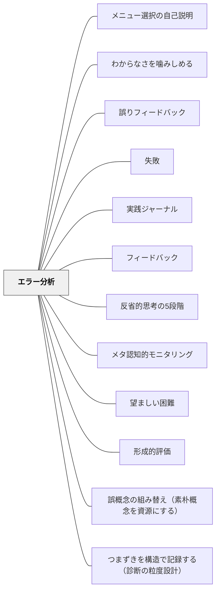

# エラー分析

> 思考停止の詰め込み学習で、記憶が続かない。

## 背景（Context）

（詳細はソースPDF参照）

## 問題（Problem）

学習者が学習の土台に乗れず、本来の教育の価値が届かない。

## 力のかたち（Forces）

- 教育者の意図と学習者の実態のギャップ
- 個々の状況に応じた柔軟な対応の必要性
- 経済性（無駄なコスト・苦しみを省く）の原理

## 解決（Solution）

思考停止の詰め込み学習で、記憶が続かない。

記憶は思考の残滓であると言われる。人は、なぜ間違ったのだろうか、なぜ失敗したのだ
ろうか、なぜエラーしたのだろうかと問い、問われることで思考を促し記憶を強化した
り、理解を確実にしたりする。

間違いから学べるようにエラー分析を奨励せよ

♡♡♡

エラー分析をすることで思考が促され確かな記憶になる。また十分に練習することで記憶
は長く留まるものとなる。

参考文献
ダニエル・T・ウィリンガム（２０１９）『教師の勝算』東洋館出版社
マルザーノら（２０１３）『教育目標をデザインする』北大路書房

## 結果（Consequences）

- 学習者の力能（なしうる力）が増大する
- パタンの圧縮による教育の経済性が実現する
- 関連パタンと重ね合わせることで効果が高まる

## 関連パタン
- [[実践/ノート指導（読み書きハンドブック・ノート検定）]]
- [[パタン/メニュー選択の自己説明]]
- [[パタン/わからなさを噛みしめる]]
- [[パタン/誤りフィードバック]]
- [[パタン/失敗（インストラクション）]]
- [[パタン/実践ジャーナル]]

- [[パタン/フィードバック]] — エラー分析は形成的フィードバックの核心的手法
- [[パタン/反省的思考の5段階]] — 「なぜ間違えたか」の問いは Dewey の②問題の知的化に対応する
- [[パタン/メタ認知的モニタリング]] — 自分のエラーを観察・分析することがメタ認知の実践形
- [[パタン/望ましい困難]] — エラーから学ぶプロセス自体が望ましい困難の一形態
- [[パタン/形成的評価]] — エラーのパターンを授業改善の根拠として使う
- [[パタン/誤概念の組み替え（素朴概念を資源にする）]] — エラーの背後にある素朴理論まで掘り下げ、その適用範囲を再交渉する発展形
- [[パタン/つまずきを構造で記録する（診断の粒度設計）]] — 誤答を「見せる化」する姿勢（本パタン）と、誤答をどの変化種別で分類・記録するかという診断設計（つまずきを構造で記録する）の分業——両者を組み合わせると学習者自身が種別ごとのエラーを分析する実践が生まれる

## クラスター図

## Actionable Insight

- テストやドリルで間違えた問題の横に「なぜ間違えたか」を1行書かせる——エラーの理由を考えることが記憶を強化する思考になる
- 授業中の間違いをその場で「なぜそう考えたの？」と聞く——エラーを批判せず分析する問いが失敗から学ぶ文化を育てる
- クラス全体に見られる共通のエラーを1つ取り上げてみんなで分析する——全体フィードバックとエラー分析の組み合わせが最も効率的な理解の修正になる

## 出典
- [[文献/一つの教育のパタン・ランゲージ]]

岩井輝久「岩井輝久『一つの教育のパタン・ランゲージ』」（2026-04-29 vault収録）
