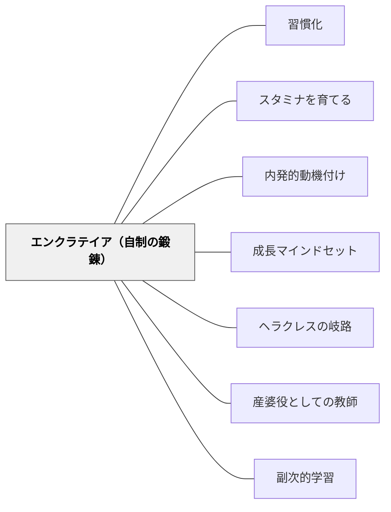

# エンクラテイア（自制の鍛錬）

> 自分自身を支配できない者は、他者を支配することも、より善いことを達成することもできない。——ソクラテス（クセノフォン第一巻五章より）

## Pattern Connection

---

**ショーペンハウアー（1851/2013）「幸福について」統合（2026-05-31）：**

ショーペンハウアーの「幸福について」第五章「訓話と金言」は、エンクラテイアの現代的な実践集として読める。「あらゆる望ましいもののうち……欲望を慎み、怒りを抑えること、すなわち一言でいうと『節制と忍耐』が原則である」——ソクラテスのエンクラテイア論を19世紀に独立して再発見した形だ。

- **補強された点**：エンクラテイアの目的として「精神の平穏」という概念が加わる（[[パタン/精神の平穏]]）。自制は道徳的義務としてだけでなく、精神の平穏という幸福の条件として位置づけられる。「欲望を慎む」理由が「徳があるから」だけでなく「精神の平穏のため」という幸福論的根拠を得る
- **「引き出しを一つ開ける」技法との接続**：「ひとつのことを企てたら、他の一切を度外視し、払いのけねばならない。いわば思考の引き出しのひとつを開けたら、その間は他の引き出しを閉めたままにしておきなさい」——これは注意の自制であり、エンクラテイアの認知的な次元を示す
- **波及するパタン**：[[パタン/精神の平穏]] — 節制と忍耐が精神の平穏を生む；[[パタン/「何者であるか」の優位]] — 自制できる者が「何者であるか」を高められる

---

### クセノフォン（前370年代）——アリスティッポスとの対話

クセノフォン『ソクラテスの思い出』第一巻第五章において、ソクラテスはアリスティッポス（快楽主義者）との対話で「エンクラテイア（自制）」を論じる。快楽と安逸を求めるアリスティッポスに対し、ソクラテスは「支配する能力を育てる教育」と「支配される能力を育てる教育」を対比させ、自制心の鍛錬が卓越性の基礎であることを示す。

- **既存パタンとの関連**：[[パタン/習慣化]] が「反復によって行動を自動化する」ことを論じるなら、エンクラテイアは「欲望への抵抗を繰り返すことで自由を広げる」という逆向きの習慣形成を扱う。[[パタン/スタミナを育てる]] が「学習の持続」を論じるなら、エンクラテイアはその基礎にある身体的・感情的欲望の管理を扱う。
- **補強された点**：[[パタン/内発的動機づけ]] における「自律性（Autonomy）」欲求は、エンクラテイアによって確保される——欲望に支配された状態では真の自律性はない。欲望を管理することが、真の自律的行動の前提条件である。
- **段階的アプローチ**：ソクラテスは食欲→飲欲→睡眠→性欲という順序で、基本的な欲望から高次の欲望へと段階的に自制を論じる。この「基礎から積み上げる」構造は、スキャフォールディング（足場かけ）の原理と対応する。

---

## 背景（Context）

より良い行動をしたいと思いながら、衝動や即時的な快楽に負けてしまう経験は普遍的である。「わかっているのにできない」状態は、知識不足ではなく自制能力の問題である。

ソクラテスは2500年前に、この問題を「エンクラテイア（enkrateia：自制・自己統治）」として体系的に論じた。自制心は生まれつきの気質ではなく、**意図的な鍛錬によって育てられる能力**である。

## 問題（Problem）

即時的な欲求（食べたい・眠りたい・楽をしたい・娯楽に没入したい）が、長期的に価値あることへの取り組みを妨げる。「頑張ろう」という意志力だけでは不安定で、欲望が強いときに崩れる。教師が「自律的に学べ」と期待しても、欲望の管理という基礎が育っていなければ実現しない。

## 力のかたち（Forces）

- 欲望は自然なものであり、否定はできない——「湧いてくることは当然だ」
- 欲望への抵抗は繰り返すたびに弱くなる（習慣化の論理）
- 小さな自制の成功体験が「私にはできる」という有能感を育てる
- 基本的な欲望の管理（食・睡眠）が、より高次の目標達成への基盤となる
- 「誰かを支配したい者は、まず自分自身を支配せよ」——自制と他への影響力は対応する

## 解決（Solution）

**基本的な欲望への自制練習から始め、段階的に自己管理の能力を育てる。各段階の成功を確認しながら、より高次の自制へと積み上げる。**

### ソクラテスの段階的アプローチ

| 段階 | 欲望の種類 | 練習の例 |
|---|---|---|
| 1 | 食欲 | 「腹八分」「間食を決まった時間に限る」 |
| 2 | 飲欲 | 「喉が乾いても、適切な時まで待つ」 |
| 3 | 睡眠 | 「眠気に打ち勝って、やるべきことを終える」 |
| 4 | 快楽全般 | 「楽しいことより、今必要なことを優先する」 |
| 5 | 高次の目標 | 上記の基礎の上に、探究・創造・奉仕が置かれる |

### 教室での実践

1. **小さな「待つ」練習**：「あと5分だけ問題に取り組んでから休憩する」という小さな決定を自分で宣言させる——成功体験が自制の自信を育てる
2. **欲望を認めてから扱う**：「やめたくなる気持ちはわかる。でも今は続けよう」——欲望を否定せず、認めた上でコントロールする文化をつくる
3. **「支配できる自分」の物語**：「今日、○○したい気持ちがあったけど、我慢して○○した」という小さな成功を帰りの会で語る
4. **教師自身の自制の可視化**：「先生も疲れているけど、この課題に向き合っている」——教師のエンクラテイアの実践が副次的学習として伝わる（[[パタン/産婆役としての教師]]）

## 結果（Consequences）

- 基本的な欲望の管理が習慣化され、長期的な取り組みが可能になる
- 「自分はコントロールできる」という有能感（[[パタン/成長マインドセット]] の基盤）が育つ
- 即時的な報酬への依存が減り、延期満足が可能になる
- ただし、過剰な自制の要求は疲弊と反動（「やけ食い」「爆発」）を生む——段階的・漸進的なアプローチが不可欠

## 関連パタン
- [[パタン/「何者であるか」の優位]]
- [[パタン/精神の平穏]]

- [[パタン/習慣化]] — 自制を繰り返すことで習慣化する
- [[パタン/スタミナを育てる]] — 学習継続力の育成
- [[パタン/内発的動機づけ]] — 自律性の前提としての自制
- [[パタン/成長マインドセット]] — 「自制できる」という自己認識の育成
- [[パタン/ヘラクレスの岐路]] — 徳の道を選ぶ決断を支える
- [[パタン/産婆役としての教師]] — 教師自身の自制の可視化が副次的学習に
- [[パタン/副次的学習]] — 教室で見られる教師の自制が学習者に伝わる
- [[パタン/オペラント条件付け]] — 自制の強化のメカニズム
- [[文献/ソクラテスの思い出（クセノフォン）]] — 本パタンの出典

## クラスター図

<!-- cluster: manual -->

## Actionable Insight

- **今週の「エンクラテイア練習」**：学習者に「今週、自分がしたくない気持ちに勝ってやり続けたこと」を週末に1つ書かせる——自制の自覚が自制の習慣を育てる
- **「5分だけ」の自制**：「やめたくなったら5分だけ続けてみる」というルールを学級に導入する——小さな自制の成功が積み重なる
- **教師自身の自制を語る**：「先生も今日○○したくなかったけど、□□のためにやった」と週に1回語る——エンクラテイアの副次的学習が始まる

## 出典

クセノフォン（前370年代）『ソクラテスの思い出』第一巻第五章（相澤 拓訳）光文社古典新訳文庫、2022年

> 「自分自身を支配できない者は、他者を支配することも、より善いことを達成することもできない。」——ソクラテス（クセノフォン第一巻五章より）
