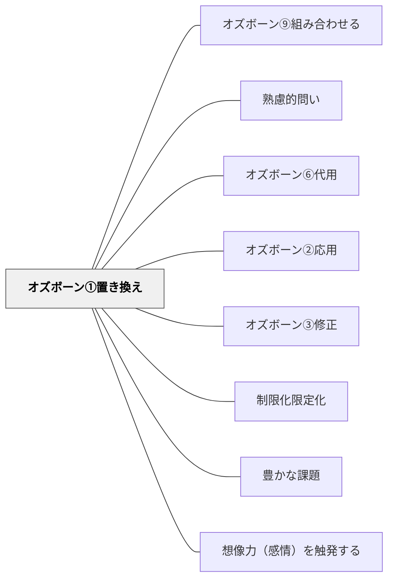

# オズボーン①置き換え

> 「別のものに置き換えてみたらどうか？」と問うことで、現状の固定化から発想が解放される。

## 背景（Context）

既存のやり方や素材・手段に慣れていると、「これしかない」という思い込みが生まれやすい。オズボーンのチェックリストは、創造的思考を体系的に引き出すための問いのセットであり、「置き換え」はその最初の問いである。代替可能性を意識することで、多様な解決策が見えてくる。

## 問題（Problem）

一つの方法・素材・手段にこだわりすぎると、改善の可能性が見えなくなる。「これでなければならない」という固定観念は、しばしば習慣や慣例から生まれており、本質的な理由があるとは限らない。代替を問うことで、その前提を問い直すきっかけになる。

## 力のかたち（Forces）

- 置き換えの候補が思い浮かばない場合、問いが空回りする
- 置き換えの発想は、知識の幅に依存する
- 置き換えを「何でもよい」ではなく、目的との整合性で評価する必要がある
- 置き換えの問いは他のオズボーンの問いと組み合わせると効果が高まる

## 解決（Solution）

「これを別のものに置き換えるとしたら何が使える？」「この役割を別の人・道具・方法が担えないか？」「素材を変えたらどうなる？」のように問いかける。たとえば「この評価方法を別の形式に置き換えるとしたら？」「講師の役割を動画・AI・学習者自身に置き換えるとしたら？」のように教育文脈でも活用できる。

## 結果（Consequences）

- 固定した前提が崩れ、多様な代替案を検討する姿勢が育つ
- 「なぜ今のやり方なのか」を問い直す批判的思考が促される
- 置き換えたことの影響・副作用も合わせて検討する必要がある

## 関連パタン
- [[パタン/オズボーン⑨組み合わせる]]

- [[パタン/熟慮的問い]] — 親パタン
- [[パタン/オズボーン⑥代用]] — 同じ「別のもので機能を代替する」発想の兄弟手法——置き換えは手段の代替、代用は用途の転用
- [[パタン/オズボーン②応用]] — 別の文脈へ移植する横断的発想の兄弟パタン
- [[パタン/オズボーン③修正]] — 性質・形・機能を変える兄弟パタン
- [[パタン/制限化限定化]] — 置き換え対象を一つに絞ることで発想が研ぎ澄まされる
- [[パタン/豊かな課題]] — オズボーンの問いが「低コスト高エントリー」の豊かな課題を生む
- [[パタン/想像力（感情）を触発する]] — 発想の組み換えが想像力を解放する
- [[メタパタン/経済を原理とする]] — 最小の変更で最大の発想変換を生む経済的設計

## クラスター図

## Actionable Insight

- 授業設計のときに「この評価方法を別の形式に置き換えるとしたら？」と自問する——置き換えの問いが現状の評価方法の前提を問い直すきっかけになる
- ブレインストーミングで詰まったとき「使っている手段を全部別のものに置き換えてみよう」と促す——代替可能性を探る発想が固定観念を崩す
- 学習者に「今の自分のやり方を別の方法に置き換えるとしたら？」と問う——固定した学習法への批判的眼差しが自律的な学習戦略の改善を促す

## 出典

- [[文献/熟慮的問いのパターンリスト（動画記録）]]
- Osborn, A. F. (1953). *Applied Imagination: Principles and Procedures of Creative Problem-Solving*. Scribner.
