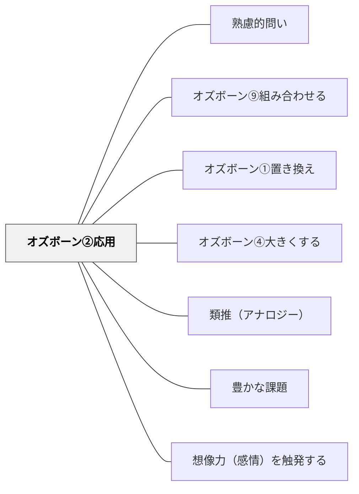

# オズボーン②応用

> 「別の場面・文脈に応用してみたら？」と問うことで、知識や方法の転用可能性が広がる。

## 背景（Context）

ある文脈でうまく機能しているアイデアや方法が、別の文脈でも有効かもしれない。しかし、それを意識的に試みることは少ない。オズボーンのチェックリストにおける「応用」の問いは、既存の知識・方法・アイデアを新しい文脈に持ち込むことを促す。これは類推的思考の実践でもある。

## 問題（Problem）

アイデアや方法は特定の文脈に最適化されて生まれることが多く、作った人も「他への応用」を考えないままにしていることがある。学習者も、学んだ知識を別の場面で使う可能性に気づかないことが多い。応用の発想がないと、知識は孤立したままで統合されない。

## 力のかたち（Forces）

- 応用先の文脈についての知識がないと、応用の問いが機能しにくい
- 異なる分野への応用は、専門家にとって「自明でない」ことが多い
- 「無理やりな応用」は現実的でないアイデアになりやすい
- 応用の成功例を示すことで、参加者の発想が刺激される

## 解決（Solution）

「この方法を教育以外の場面に使うとしたら？」「このアイデア、別の業界でも使えないか？」「あの分野のやり方をここに応用したら？」のように問いかける。たとえば「ゲームのデザイン原則を授業設計に応用するとしたら？」「このビジネスの仕組みを地域コミュニティに応用できないか？」のような形で、文脈の移植を促す。

## 結果（Consequences）

- 学んだ知識が孤立せず、他文脈への転用意識が育つ
- 異分野との接続から、予想外のアイデアが生まれることがある
- 文脈の差異を無視した安易な応用には注意が必要

## 関連パタン

- [[パタン/熟慮的問い]] — 親パタン
- [[パタン/オズボーン⑨組み合わせる]] — どちらも異なる文脈・要素をつなぐ横断的思考——応用は別文脈への移植、組み合わせは複数要素の統合
- [[パタン/オズボーン①置き換え]] — 手段を別のものに代替する兄弟パタン
- [[パタン/オズボーン④大きくする]] — 規模・量・強度を変える兄弟パタン
- [[パタン/類推（アナロジー）]] — 別文脈への応用はアナロジー思考の実践
- [[パタン/豊かな課題]] — オズボーンの問いが「低コスト高エントリー」の豊かな課題を生む
- [[パタン/想像力（感情）を触発する]] — 発想の組み換えが想像力を解放する
- [[メタパタン/経済を原理とする]] — 最小の変更で最大の発想変換を生む経済的設計

## クラスター図

## Actionable Insight

- 学んだ概念・方法を「別の教科や日常生活に応用するとしたら？」と問う——知識の転用意識が孤立した知識を統合的な理解へと変える
- 「ゲームのデザイン原則を授業設計に応用するとしたら？」のように異分野のやり方を持ち込む問いを授業に入れる——異分野との接触が予想外の発想を生む
- 単元の終わりに「今日学んだことを別の場面で使うとしたら、どんな場面？」と問う——応用の意識が学習の転移を促し知識の活用力を育てる

## 出典

- [[文献/熟慮的問いのパターンリスト（動画記録）]]
- Osborn, A. F. (1953). *Applied Imagination: Principles and Procedures of Creative Problem-Solving*. Scribner.
