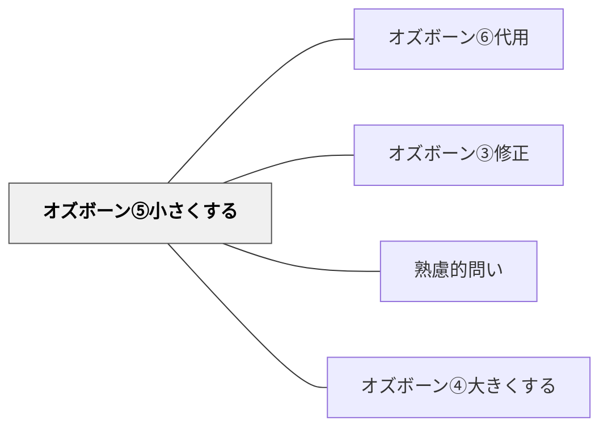

# オズボーン⑤小さくする

> 「もっと小さく・少なく・弱くしたら？」と問うことで、本当に必要な核心が明らかになる。

## 背景（Context）

物事を削ぎ落とし、最小限にすることで、本質が浮かびあがることがある。オズボーンのチェックリストにおける「小さくする」の問いは、縮小・簡略化・省略の可能性を探ることで、過剰な要素や冗長性に気づかせる。シンプルさが価値を生む場面は多い。

## 問題（Problem）

物事は時間とともに複雑化・肥大化する傾向があり、「本当に必要なもの」と「惰性で続けているもの」の区別が難しくなる。「どこまで削れるか」という発想がなければ、改善は追加ばかりになってしまう。本質を見極めるためには、意図的に縮小する問いが有効である。

## 力のかたち（Forces）

- 縮小しすぎると価値が失われるため、「最小単位」の見極めが難しい
- 「小さくする」と「省略する」は異なる操作であることに注意が必要
- 削減の対象を誤ると、重要な要素まで失うリスクがある
- ミニマリズムの発想との親和性が高い

## 解決（Solution）

「この授業から一つだけ残すとしたら何を残す？」「活動を半分に減らすとしたら何を切る？」「もし5分でこの学びを届けるとしたら？」「最小限の問いで最大の思考を引き出すとしたら？」のように問いかける。たとえば「このワークシートの問いを3つに絞るとしたら？」「この評価項目から本当に必要なものだけを残すと？」のような実践的な問いとして使える。

## 結果（Consequences）

- 本質的な要素と付随的な要素の区別が明確になる
- 「引き算の発想」が育ち、シンプルで力強いデザインが生まれやすくなる
- 削ぎ落としすぎることへの抵抗感があり、合意形成が必要な場合もある

## 関連パタン
- [[パタン/オズボーン⑥代用]]
- [[パタン/オズボーン③修正]]

- [[パタン/熟慮的問い]] — 親パタン
- [[パタン/オズボーン④大きくする]] — 縮小と拡大の対称操作——どちらも量・規模の変換を問う直接対比の手法

## クラスター図

## Actionable Insight

- 授業設計のときに「この授業から一つだけ残すとしたら何か」と問い、その答えがキーコンセプトになる——「削ぎ落とす」発想が本質的な目標を明確にする
- 学習者のワークシートを「問いを3つに絞るとしたら？」という目線で見直す——引き算の設計が学習者の負担を減らし深い思考を促す
- 「5分でこの学びを誰かに伝えるとしたら何を言う？」と単元の最後に問う——本質だけを抽出する経験が理解の核を明確化させる

## 出典

- [[文献/熟慮的問いのパターンリスト（動画記録）]]
- Osborn, A. F. (1953). *Applied Imagination: Principles and Procedures of Creative Problem-Solving*. Scribner.
