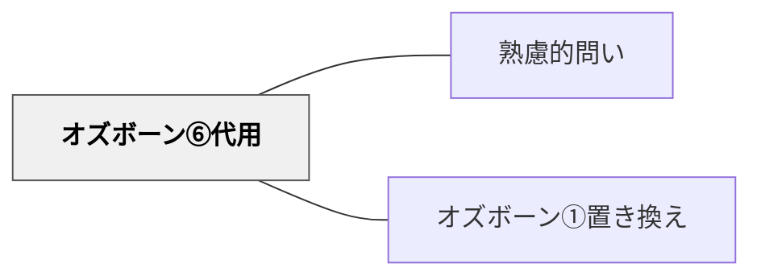

# オズボーン⑥代用

> 「別のもので代用できないか？」と問うことで、資源・手段・役割の再設計が促される。

## 背景（Context）

手元にある素材・人・方法では対応できないと思っていたことが、別のもので代用することで解決できる場合がある。オズボーンのチェックリストにおける「代用」の問いは、不足や制約を逆手に取って新たな可能性を開く視点を与える。

## 問題（Problem）

「これがなければできない」という思い込みは、リソース不足の場面で思考を止める。しかし実際には、別のものが同じ機能を果たせることが多い。代用の発想がなければ、制約をそのまま「できない理由」として受け入れてしまう。

## 力のかたち（Forces）

- 代用品が元のものより劣る場合に、質の低下をどう許容するかが問われる
- 代用の発想は、機能・目的の本質を問い直すことを促す
- 「置き換え」との違いは、代用が「欠如や制約への対応」という文脈を持つ点である
- 代用の実現可能性は文脈によって大きく異なる

## 解決（Solution）

「これがない場合、何で代わりができる？」「この役割を別の人・もの・仕組みが担えないか？」「高価なものを安価なもので代用するとしたら？」のように問いかける。たとえば「教室がない場合、どこで同じ学習ができるか？」「専門家なしでこの知識をどう提供するか？」「紙のワークシートをデジタルで代用したら、何が変わる・変わらない？」のような問いに展開できる。

## 結果（Consequences）

- 制約を創造性の源として活用する思考が育つ
- リソースの本質的な機能を問い直すメタ認知が促される
- 代用による質の変化を正確に評価する必要がある

## 関連パタン

- [[パタン/熟慮的問い]] — 親パタン
- [[パタン/オズボーン①置き換え]] — 同じ「別のもので機能を代替する」発想の兄弟手法——代用は用途の転用、置き換えは手段の代替

## クラスター図

## Actionable Insight

- 設備や素材が足りないとき「同じ目的を達成するために何で代用できるか」と学習者に考えさせる——制約を創造性の源として活用する発想が問題解決力を育てる
- 「教室がない場合、どこで同じ学習ができるか？」と問う——場所の代用を考える経験が学習環境の多様な可能性への気づきをつくる
- 紙のワークシートをデジタルに替えてみて「何が変わった・変わらなかったか」を比較する——代用の比較が道具の機能と限界への理解を深める

## 出典

- [[文献/熟慮的問いのパターンリスト（動画記録）]]
- Osborn, A. F. (1953). *Applied Imagination: Principles and Procedures of Creative Problem-Solving*. Scribner.
