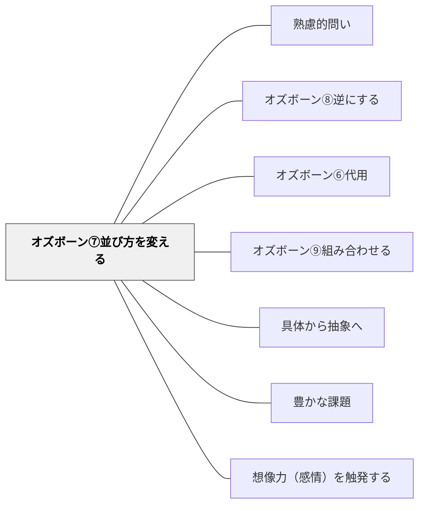

# オズボーン⑦並び方を変える

> 「順序・配置を変えてみたら？」と問うことで、同じ要素から全く異なる体験や意味が生まれる。

## 背景（Context）

要素そのものは同じでも、その順序・配置・組み合わせ方を変えることで、全く異なる効果や意味が生まれることがある。オズボーンのチェックリストにおける「並び方を変える」の問いは、固定された序列や配置への問い直しを促す。

## 問題（Problem）

慣れた順序や配置は「当然のもの」として疑われにくい。しかし実際には、順序の違いが学習の効果や体験に大きく影響することがある。「なぜこの順番なのか」を問い直す機会がないと、最適でない設計が惰性で続く。

## 力のかたち（Forces）

- 順序変更が内容の理解に与える影響は、文脈によって大きく異なる
- 前提知識が必要なものには順序の自由度が低い
- 意外な順序が「驚き・気づき」を生み、学習の動機を高めることがある
- 並び方の変更は比較的リスクが低く、試みやすい改善策である

## 解決（Solution）

「このステップの順番を変えたら体験はどう変わる？」「結論を最初に言ったら？」「評価を学習の前に行うとしたら？」「最も難しい内容を最初に持ってきたら？」のように問いかける。たとえば「この授業、ウォームアップと本題を入れ替えたら何が変わるか？」「質問を講義の後ではなく最初に提示したら？」のような授業設計の問い直しに応用できる。

## 結果（Consequences）

- 同じ要素でも順序変更によって新たな可能性が発見される
- 「当たり前の順序」への批判的眼差しが育つ
- 順序変更の影響を実際に試さなければわからない部分も多く、実験的アプローチが有効

## 関連パタン

- [[パタン/熟慮的問い]] — 親パタン
- [[パタン/オズボーン⑧逆にする]] — どちらも構造・順序の組み換えを問う兄弟手法——並び替えは部分の移動、逆転は全体の反転
- [[パタン/オズボーン⑥代用]] — 用途・素材を別のもので代替する兄弟パタン
- [[パタン/オズボーン⑨組み合わせる]] — 複数要素を統合する兄弟パタン
- [[パタン/具体から抽象へ]] — 順序の組み換えは具体→抽象の流れを意図的に変える
- [[パタン/豊かな課題]] — オズボーンの問いが「低コスト高エントリー」の豊かな課題を生む
- [[パタン/想像力（感情）を触発する]] — 発想の組み換えが想像力を解放する
- [[メタパタン/経済を原理とする]] — 最小の変更で最大の発想変換を生む経済的設計

## クラスター図

## Actionable Insight

- 授業設計のとき「ウォームアップと本題の順番を入れ替えたら何が変わるか？」と試してみる——順序変更がリスクを低く試みやすい改善策であることが気軽な実験を後押しする
- 「質問を講義の後ではなく最初に提示したら、何を調べたくなるか」と経験させる——結論より先に問いを提示する逆転が探究の動機をつくる
- 発表順・活動順を一度シャッフルして「どの順番が最も理解しやすかったか」を比較する——並び方の実験が「当たり前の順序」への批判的眼差しを育てる

## 出典

- [[文献/熟慮的問いのパターンリスト（動画記録）]]
- Osborn, A. F. (1953). *Applied Imagination: Principles and Procedures of Creative Problem-Solving*. Scribner.
