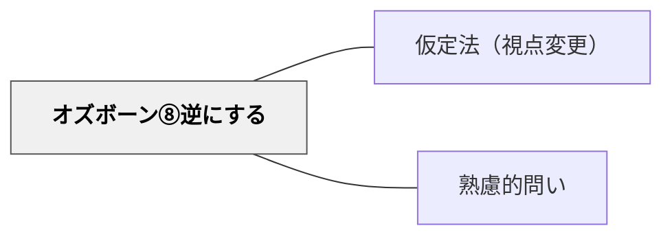

# オズボーン⑧逆にする

> 「逆にしてみたら？反対から考えると？」と問うことで、常識の盲点が照らし出される。

## 背景（Context）

「逆から考える」という発想は、既成の枠組みを根底から問い直す力を持つ。教える側が学ぶ、評価される側が評価する、問う側が答える——こうした逆転の問いは、現行の仕組みの前提を可視化し、より本質的な設計を考えるきっかけになる。オズボーンのチェックリストにおける「逆にする」は最も発想の転換力が大きい問いの一つである。

## 問題（Problem）

「当たり前」として受け入れている構造や役割は、問い直される機会がほとんどない。方向・役割・順序・前提を逆にするという発想は、日常の思考では生まれにくい。しかし逆転の発想が、イノベーションや深い学びのきっかけになることは多い。

## 力のかたち（Forces）

- 逆転が現実的でない場合でも、「なぜ逆はいけないのか」という問いが価値を持つ
- 逆転は冗談や遊びに見えることがあり、真剣に取り組まれないリスクがある
- 完全な逆転ではなく「部分的な逆転」の方が実現可能な場合が多い
- 逆転の問いは問い手の創造性と大胆さが問われる

## 解決（Solution）

「教える側と学ぶ側を逆にしたら？」「失敗を目標にしたら何が見えるか？」「問いへの答えを先に言って、問いを参加者に作らせたら？」「このプロセスを逆順で辿ったら？」のように問いかける。たとえば「教師なしの授業を設計するとしたら？」「悪い授業を意図的にデザインしてみてください」のように、逆転を出発点にした設計課題にも応用できる。

## 結果（Consequences）

- 常識や慣例の「見えない前提」が明確になる
- 逆転発想から生まれたアイデアが革新的な解決策につながることがある
- 逆転の問いに慣れるまで、参加者が戸惑いを感じる場合があるため、丁寧な導入が必要

## 関連パタン
- [[パタン/仮定法（視点変更）]]

- [[パタン/熟慮的問い]] — 親パタン

## クラスター図

## Actionable Insight

- 「教える側と学ぶ側を逆にする」活動（学習者が教師になる）を単元に一度取り入れる——逆転が学習者の理解の深さと責任感を一気に高める
- 「意図的に悪い授業をデザインしてください」という逆転課題を出す——意図的な逆転が「良い授業の条件」を明確化し批判的な設計眼を育てる
- 「問いへの答えを先に言って、問いを学習者に作らせる」という活動をする——答えから問いを逆算する経験が問いを立てる力と概念理解を同時に育てる

## 出典

- [[文献/熟慮的問いのパターンリスト（動画記録）]]
- Osborn, A. F. (1953). *Applied Imagination: Principles and Procedures of Creative Problem-Solving*. Scribner.
