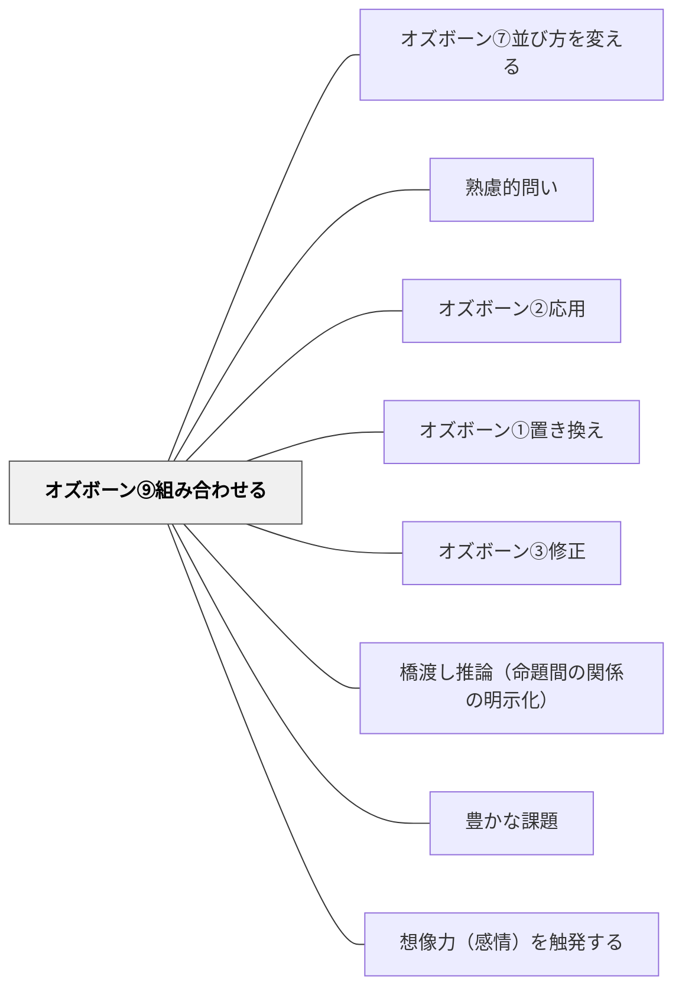

# オズボーン⑨組み合わせる

> 「AとBを組み合わせてみたら？」

## 背景（Context）
アイデアの発散を促す場面では、既存の要素をそのまま再利用するだけでは新しい視点が生まれにくい。オズボーンのチェックリストは、強制的な観点の変換を通じて発想を広げる古典的な技法である。その第9番目の観点「組み合わせる（Combine）」は、異なる素材・概念・方法を結びつけることで新たな可能性を問いかける。授業や研究の場で「掛け合わせ」の思考を引き出したいときに有効である。

## 問題（Problem）
学習者は既知の概念や事例を個別に扱いがちで、それらを結合して考えることを自発的にはしない。ファシリテーターも、「もっと自由に考えて」という抽象的な促しにとどまり、具体的な思考の足場を提供できていないことが多い。「組み合わせる」という操作を明示した問いがなければ、学習者の発想は既存の枠の中に留まり続ける。

## 力のかたち（Forces）
- 既知要素の保守的利用 vs 新結合による創発
- 問いの具体性 vs 発想の開放性
- 個別の深い探究 vs 横断的なつながりの発見
- 答えやすさ vs 問いの挑戦性

## 解決（Solution）
「AとBを組み合わせてみたら？」という形式で問いかける。対象は概念・手法・素材・事例など何でもよい。例えば「プロジェクト学習とゲーミフィケーションを組み合わせたらどんな授業になる？」「この詩の技法とニュース記事を組み合わせたら？」のように、具体的な二項を提示することで思考の足場を作る。ブレインストーミングや授業設計の場で、最初の問いとして用いると効果的である。

## 結果（Consequences）
- 学習者が意外なつながりを発見し、発想の幅が広がる
- 具体的な二項を提示することで、全員が問いに参加しやすくなる
- 既存知識の再評価と再組織化が促される

## 関連パタン
- [[パタン/オズボーン⑦並び方を変える]]
- [[パタン/熟慮的問い]] — 親パタン
- [[パタン/オズボーン②応用]] — どちらも異なる文脈・要素をつなぐ横断的思考——組み合わせは複数要素の統合、応用は別文脈への移植
- [[パタン/オズボーン①置き換え]] — 手段を別のものに代替する兄弟パタン
- [[パタン/オズボーン③修正]] — 性質・形・機能を変える兄弟パタン
- [[パタン/橋渡し推論（命題間の関係の明示化）]] — 組み合わせる発想は命題間の関係を明示化する思考と近い
- [[パタン/豊かな課題]] — オズボーンの問いが「低コスト高エントリー」の豊かな課題を生む
- [[パタン/想像力（感情）を触発する]] — 発想の組み換えが想像力を解放する
- [[メタパタン/経済を原理とする]] — 最小の変更で最大の発想変換を生む経済的設計

## クラスター図

## Actionable Insight

- ブレインストーミングの最初に「AとBを組み合わせてみたら？」という具体的な二項を提示して問う——意外なつながりを発見し発想の幅が広がる
- 「プロジェクト学習とゲーミフィケーションを組み合わせたらどんな授業になる？」のように分野をまたいだ組み合わせを問う——横断的なつながりの発見が既存知識の再組織化を促す
- 授業設計の場で「今の授業と○○を組み合わせたらどうなる？」と問いかける——具体的な二項が提示されると全員が問いに参加しやすくなる

## 出典
- [[文献/熟慮的問いのパターンリスト（動画記録）]]
- Osborn, A. F. (1953). *Applied Imagination: Principles and Procedures of Creative Problem-Solving*. Scribner.
