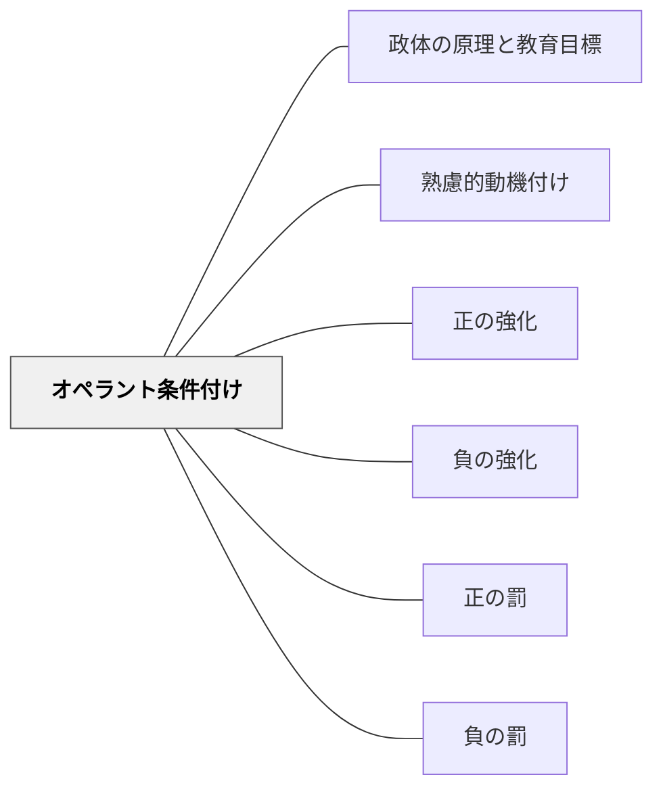

# オペラント条件付け

> 行動の結果が次の行動を形作る。強化と罰の仕組みを知ることが、動機付けの設計の基礎となる。

## 背景（Context）
B.F.スキナーが提唱した行動主義の学習理論。行動の後に続く結果（強化子・罰子）によって、その行動の頻度が増減するという原理に基づく。教育における外発的動機付けの理論的基盤として広く活用されている。

## 問題（Problem）
学習者が望ましい行動を増やしたい、あるいは望ましくない行動を減らしたいとき、どのような働きかけが有効かを体系的に考える枠組みが必要となる。闇雲な賞賛や罰は意図しない副作用を生む。

## 力のかたち（Forces）
- 強化は行動を増やす方向に、罰は行動を減らす方向に作用する
- 「正」は何かを付け加えること、「負」は何かを取り除くことを意味する
- 外発的動機付けが内発的動機付けを阻害する可能性（アンダーマイニング効果）がある
- スケジュール（頻度・タイミング）が強化の効果に大きく影響する

## 解決（Solution）
**強化（正・負）と罰（正・負）の4種類の仕組みを理解し、文脈と目的に応じて使い分けることで、行動の増減を意図的に設計する。**

正の強化（望ましい行動に良いものを与える）・負の強化（望ましい行動で不快なものを除く）・正の罰（望ましくない行動に不快なものを与える）・負の罰（望ましくない行動で心地よいものを除く）の各手法を状況に応じて選択する。内発的動機付けへの移行を視野に入れながら活用することが重要。

## 結果（Consequences）
- 行動の増減を比較的短期間で実現できる
- 過度に用いると内発的動機付けを損なうリスクがある
- 強化の撤廃後に行動が消去される可能性がある

## 関連パタン
- [[パタン/政体の原理と教育目標]]
- [[パタン/熟慮的動機付け]] — 親パタン
- [[パタン/正の強化]] — サブパタン
- [[パタン/負の強化]] — サブパタン
- [[パタン/正の罰]] — サブパタン
- [[パタン/負の罰]] — サブパタン

## クラスター図

## Actionable Insight

- 望ましい行動（手を挙げて発言する、課題に集中するなど）を見かけたらその場ですぐに具体的に認める——正の強化は即時性が高いほど行動との結びつきが明確になる
- ご褒美（点数・シール・称賛）だけに頼らず、内発的動機に移行できる設計を意識する——外発的強化は導入には有効だが、長期的には内発的動機との接続が重要
- 望ましくない行動への「正の罰」より「望ましい代替行動への正の強化」を優先する——罰より代替行動の強化の方が副作用が少なく持続する行動変容につながる

## 出典

- B.F. Skinner（1938）*The Behavior of Organisms: An Experimental Analysis* Appleton-Century-Crofts
