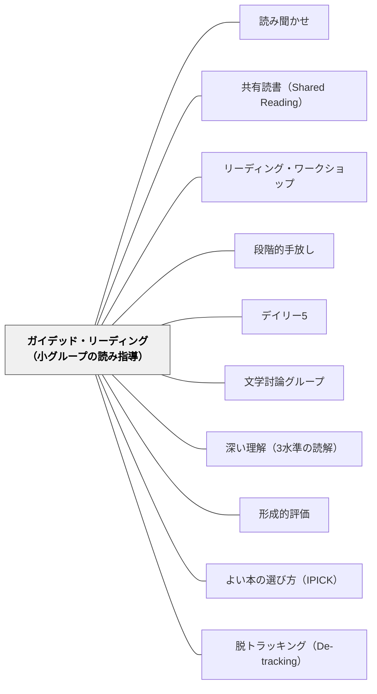

# ガイデッド・リーディング（小グループの読み指導）

> 一斉指導と完全な自立読書のあいだには、「教師がそばにいる小グループの読み」という段階がある。読み聞かせ→共有読書→ガイデッド・リーディング→ひとり読みという段階的手放しの連続体において、子どもが「少し背伸び」のテキストを自分の力で読み、その姿を教師が傍らで観察し、その場で手立てを入れる——日本の教室で最も欠けやすい第3段階を、制度として埋めるパタン。

## 背景（Context）

ひとつの学級には、読みの発達段階が数学年分混在している。1年生でも字を追うのに精一杯の子と、まとまった本を黙々と読みこなす子が同居する。中学年・高学年になればその差はさらに開く。読みの指導を一斉指導だけで担おうとすると、必ずどこかの層に合わなくなる。

連続体の発想に立てば、読みの指導は4段階の手放しで設計できる——**読み聞かせ**（教師が全部読む）→**共有読書**（教師と子どもが一緒に読む）→**ガイデッド・リーディング**（子どもが読み、教師が傍で支える）→**ひとり読み**（自立）。この4段階のうち、日本の教室では第1・第2・第4段階の素地はあっても、第3段階の「少し背伸びのテキストを、自分の力で、教師の見守りのもとで読む」段階が制度化されにくい。一斉の音読指導・班での輪読・自学としての音読カードは整っていても、「教師が傍にいて一人ひとりの読みを観察しながら個別に手立てを入れる小グループの場」は授業構造として欠けがちである。

Fountas & Pinnell（1996）はこの第3段階を体系化し、ニュージーランドのClay（2000）が開発したランニング・レコードによる継続的観察と組み合わせて、世界の読み指導に大きな影響を与えた。本パタンは、その輸入ではなく、日本の学級規模・授業時数のもとで実装可能な形に落とし込むことを意図する。

## 問題（Problem）

一斉の読解指導は、必然的に学級の中間層に合わせて設計される。すでに読める子にとっては退屈で、まだ読めない子にとっては速すぎる。「同じ文章を、同じペースで、同じ問いで」全員に当てることそのものに、適合の難しさがある。

代替として広く行われてきた「回し読み（輪読）」は、一見全員参加に見えて、一人あたりの読書量は極めて少ない。35人の学級で1人が音読する時間、残りの34人は耳で聞いているだけで、自分の目と頭で文字を追ってはいない。しかも、つかえる子は注目を浴びて緊張し、読みの実態（速度・正確さ・つまずきの種類）は教師にほとんど見えてこない。

個別指導は時間が圧倒的に足りない。35人を一人ずつ見ていけば、一人あたり週に数分しか取れない。

その間にも、読みの伸びは「テキストの難度と読み手の力の適合の窓」で起きている——一人で読めるほど易しくはなく、しかし崩れない程度には読める、おおむね9割台前半〜後半の正確さで読める「少し背伸び」の本（instructional level）が、最も伸びるレンジである。この適合の窓を全員に同時に保証することは、一斉指導でも完全な個別指導でも不可能に近い。

## 力のかたち（Forces）

- 読みの力はテキストの難度と読み手の力の「適合の窓」（instructional level——おおむね9割台前半〜後半の正確さで読める少し背伸びの本）で最も伸びる。簡単すぎても難しすぎても伸びない
- 一斉指導で全員にその窓を保証することはできない。学級にはいくつもの窓が並存している
- 輪読（回し読み）は一人あたりの読書量を著しく減らす——34人が待っている時間、自分の頭は動いていない
- 4〜6人なら、教師は全員の読む姿を同時に観察できる。一人ずつのつまずきがその場で見える
- レベル別のグループ編成は、固定化すると能力ラベルになる。Fountas & Pinnell自身が後年「レベルは教師の道具であって子どものラベルではない」と警告している
- 教師の見取り（ランニング・レコード等の継続的な観察記録）がないと、グループ編成が勘になる——直感だけの編成は固定化を招く
- 小グループ指導の間、残りの30人ほどが自立して学べる仕組み（[[パタン/デイリー5]]など）がなければ、構造そのものが成立しない

## 解決（Solution）

**読みの実態が近い4〜6人を柔軟に小グループにまとめ、教師がそのグループに「少し背伸び」のテキストを当て、15〜20分の定型セッションのなかで、全員が同時に・各自のペースで・全文を自分で読む間、教師は一人ずつの読みを観察してその場で個別の手立てを入れる。グループは評価のたびに組み替え、固定班にしない。残りの子は自立学習システム（デイリー5・読書センター・ひとり読み）で同時並行に学ぶ——この両輪で初めて成立する。**

実装は次の5要素で組み立てる:

1. **柔軟なグループ編成**：読みの実態（正確さ・読速・内容理解・つまずきの種類）が近い4〜6人を一時的にまとめる。形成的評価のたびに組み替える。固定班にしない・名前を付けない——これがレベル偏重への防波堤になる
2. **教師による「少し背伸び」のテキスト選定**：そのグループにとって9割台前半〜後半の正確さで読める難度を選ぶ。教科書教材だけでなく、レベル付き読み物・並行読書テキストも候補にする
3. **15〜20分の定型セッション**：
   - **導入（2〜3分）**：題名・挿絵・目次から内容を予想する。難語・固有名詞を先出しする
   - **各自読み（10〜12分）**：**輪読ではない**。全員が同時に・各自のペースで・全文を自分で読む（黙読または小声音読）。教師は一人ずつの読む様子を順に観察し、つまずきにその場で個別の手立て（手がかり質問・部分音読・指でなぞる）を入れる
   - **対話（3〜5分）**：読後に内容について短く話す。「ここはどういうこと？」「どう思った？」
   - **指導ポイント1つ（2〜3分）**：今日のグループに最も必要な1点だけ（語彙・読み方略・推論など）を取り出して教える。多くを教えない
4. **観察記録と次の編成・選書への循環**：セッション中の観察（簡略ランニング・レコード、つまずきメモ、対話の質）を名簿1枚に書き留め、次のグループ編成・テキスト選定の根拠にする（[[パタン/形成的評価]]の実装）
5. **残りの子の自立システム**：教師が1グループと向き合っている間、残りの子が自分で学べる構造が要る。[[パタン/デイリー5]]・読書センター・ひとり読みなどがその役を担う。この自立側が崩れると本パタンは成立しない

---

### 具体例1：通常学級（35人）での週間ローテーション

35人を5グループ×7人前後で柔軟に区切る（実際には実態の近い子で4〜6人ずつ）。1日に1〜2グループ×15分、週で全グループに1〜2回まわす。

| 月 | 火 | 水 | 木 | 金 |
|---|---|---|---|---|
| A・B | C・D | E・A | B・C | D・E |

残りの子はデイリー5（自分で読む・自分で書く・語彙・聞く・話す）で回る。学級掲示に「今週どのグループが先生と読むか」をカレンダー形式で示し、「先生の班だけずるい」とならないよう、全員に順番が見える形にする。

---

### 具体例2：1回20分のセッション実例（4年生・説明文）

メンバー4人、テキストは「動物の冬越し」を扱う説明文（学年相当だが少し詳しい）。

- **導入（2分）**：表紙の写真を見て「この動物、どうやって冬を越すと思う？」。タイトルから内容を予想する。難語「貯蔵」を黒板に書く
- **各自読み（10分）**：全員が同時に小声で読む。教師はA児・B児の2人について簡略ランニング・レコードを取る。A児は「貯蔵」で止まる——「前の文に何があった？」と促す。C児はスラスラ読み終わったので「2段落目の見出しを書くとしたらどうする？」と次の課題を渡す
- **対話（5分）**：「結局、リスは何をしているの？」「クマとリスの違いはどこ？」
- **指導ポイント1つ（3分）**：今日の1点は「見出しから内容を予想する」。「次に説明文を読むとき、見出しを先に見て予想してから本文を読んでみよう」と渡して終わる

---

### 具体例3：グループの組み替えの実例

単元の途中で観察記録を見直すと、これまで同じグループだったD児は「読みの正確さは高いが、内容理解が浅い」、E児は「正確さに課題はあるが、内容把握は鋭い」——必要な指導が違うことがわかった。

次のサイクルで、D児は「内容理解・推論」に課題のある別グループへ、E児は「デコーディングの精度」を扱うグループへ移す。能力のレベル（高い・低い）でなく、**いま必要な指導**で括り直す——この組み替えの規律が、固定ラベル化を防ぐ本体である。子どもには「今回はこの読み方の練習で集まる」と説明する。

---

### 特別支援の視点：少人数を構造としてそのまま活かす

特別支援学級は元々少人数（多くは1〜6人程度）で、ガイデッド・リーディングの構造をそのまま活かせる場である。

- **デコーディング負荷の調整**：難語の先出し（導入で書く・読み方を渡す）、漢字へのルビ振り、フォントサイズの調整で、解読の負荷を下げる。負荷を下げた上で、内容理解の対話の質を確保する
- **先行オーガナイザーとしての導入**：題名・挿絵だけでなく、内容の見取り図を口頭または図で先に示してから読み始める。「これは○○の話で、最後に××が起きるよ」と先に渡してから読むと、見通しが立って読みやすくなる子がいる
- **成功体験で終わる長さの設計**：1回のセッションで読み切れる長さに区切る。途中で時間切れになり「読み終わらなかった」で終わると、次回の意欲が削がれる。短いテキスト・短い区切りで、毎回「最後まで読めた」を確保する
- **対話の代替経路**：口頭の対話が難しい子には、絵・指差し・短い書き込みで応える経路も用意する

## 結果（Consequences）

**利点：**
- 一人あたりの読書量が増える——輪読の34人が待つ時間が消える
- つまずきがその場で見える・その場で手立てが入る。事後の○×ではなく、読みの最中に介入できる
- 一人ひとりの「適合の窓」に近いテキストが当たるため、指導が実態に合う
- 残りの子が自立して学ぶ仕組み（デイリー5など）が、結果として学級全体の自立学習文化を育てる
- 教師の側に「誰が何でつまずいているか」の解像度の高い情報が蓄積される——次の単元設計の質が上がる

**注意点：**
- グループが固定ラベル化する危険が常にある——「Aさんはいつも下のグループ」となった瞬間に、本パタンは「能力別編成」に堕ちる。**組み替えの規律が本体**である
- レベル偏重で「本のレベルを上げること」が目的化する危険。Fountas & Pinnell自身が後年警告した通り、レベルは教師の道具であって子どものラベルではない
- 観察記録・グループ編成・テキスト選定の準備負荷が大きい。同僚との分担・記録様式の定型化で持続可能にする
- 自立活動側（デイリー5など）が崩れると、本パタン全体が崩れる。教師が小グループに集中できる前提が消える
- 通常学級35人で週1〜2回しか各グループに当てられない計算になる。これだけでは足りないので、共有読書・自立読書・読み聞かせと組み合わせて連続体全体で読みを育てる

## 関連パタン

- [[パタン/読み聞かせ]] — 段階的手放しの連続体の第1段階（教師が全部読む）
- [[パタン/共有読書（Shared Reading）]] — 連続体の第2段階（一緒に読む）。本パタンはその次の段階
- [[パタン/リーディング・ワークショップ]] — 本パタンが組み込まれる上位の授業構造
- [[パタン/段階的手放し]] — 本パタンが体現するメタ原理（GRRの「導かれた練習」段階）
- [[パタン/デイリー5]] — 小グループ指導の間、残りの子が自立して回る仕組み。本パタンの成立条件
- [[パタン/文学討論グループ]] — 同じ小グループでも子ども主導の討論。教師主導の指導グループとの役割の違い
- [[パタン/深い理解（3水準の読解）]] — 小グループでの対話が推論的・応用的水準まで引き上げる
- [[パタン/形成的評価]] — 観察記録→グループ編成更新の循環は形成的評価の実装
- [[パタン/よい本の選び方（IPICK）]] — 子どもが自分で選ぶ自立読書の側。教師が選ぶ本パタンと相補的
- [[パタン/脱トラッキング（De-tracking）]] — 緊張関係にあるパタン。固定的能力別編成への警告。柔軟な組み替えがこの緊張への答え

## クラスター図

## Actionable Insight

- **来週の国語で1グループ4人×15分だけ試す**——いきなり週5日のローテーションを組まず、まず1セッションだけ走らせる。残りの子の自立活動が15分持つかを観察する。持たなければデイリー5側の整備が先になる
- **輪読を1回だけ「全員同時読み」に置き換えてみる**——同じ単元の同じ文章を、いつもの輪読ではなく「全員が同時に・各自のペースで黙読」に置き換える。読み終わるまでにかかる時間の差と、一人あたり実際に読めた量の差を体感する
- **読みの記録用に名簿1枚を用意する**——A4の名簿に、観察メモ欄（つまずき・読速・対話の質）を付けたものを1枚刷っておく。完璧なランニング・レコードでなくてよい。「気づいたことを1行書く」を続けるだけで、次のグループ編成・テキスト選定の根拠が手元に貯まる

## 出典

Fountas, I. C., & Pinnell, G. S. (1996). *Guided reading: Good first teaching for all children*. Heinemann.

Clay, M. M. (2000). *Running records for classroom teachers*. Heinemann.

Ford, M. P., & Opitz, M. F. (2011). Looking back to move forward with guided reading. *Reading Horizons*, 50(4), 225–240.
