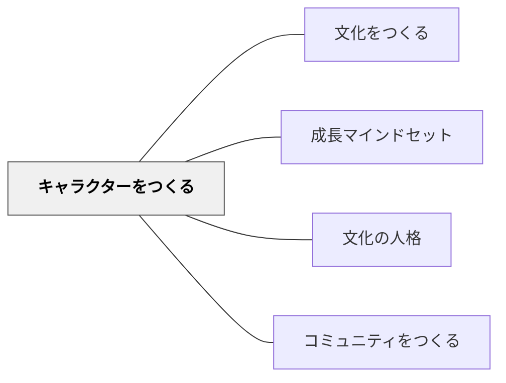

# キャラクターをつくる

> 学習に向かう姿勢を共通言語として具体化するために、それを体現したキャラクターをつくる。— シャーリー・クラーク

## 背景（Context）

「好奇心を持って」「粘り強く」「協力して」という言葉は抽象的で、子どもたちが自分の行動と結びつけにくい。具体的なキャラクターとして学習姿勢を形象化すると、子どもたちはその姿勢を想起しやすく、自分の行動と照らし合わせやすくなる。

## 問題（Problem）

抽象的な価値観・姿勢を「覚えなさい」と言っても定着しない。具体的なモデルがないと、学習者はその姿勢が「実際にはどう見えるか」をイメージできない。

## 力のかたち（Forces）

- 子どもは物語・キャラクターを通じた学びに強く引き込まれる
- キャラクターが形式化すると「壁に貼ってあるだけ」になりやすい
- キャラクターはコミュニティの文化と一致している必要がある

## 解決（Solution）

**学習に向かう姿勢を体現したキャラクターを、学習者と一緒につくり、日常の会話の中で参照する。**

実践例（シャーリー・クラーク）：
- 「粘り強いロボット」「好奇心旺盛な探偵」など、学習姿勢をキャラクターに結びつける
- キャラクターの名前・見た目を学習者が決める（当事者性）
- 授業の中で「今日のRRR（リスク・レジリエンス・ルーティン）はどのキャラクターを使った？」と振り返る
- キャラクターを学校の記念行事（50周年など）のシンボルにする

## 結果（Consequences）

- 学習姿勢への語彙（共通言語）が生まれ、振り返りが具体的になる
- 子どもたちが「今日のぼくはXキャラクターだった」と自己評価できるようになる
- 学習姿勢の文化が学校の物語・アイデンティティと結びつく

## 関連パタン

- [[パタン/文化をつくる]] — 親パタン
- [[パタン/成長マインドセット]] — キャラクターで体現するマインドセット
- [[パタン/文化の人格]] — 文化をキャラクターとして人格化する
- [[パタン/コミュニティをつくる]] — キャラクターがコミュニティのシンボルになる

## クラスター図

## Actionable Insight

- 「粘り強く続けている学習者」を見かけたとき「今のは〇〇（キャラクター名）みたいだった」と全体に伝える——日常の会話の中でキャラクターが参照されることで文化として定着する
- キャラクターの名前と見た目を学習者と一緒に決める——当事者性があると子どもたちがキャラクターを自分のものとして使いこなす
- 振り返りの時間に「今日の自分はどのキャラクターだったか」を1文書かせる——自己評価にキャラクターを使うことで学習姿勢への共通語彙が育つ

## 出典

- シャーリー・クラーク：学習キャラクター実践
- 動画記録：[[文献/コミュニティオブプラクティスと文化をつくるパタン（動画記録）]]
