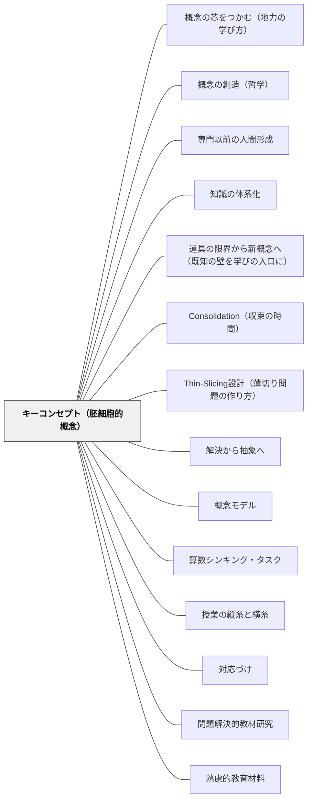

# キーコンセプト（胚細胞的概念）

> 教科の核となる概念が、深い理解と転移の鍵を握る教育材料。

## 背景（Context）

ウィギンズ&マクタイ（Understanding by Design）・エリクソン（Concept-Based Curriculum）・エンゲストローム（活動理論）が指摘するように、教育材料の分析・研究を深めると教科の核となる「キーコンセプト」に出会う。このキーコンセプトが教育材料として最重要となる。「胚細胞的概念」はヴィゴツキー・エンゲストロームの用語で、単元・教科の核となる発生的概念のこと。

## 問題（Problem）

教材が個別の事実・知識の羅列になると、学習者は転移できる概念的理解を得られない。

## 力のかたち（Forces）

- キーコンセプトは少数で強力
- 概念的理解は知識の転移を可能にする
- キーコンセプトの特定には教材分析が必要

## 解決（Solution）

**教材を設計・分析する際に「この単元・教科のキーコンセプトは何か」を問い、そのコンセプトを中心に据えた教材設計をする。**

---

具体例：体育・自立活動「軸を作る」
特別支援での朝の運動指導（[[特別支援/身体と学習]]）では、頭からお尻に一本の芯を通す「軸」を運動の胚細胞的概念に据える。子どもには「ヤキトリの軸」という具体イメージで渡す。この「軸」という一つの概念は、槍投げ・砲丸投げ・短距離走・長距離走といった陸上種目だけでなく、ダンス・ヨガ・格闘技・ボール運動にまで広く転移する。種目ごとにゼロから学び直さずに応用できるのは、少数で強力なキーコンセプトが転移の鍵を握るからだ——概念の圧縮による教育の経済性がそのまま現れている。

## 結果（Consequences）

- 学習者が概念的理解を得て、他の場面に転移できる
- 教科の本質に迫る学習が実現する

## 関連パタン
- [[パタン/概念の芯をつかむ（地力の学び方）]]
- [[パタン/概念の創造（哲学）]]
- [[パタン/専門以前の人間形成]]
- [[パタン/知識の体系化]]
- [[パタン/道具の限界から新概念へ（既知の壁を学びの入口に）]]
- [[パタン/Consolidation（収束の時間）]]
- [[パタン/Thin-Slicing設計（薄切り問題の作り方）]]
- [[パタン/解決から抽象へ]]
- [[パタン/概念モデル]]
- [[パタン/算数シンキング・タスク]]
- [[パタン/授業の縦糸と横糸]]
- [[パタン/対応づけ]]
- [[パタン/問題解決的教材研究]]

- [[パタン/熟慮的教材教具]] — 親パタン
- [[パタン/胚細胞モデル]] — 胚細胞的概念の実践
- [[パタン/概念型の目標]] — 概念を目標にする
- [[パタン/教材の構造を見極める]] — キーコンセプトの発見

## このパタンが働く実践
- [[特別支援/身体と学習]] — 「軸を作る」を運動の胚細胞的概念に据え、多くのスポーツへ転移させる（ヤキトリの軸）

- [[概念/認知加速とダイナミック・アセスメント（学習する力そのものを狙う）]] — ヴィゴツキー学派との接続点。学ぶ力そのものを狙うプログラムの理論的背景
- [[パタン/教科に対しても責任を負う（教えすぎと放任のあいだ）]] — 「教科の本質」を具体的に持つための一つの形

## クラスター図

## Actionable Insight

- 単元設計の前に「この単元が終わったとき、学習者に持ち帰ってほしい核となる概念は何か？」を一言で書く——キーコンセプトの特定が教材の構造と優先順位を整理する
- そのキーコンセプトを「他の場面でも使える問いの形」に変換する（例：「なぜ文化は変化するのか？」）——転移可能な概念問いが深い理解の道具になる
- 単元の授業ごとに「今日の学習は核となる概念とどうつながっているか」を学習者に一言言わせる——授業の個々の内容をキーコンセプトへと統合する習慣が概念的理解を育てる

## 出典

- G. ウィギンズ・J. マクタイ（2005）『Understanding by Design』ASCD
- H.L. エリクソン（Concept-Based Curriculum）
- [[文献/熟慮的教育材料のパターンリスト（動画記録）]]
