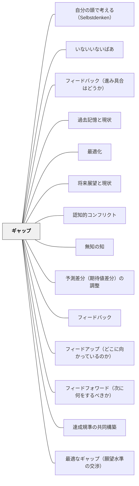

# ギャップ

> 効果的なフィードバックの核心は、ゴールと現状のギャップを認識し、埋めることである。— サドラー

## 背景（Context）

フィードバック研究者のサドラーは、効果的なフィードバックの本質を「ギャップを埋めること」として定式化した。エアコンの温度制御と同様に、教育においても目標（設定温度）と現状（室温）のギャップを検知し、埋める制御が働くとき、学習が前進する。

## 問題（Problem）

ゴールが曖昧であったり、現状が把握されていなかったり、どう改善すれば良いかがわからなかったりすると、フィードバックは情報として機能せず、学習者は同じ場所に留まる。

## 力のかたち（Forces）

- ギャップが大きすぎると、学習者が諦める
- ギャップが小さすぎると、挑戦が生まれない
- ギャップを意識するには、まずゴールの概念が必要

## 解決（Solution）

**ゴール・現状・ギャップ・改善行動の4要素を明確にすることで、フィードバックを学習の駆動力にする。**

| ステップ | 内容 | パタン |
|----------|------|--------|
| 2 | 現状のパフォーマンスを把握する | [[パタン/フィードバック（進み具合はどうか）]] |
| 3 | ギャップを認知する | ギャップそのもの（このパタン） |
| 4 | ギャップを埋める行動を取る | [[パタン/フィードフォワード（次に何をするべきか）]] |

## 結果（Consequences）

- フィードバックが「評価」から「改善の情報」として機能し始める
- 学習者が自分の学習を自己調整できるようになる（メタ認知の向上）

## 関連パタン
- [[パタン/自分の頭で考える（Selbstdenken）]]
- [[パタン/いないいないばあ]]
- [[パタン/フィードバック（進み具合はどうか）]]
- [[パタン/過去記憶と現状]]
- [[パタン/最適化]]
- [[パタン/将来展望と現状]]
- [[パタン/認知的コンフリクト]]
- [[パタン/無知の知]]
- [[パタン/予測差分（期待値差分）の調整]]

- [[パタン/フィードバック]] — 親パタン
- [[パタン/フィードアップ（どこに向かっているのか）]] — ゴールを明確にする
- [[パタン/フィードフォワード（次に何をするべきか）]] — 次のステップへ
- [[パタン/達成規準の共同構築]] — ゴールを共に作る
- [[パタン/最適なギャップ（願望水準の交渉）]] — ギャップの大きさをどう調整するかを扱う（Sadler, 1989）

## クラスター図

## Actionable Insight

- 授業の最初にゴール（何ができるようになるか）を明示し、授業後に「どこまで到達したか」を自分で確認させる——ゴール・現状・ギャップの認識サイクルを授業の構造に組み込む
- 学習者の作品を見て「ゴールと現状のギャップ」を1点に絞ってコメントする——ギャップを小さな単位で認識することが学習者を諦めさせない
- 「今日の自分と目標の差で一番大きなものは何か」を1文書かせる——ギャップを自分で言語化する経験が自己調整学習の始動点になる

## 出典

- D.R.サドラー（1989）「Formative Assessment and the Design of Instructional Systems」*Instructional Science* 18
- Hattie, J. (2009). *Visible Learning: A Synthesis of Over 800 Meta-Analyses Relating to Achievement*. Routledge.（邦訳：原田信之訳（2018）『教育の効果―メタ分析による学力に影響を与える要因の効果の可視化』図書文化社）
