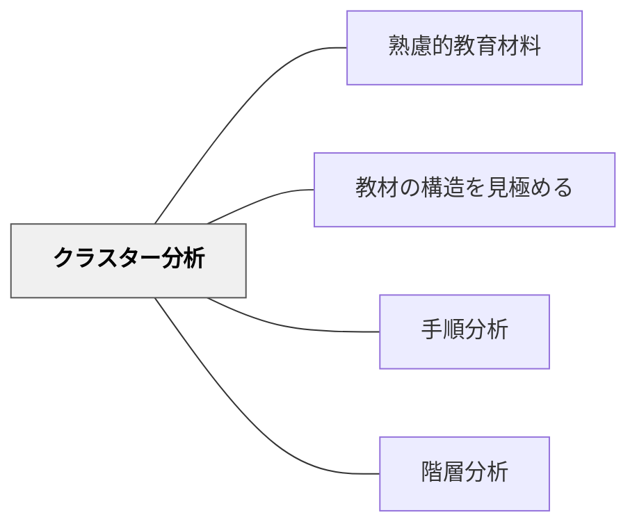

# クラスター分析

> 関連し合う知識・概念のかたまり（クラスター）を識別し、教材の構造を把握する。

## 背景（Context）

鈴木克明「教材設計マニュアル」の教材分析手法の一つ。教材の内容を「並立して習得できる」「相互に関連する」知識のかたまり（クラスター）として整理する手法。階層関係（上下）はなく横並びの関係を分析する。

## 問題（Problem）

関連する内容を無関係に扱うと、学習者が内容のつながりを理解できず記憶・理解が断片化する。

## 力のかたち（Forces）

- クラスターとして教えると相互の関係が見えやすい
- 分析に専門的な教科知識が必要

## 解決（Solution）

**教材の内容を並列的なクラスターとして整理し、クラスター間の関連を可視化する。関連するものは近づけて教える。**

## 結果（Consequences）

- 知識のつながりが見えやすくなる
- 教材の全体像が把握しやすくなる

## 関連パタン

- [[パタン/熟慮的教材教具]] — 親パタン
- [[パタン/教材の構造を見極める]] — 上位パタン
- [[パタン/手順分析]] — 別の分析手法
- [[パタン/階層分析]] — 別の分析手法

## クラスター図

## Actionable Insight

- 単元の設計前に「この内容の中で、並べて教えると理解が深まるグループはどれか」を付箋で分類してみる——クラスターの可視化が教材の全体像と内容のつながりを把握する助けになる
- 授業で関連する概念を教えるとき「これは今日の○○と同じグループの話です」と明示的に伝える——クラスター関係の明示が断片的な理解を防ぎ統合的な理解を促す
- 単元末に「今まで学んだことを関連するグループに分けてみよう」という活動をする——学習者自身がクラスターを作る経験が知識のつながりへの理解を深める

## 出典

- 鈴木克明（2002）『教材設計マニュアル――独学を支援するために』北大路書房
