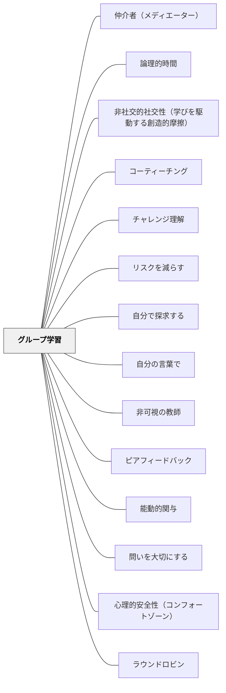

# グループ学習

> 大きなグループも小さなグループも、長続きするグループも瞬間のグループも——多様なグループ形態を意図的に使い分けることで、教師一人では届かないフィードバックを学習者同士が補い合う。

## [Pattern Connection]

Bergin et al.（2012）の *Pedagogical Patterns* における「Groups Work」パタンは、グループのサイズ・継続期間の両軸を意識的に設計することを提示する。既存のWikiパタンとの接続点は次のとおり。

- **補強点**：既存の [[パタン/ピアフィードバック]] や [[パタン/能動的関与]] が「何のためにグループを使うか」に焦点を当てているのに対し、本パタンは「どのようなグループをいつ使うか」という設計の軸（サイズ・継続時間）を明示的に提供する
- **拡張点**：2分間の「バズグループ」という超短期グループは、個人思考から全体共有への橋として機能する——従来の「グループ活動」の概念を「数分単位の即興的対話」まで拡張する
- **他のパタンへの波及**：[[パタン/非可視の教師]] はグループ学習なしには成立しない。グループが機能することで教師がボトルネックでなくなる

---

## 背景（Context）

一人の教師が教室の全学習者に十分なフィードバックを与えることには物理的な限界がある。教師が説明し続け、学習者が聴き続ける授業では、学習者が思考・表現・検証する機会が乏しくなる。また、フィードバックなしに進む学習は誤概念を固着させやすい。人が互いに説明し合い、問い合い、比べ合う中で理解は深まる——この原理をどう授業に埋め込むかが課題となる。

## 問題（Problem）

教師が唯一のフィードバック源である授業では、教師はボトルネックになる。学習者の人数に比べて教師の時間は圧倒的に少なく、個別の支援は断片的になりがちである。一方で「グループ活動をやる」とだけ指示しても、フリーライダーが生まれたり、話し合いが表面的になったり、グループの質と目的が曖昧になりやすい。グループの設計なしに「グループでやらせる」だけでは機能しない。

## 力のかたち（Forces）

- 学習者は他者に説明することで自分の理解が整理される
- グループサイズが変わると対話の質と量が変わる（大人数=多様な視点、少人数=深い対話）
- 短期グループは即時の思考整理に、長期グループは責任と継続的な協力関係の構築に機能する
- グループが多すぎると教師の観察・支援が行き届かなくなる
- グループ内の関係性・文化が育つには時間がかかる

## 解決（Solution）

**授業に大小・長短の多様なグループ形態を意図的に組み合わせて使う。各グループ形態の目的を設計し、学習者がフィードバックを互いに与え合える構造をつくる。**

グループは「サイズ」と「継続時間」の2軸で設計する。

| グループ形態 | サイズ | 継続時間 | 目的・特徴 |
|---|---|---|---|
| バズグループ | 2〜3名 | 2〜5分 | 問いへの即時対話、全体共有前の思考整理 |
| ペア活動 | 2名 | 数分〜1単位時間 | 互いの考えの説明・聴き合い |
| 小グループ | 3〜5名 | 1時間〜数週間 | 問題解決・相互説明・ピア指導 |
| 学期チーム | 4〜6名 | 数週間〜学期全体 | 継続的な協力・責任感の醸成 |
| 全体討論 | 学級全員 | 10〜20分 | 多様な視点の集約・ブレインストーミング |

---

**具体例1：バズグループで問いを捌く**

全体の場で問いが出たとき、すぐに全体討論に移らず「まず2人で2分間話してみて」と指示する。この短時間の対話が思考を整理し、全体共有の質を上げる。[[パタン/問いを大切にする]] のバズグループ技法と直結する実践。

**具体例2：速い学習者をコーチに変える**

課題の理解が速い学習者を「サポーターグループ」として動かし、まだ取り組んでいる仲間の小グループを支援させる。速い学習者にとっては説明する機会が、遅い学習者にとっては個別の説明を受ける機会が生まれる。[[パタン/非可視の教師]] を実現する構造的な仕組みになる。

**具体例3：学期チームの設計**

学期を通じた長期グループでは、共同プロジェクト・互いの学習観察・役割の分担が生まれる。短期の活動とは異なり、継続的な責任関係と文化が育まれる。グループメンバーが互いの学習スタイルを理解し、補い合う関係になる。

## 結果（Consequences）

- 教師一人では届かないフィードバックの量が増え、学習者全員の理解が高まる
- 学習者が互いのリソースになり、教師はシステム的な課題への対応に集中できる
- 説明する機会が増えることで、理解が深まり定着が促進される
- グループ内での協力・対話スキルが育つ
- グループ設計が不十分だと、表面的な活動や不均等な貢献が起きることもある

## 関連パタン
- [[パタン/仲介者（メディエーター）]]
- [[パタン/論理的時間]]
- [[パタン/非社交的社交性（学びを駆動する創造的摩擦）]]
- [[パタン/コーティーチング]]
- [[パタン/チャレンジ理解]]
- [[パタン/リスクを減らす]]
- [[パタン/自分で探求する]]
- [[パタン/自分の言葉で]]

- [[パタン/非可視の教師]] — グループ学習によって教師がボトルネックでなくなる
- [[パタン/ピアフィードバック]] — グループ内でのフィードバックの具体的な実践
- [[パタン/能動的関与]] — グループ活動は能動的関与を生む主要な手段
- [[パタン/問いを大切にする]] — バズグループが問いを全体の探究に変える
- [[パタン/心理的安全性（コンフォートゾーン）]] — グループが機能するための安全な文化の土台
- [[パタン/ラウンドロビン]] — 全員が順番に発言する構造でグループ内の発言の偏りを解決する

## クラスター図

## Actionable Insight

- 今週の授業に「2分間バズグループ」を1回入れてみる——「問いかけ→個人思考30秒→ペアで2分→全体共有」の流れを1単位時間に1回つくるだけで対話の密度が変わる
- グループ活動の前に「このグループは何のためにあるか（目的）」「何分間か（継続時間）」を明示する——目的と時間を示すだけで対話の質が上がる
- 早く終わった学習者に「まだやっている人のグループに入ってサポートして」と指示する機会をつくる——速い学習者のリソース化が非可視の教師の第一歩になる

## 出典

Bergin, J., Eckstein, J., Manns, M. L., Sharp, H., & Voelter, M. (2012). *Pedagogical Patterns: Advice For Educators*. Joseph Bergin Software Tools. (CC BY-SA 3.0)

> "Emphasize group work in your courses. Use both large and small groups. Use both long-lived (weeks) and short-lived (minutes) groups."——Bergin et al.（2012）
