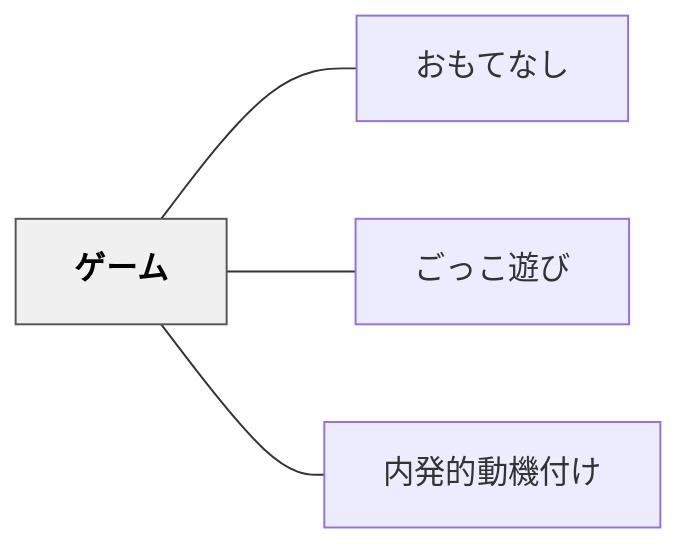

# ゲーム

---

## [Pattern Connection]

**出典**: 深田浩嗣（2012）.『ゲームにすればうまくいく ―＜ゲーミフィケーション＞９つのフレームワーク』NHK出版

- **既存パタンとの関連**：本パタンが「ゲーム的要素を取り入れる」という方向性を示すのに対して、深田（2012）は「どう取り入れるか」の9つのフレームワーク（gデザインブロック）を提供する。本パタンの解像度を大幅に上げる補助線として機能する。
- **補強された点**：深田（2012）の核心的な区別——「ゲームをつくる」vs「ゲームにする」——を追加する。ゲーム要素を「外付け」するのでなく、学習活動そのものの中にゲームの構造を組み込むことが重要。ゲームを「客寄せパンダ」にしない。
- **修正・拡張された点**：gデザインブロックの9つの構造を解説セクションとして追加。これにより「どの要素を取り入れるか」の判断枠組みが具体的になる。
- **他のパタンへの波及**：[[パタン/オンボーディング]]（最初の一歩の設計）、[[パタン/可視化]]（ゲームの最基本要素）、[[パタン/世界観]]（ゲームの深度を決める要素）、[[パタン/ソーシャル]]（インタラクションの設計）、[[パタン/おもてなし]]（すべての道具の基盤となるマインド）がそれぞれgデザインブロックの各レベルに対応する。

**gデザインブロック（9つのフレームワーク）概要**：

```
【FINAL】おもてなし（道具をどう使うかというマインド）
【LV5】ゴール（深い動機・目的——目標とは異なる）
【LV4】チューニング（KPI→データ→施策の改善ループ） / 上級者向け
【LV3】世界観（所属感・アイデンティティ） / ソーシャル（人同士のインタラクション）
【LV2】オンボーディング（最初の一歩）
【LV1】可視化（フィードバックの見える化） / 目標（具体的な行動ゴール）
```

**目標とゴールの決定的な区別**：
- **目標**：「今週のレッスンを完了する」「算数のドリルp.30まで終わらせる」——具体的・達成可能
- **ゴール**：「英会話が上達したい」「数が好きな自分になりたい」——終わりがない深い動機
- 目標がゴールに向いていないとき「これ、何のためにやってるんだっけ」という「われに返る」瞬間が生じ、モチベーションが急落する

---

> 楽しいこと自体が「やってみよう」という動機の源泉になる。

## 背景（Context）
ゲーム的要素（ポイント・レベルアップ・達成バッジ・競争・協力・即時フィードバック）を学習に取り入れることで、楽しさと動機を生み出す。ゲーミフィケーションという概念として広まっており、内発的動機付けの観点からも「有能感・自律感・関係性」を提供しやすい形式である。

## 問題（Problem）
学習が義務感・強制感で満ちていると、取り組む気持ちが生まれにくい。「やらなければならない」から「やりたい」への転換をどのように実現するかが課題である。外発的報酬に頼りすぎると内発的動機が損なわれる。

## 力のかたち（Forces）
- ゲームの即時フィードバックが達成感を高める
- 競争要素は人によっては逆にプレッシャーになる
- ゲーム要素が学習内容より目立つと本末転倒になる
- ゲームへの没入（フロー状態）は強力な内発的動機付けの形

## 解決（Solution）
**学習にゲーム的な構造（即時フィードバック・明確なゴール・挑戦と達成のサイクル・自律的な選択）を組み込み、楽しさから動機を生み出す。**

ポイントシステム・クエスト形式・バッジ・レベルアップなどのゲーミフィケーション要素を活用する。チーム協力・競争を適切に組み合わせる。ゲームそのものを使った学習（シリアスゲーム・シミュレーション）も効果的。

## 結果（Consequences）
- 学習への参加意欲・継続意欲が高まる
- フロー状態が深い学習を促す
- 外的報酬への依存が生じないよう設計に注意が必要

## クラスター図



## Actionable Insight

## 出典

- 一つの教育のパタン・ランゲージ（岩井輝久）／深田浩嗣（2012）ゲームにすればうまくいく NHK出版

- 学習にクエスト形式・バッジ・レベルアップなどのゲーミフィケーション要素を一つ取り入れてみる——即時フィードバックと達成感が学習への参加意欲を高める
- チーム協力型のゲームを一単元に一度組み込む——競争でなく協力の要素が全員の参加を促す
- 学習の進捗を「ポイント」や「レベル」で可視化する——フロー状態が生まれると深い学習が促される

## 関連パタン
- [[教科/算数・数学で使うパタン]]
- [[パタン/おもてなし]]
- [[パタン/ごっこ遊び]]
- [[パタン/内発的動機付け]]

## このパタンが働く実践

| 実践パタン | どのようにゲームが働くか |
|------------|--------------------------|
| [[実践/カエルの算数：勝ちやすさを表で考えよう]] | サイコロとカエルのゲームが、「どれが勝ちやすいか」を考えたくなる入口になる |
| [[教材/カエルの算数ゲームボード]] | ゲームボードそのものが、勝ちやすさを予想して確かめる学習活動を生み出す |

- [[パタン/熟慮的動機付け]] — 親パタン
- [[パタン/アドベンチャー]] — 挑戦と発見の動機を扱うパタン
- [[パタン/正の強化]] — ゲームの報酬要素と連動
- [[パタン/フィードバックシステム]] — ゲームの即時フィードバックの設計
