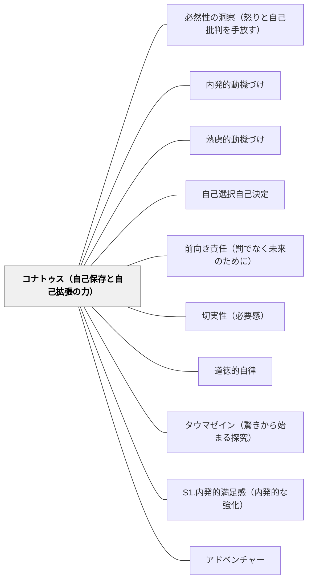

# コナトゥス（自己保存と自己拡張の力）

> すべての有限なものは、自己の存在を維持し、力を増大させようとする。これがコナトゥスである。喜びは力の増大の表れ、悲しみは力の減少の表れ——欲望はコナトゥスが意識されたものだ。学習者の中に生まれる「もっと知りたい・できるようになりたい」という感覚は、コナトゥスの発現として理解できる。

---

## [Pattern Connection]

**Spinoza on Free Will（Kisner, 2026）統合：**

スピノザは『エチカ』第三部公理(3p7)で「各物が自己の存在において留まろうとする力（コナトゥス）は、その物の現実的本質に他ならない」と述べた。Kisner（2026）の整理によれば、コナトゥスは三つの形態をとる：

| コナトゥスの形態 | 意味 | 教育的対応 |
|---|---|---|
| **喜び（Laetitia）** | 力の増大への移行 | 「わかった・できた・伸びた」の感覚 |
| **悲しみ（Tristitia）** | 力の減少への移行 | 「できない・わからない・負けた」の感覚 |
| **欲望（Cupiditas）** | 意識されたコナトゥス | 「〜したい・〜になりたい」という動機 |

- **既存パタンとの関連**：[[パタン/内発的動機づけ]] のSDT三欲求（自律性・有能感・関係性）の哲学的基盤がコナトゥスにある。Deci & Ryanが「内発的動機は活動への自然な関与から生まれる」と言うとき、スピノザはその根拠を「存在そのものが自己拡張を求めるコナトゥスを本質とする」として提供する。
- **補強された点**：「内発的動機をどう育てるか」という設計論に対し、スピノザは「コナトゥスはすべての有限存在の本質だから、内発的動機は育てるのでなく阻害しないことが先決」という逆転の視点を与える。
- **能動的感情 vs 受動的感情**：コナトゥスから自然に生まれる感情（能動的感情）は力を増大させ自由の表現となる。外部から引き起こされる感情（受動的感情＝パッション）は力を減少させる。報酬・罰・同調圧力への反応は受動的感情であり、学習の質を下げる。
- **他のパタンへの波及**：[[パタン/前向き責任（罰でなく未来のために）]] — 復讐・報復的罰は悲しみ（力の減少）であり、コナトゥスに反する；[[パタン/自己選択自己決定]] — コナトゥスが自己原因的に働くとき学びは自由になる（旧パタン「自己決定としての学び」を統合済み）。

---

## 背景（Context）

なぜ子どもは学ぶのか。なぜある活動には夢中になり、ある活動には無気力になるのか。

スピノザ（1677）はこの問いに対して根本的な答えを提示した。すべての有限なものは、自己の存在を維持し、力を増大させようとする根本的な力——**コナトゥス**——を本質として持つ。人間だけでなく、すべての個物がこの力を持つ。人間においてコナトゥスは身体においても精神においても働き、「喜び」「悲しみ」「欲望」の三形態として現れる。

喜びは力の増大への移行であり、悲しみは力の減少への移行である。欲望はコナトゥスが意識されたもの——「〜したい」という感覚の正体がコナトゥスである。

## 問題（Problem）

教育において動機付けは常に問題になる。しかし多くの解決策が「外から与えること」に偏っている。

報酬・罰・プレッシャー・競争——これらはすべて外部から動機を操作する試みであり、スピノザ的な観点からは「受動的感情」を生み出す設計である。受動的感情は外部に依存するため、外部条件が変われば消える。さらに、それは学習者の自己原因性（自分の本性から行動する力）を弱める。

「コナトゥスをどう活かすか」ではなく「コナトゥスを阻害している何を取り除くか」が問いになる。

## 力のかたち（Forces）

- コナトゥスはすべての存在の本質だから、「やる気を出させる」のでなく「やる気を損なわない」が先決
- 喜び（力の増大）をもたらす活動は持続し、悲しみ（力の減少）をもたらす活動は回避される——これは生物学的必然でなく哲学的必然
- 能動的感情（コナトゥスから自然に生まれる感情）は力を増大させ自由の表現となる
- 受動的感情（外部から引き起こされる感情）は力を減少させるか、外部条件に依存した一時的な増大を生む
- 適切な観念（自分の本性から生まれる理解）が能動的感情を支える——丸暗記は受動的、自力での理解は能動的
- 子どもは自分が力を増大させている感覚のある活動（有能感・成長感・探究感）に自然に引き寄せられる

## 解決（Solution）

**学習者のコナトゥスが能動的に働く条件——「力の増大を感じられる体験」——を意図的に設計する。同時に、コナトゥスを受動化する条件（外部コントロール・受動的服従・力の減少体験の蓄積）を取り除く。**

---

### 喜び（力の増大）を設計する

「わかった・できた・伸びた」という感覚こそがコナトゥス的な喜びである。これは外から与えられるものではなく、学習者が自分の力の増大を感じるときに内側から生まれる。

- **「ちょっと難しいがギリギリできる」課題設計**：能力の限界よりやや上の課題で力の増大が起きる（フロー状態）。力の減少（できない・わからない一方）は悲しみを生む。
- **成長を可視化する**：「先週はできなかった。今日はできた」という比較が力の増大の感覚を生む。他者との比較でなく自己との比較。
- **探究の自由を保障する**：「自分の問いから動く」体験がコナトゥスを能動化する。「先生から与えられた問いに答える」は受動化しやすい。

---

### 受動化を防ぐ

コナトゥスの受動化は以下で起きる：

| 受動化の原因 | コナトゥス的説明 | 設計上の対応 |
|---|---|---|
| 外部報酬への依存 | 活動の原因が外部に移る | 事後の予期しない承認・具体的フィードバック |
| 罰への恐怖 | 力の減少への恐怖が能動性を阻む | [[パタン/前向き責任（罰でなく未来のために）]] |
| 同調圧力 | 外部からの強制が自己原因性を奪う | 自己選択の余地を残す |
| 過度な監視 | 「見られているからやる」が自己原因を外部に移す | 観察するが管理しない |

---

### 具体例

**例1：算数の授業**
「できない問題があって悲しい（コナトゥスの減少感覚）」を逆用する。「これが解けるようになったら力が増大する」という見通しをつくる——「なんか悔しい・解いてみたい」という感覚がコナトゥスの能動的発動。

**例2：自由研究・探究学習**
「自分が疑問に思うことを選んでいい」という設計が、欲望（意識されたコナトゥス）を自然に呼び出す。テーマを与えるほど受動化し、選ばせるほど能動化する。

**例3：岩井の自己教育（数学デイリー）**
自分で問題を選んで取り組む時間は、コナトゥスが能動的に働いている体験。「解いてみたい・わかりたい」という欲望（コナトゥスの意識形態）が継続の源泉になっている。

## 結果（Consequences）

- 外部報酬に依存しない、力の増大感覚に根ざした持続的な学習動機が育つ
- 学習者が「自分の力で理解した・達成した」という能動的感情を持つ体験が増える
- 教師が「やる気を引き出す」という問いから「コナトゥスを阻害している何を取り除くか」という問いへ転換できる
- ただし、すべての学習を「喜び」だけにすることはできない——悲しみ（難しさへの向き合い）もコナトゥスの一形態として設計に組み込む必要がある

## 関連パタン
- [[パタン/必然性の洞察（怒りと自己批判を手放す）]]

- [[パタン/内発的動機づけ]] — SDTとコナトゥスの哲学的接続
- [[パタン/熟慮的動機づけ]] — コナトゥスの視点から動機設計を診断する
- [[パタン/自己選択自己決定]] — コナトゥスが自己原因的に働く学習設計（旧パタン「自己決定としての学び」を統合済み）
- [[パタン/前向き責任（罰でなく未来のために）]] — 悲しみ（力の減少）としての罰への代替
- [[パタン/切実性（必要感）]] — 切実性の哲学的基盤がコナトゥス
- [[パタン/道徳的自律]] — カント的自律とスピノザ的自己決定の比較
- [[パタン/タウマゼイン（驚きから始まる探究）]] — 驚き（タウマゼイン）はコナトゥスが認識的に活性化された形態
- [[パタン/S1.内発的満足感（内発的な強化）]] — 内発的満足感のコナトゥス的説明
- [[パタン/アドベンチャー]] — 適切な難度でコナトゥスを活性化する設計
- [[文献/Spinoza on Free Will（Kisner）]] — 本パタンの出典

---

## クラスター図

## Actionable Insight

- 授業後に「今日、力が増えた感覚があったか」を1行で振り返らせる——「わかった・できた・伸びた」の感覚を言語化させることで、コナトゥスの喜びを意識化できる
- 「先生から与えられた問い」と「自分で選んだ問い」を一授業の中に両方入れる——後者の時間をわずかでも確保することでコナトゥスの能動化を守る
- 「叱る」より前に「この子のコナトゥスは今どこで働いているか」を問う——何に力の増大感覚を持っているかを見つければ、そこを足場に学習設計を変えられる

---

## 出典

Kisner, M. J. (2026). *Spinoza on Free Will*. Cambridge Elements: The Philosophy of Benedict de Spinoza. Cambridge University Press.  
DOI: https://doi.org/10.1017/9781009698917

> "Conatus, which is the striving of a thing to persist and increase its power, is the very essence of a finite thing." — Spinoza, *Ethics* 3p7（Kisner, 2026 による整理）
