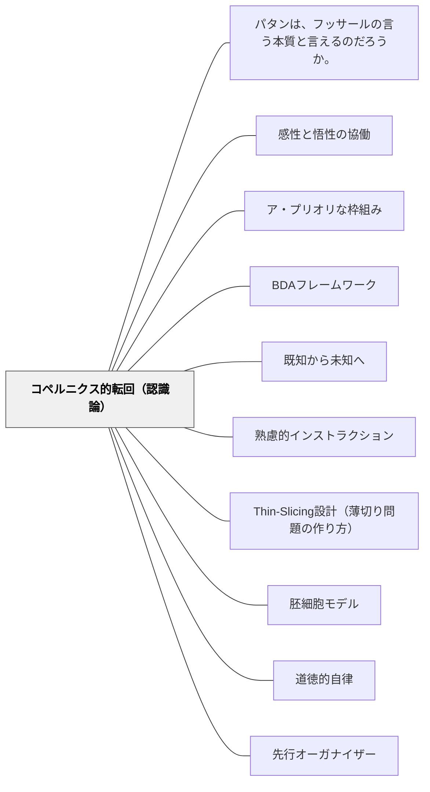

# コペルニクス的転回（認識論）

> 「これまでわたしたちは、人間のすべての認識は、その対象にしたがって規定されるべきだと想定してきた。しかし……対象がわたしたちの認識にしたがって規定されなければならないとすれば、形而上学の課題はより進展するのではないか」——カント

---

## [Pattern Connection]

**カント（1787）第二版序文統合：**

- **哲学的基盤の提供**：[[パタン/熟慮的インストラクション]] が「学習者の状態に合わせて指導を調整する」と実践的に述べていることの哲学的根拠として、カントの「コペルニクス的転回」が機能する。対象（教材・指導）が認識する主体（学習者）に合わせるという発想の転換。
- **補強する既存パタン**：[[パタン/BDAフレームワーク]] — Before・During・After という枠組みは「学習者の認識過程に沿って指導を構造化する」という意味で、コペルニクス的転回の実践形態。
- **波及するパタン**：[[パタン/ア・プリオリな枠組み]]、[[パタン/先行オーガナイザー]]（先行知識の活性化）、[[パタン/感性と悟性の協働]]

---

## 背景（Context）

イマヌエル・カントは1787年、『純粋理性批判』第二版序文において科学的思考の革命について述べた。数学（タレスの幾何学的証明）も自然科学（ガリレイの実験）も、「対象を観察して受動的に学ぶ」から「理性の計画にしたがって自然に問いかける」への転換によって学問の確実な道を開いた。

カントはここから、哲学・形而上学においても同様の「思考方法の革命」が必要だと宣言した。従来の想定——「認識が対象に従う（対象のありのままを受動的に写す）」——を逆転させる。「**対象が認識に従う**（認識の形式が対象の現れ方を規定する）」という転回がカントのコペルニクス的転回である。

教育においても、この転回は根本的な意味を持つ。**「学習内容（対象）が学習者（認識する主体）に合わせる」という発想の転換**——これが学習者中心設計の哲学的根拠となる。

## 問題（Problem）

教育設計のデフォルトは「教材・カリキュラム中心主義」である。教えるべき内容（対象）が先に決まっており、学習者はそれを受け取る受動的な存在として設計される。

この想定のもとでは：
- 学習者の先行知識・認知スタイル・発達段階が後回しにされる
- 「理解しない学習者」が問題とされ、「わかりにくい教材設計」は問われない
- 同じ内容を全員に同じ方法で届けようとする画一的指導が生まれる

コペルニクス的転回は問う：**「なぜこの教材がわからないのか」ではなく、「この学習者の認識構造に対して、この教材はどのように設計されるべきか」という問いに切り替えられているか。**

## 力のかたち（Forces）

- 学習内容には客観的な論理構造がある——それを無視した「個人の感想」レベルの授業は知識の習得につながらない
- 学習者の認識構造（先行知識・直観・誤概念）は学習の方向を規定する——これを無視した指導は「空回り」する
- 転回の方向は両方ある：教材を学習者に合わせる（学習者中心化）と、学習者に認識形式を育てる（資質・能力の育成）
- 教師の時間・エネルギーには限界がある——全員に完全に個別化する「コペルニクス的転回」は物理的に不可能
- カリキュラムの制約（教科書・学習指導要領）があるなかで転回できる余地を見つけ続ける必要がある

## 解決（Solution）

**「対象（教材）が学習者（認識）に合わせる」という発想の転換を、授業設計・指導の出発点に置く。学習者の認識状態（先行知識・誤概念・疑問）を把握してから教材の提示方法を決める。**

---

### 転回①：教材を先に提示しない——学習者の「認識状態」を先に把握する

単元の冒頭で「今日はXを教えます」ではなく、「Xについて今どう思っているか」を引き出す活動を先に置く。

- **KWL（What I Know / Want / Learned）**：知っていること・知りたいことを言語化させる
- **誤概念の意図的な発掘**：「三角形の内角の和は？」「地球の周りをまわっているのは？」など、よく知られた誤概念を引き出す
- **問いかけで始まる授業**：「これを見てどう思う？」という問いが、学習者の認識構造を開示させる

---

### 転回②：「わからない」の原因を学習者ではなく教材設計に向ける

学習者がつまずいているとき、「この子が理解できない」ではなく「この教材・説明が、この子の認識構造に合っていない」という問いに切り替える。

- 別の具体例・比喩・モデルで説明し直す（感性的入り口を変える）
- 学習者の持つ類似概念（先行知識）から橋渡しをする（[[パタン/既知から未知へ]]）
- 段階を細かくして「小さな成功体験」を積ませる（[[パタン/Thin-Slicing設計（薄切り問題の作り方）]]）

---

### 転回③：「学習者が認識を構築する」プロセスを中心に置く

教師が説明して学習者が受けとる「伝達モデル」から、学習者が問い・比較・試行錯誤を通じて認識を構築する「構成主義モデル」へ。

- グループ討議・比較・反証活動——認識が「受け取る」のではなく「構築される」経験
- 学習者自身の言葉で概念を再定義させる（悟性の自発的な働き）
- 間違いを「修正すべき欠点」ではなく「認識過程の素材」として扱う

---

### 実践例：「分数の割り算」のコペルニクス的転回

**従来型**：「割り算はひっくり返してかけます」→公式を提示→練習問題。

**転回後**：  
「ケーキ2/3個を一人1/4個ずつ分けると何人に分けられるか、図で考えてみて」→ 学習者が試行錯誤（感性段階）→「みんなの図を比べると何が共通している？」（悟性段階）→「ひっくり返してかける」公式の**理由**を学習者が発見する。

転回の核心：公式が先ではなく、学習者の直観的な問題解決プロセスが先。公式は「学習者の認識が到達した地点」として位置づく。

---

## 結果（Consequences）

**成功した場合：**
- 学習者が「わかった」と感じる深い理解が生まれる——教師に言われたのではなく、自分で気づいた感覚
- 誤概念が可視化されて修正される——「誤解しているから使えない」から「誤解の構造を知って修正する」へ
- 転移可能な理解が育つ——「なぜそうなるのか」まで把握しているから応用できる

**留意点：**
- 「学習者の認識に合わせる」を突き詰めると、学習者の現在の認識を超えるものは何も教えられなくなるという誤解——転回は「学習者の認識から始める」ことであり「学習者の認識に留まる」ことではない
- 教材論・内容の論理的構造の重要性は失われない——コペルニクス的転回は「教材の質を下げること」ではない

## 関連パタン
- [[パタン/パタンは、フッサールの言う本質と言えるのだろうか。]]

- [[パタン/感性と悟性の協働]] — コペルニクス的転回の認識論的基盤
- [[パタン/ア・プリオリな枠組み]] — 学習者が持つ先行認識構造の把握
- [[パタン/BDAフレームワーク]] — Before（先行知識把握）が転回の実践形態
- [[パタン/既知から未知へ]] — 学習者の認識構造から出発する原則
- [[パタン/熟慮的インストラクション]] — 学習者状態に合わせた指導調整
- [[パタン/Thin-Slicing設計（薄切り問題の作り方）]] — 段階化による学習者の認識への適応
- [[パタン/胚細胞モデル]] — 認識の核となる概念の学習者中心的展開
- [[パタン/道徳的自律]] — カント哲学の実践的側面（認識論と倫理の接続）
- [[パタン/先行オーガナイザー]] — 学習者の既有認識構造から出発するオーズベルの方略はコペルニクス的転回の具体的実装
- [[文献/純粋理性批判 1（カント、中山元訳）]] — 出典

---

## クラスター図

## Actionable Insight

- 単元の最初に「この内容について今何を知っていると思う？」と問い、学習者の先行認識を確認してから指導を始める——コペルニクス的転回の最小単位
- 「この子がわからない」と感じたとき、「この教材・説明の何が、この子の認識構造に合っていないのか」と問い直す習慣をつける
- 「なぜこうなるのか」を学習者に説明させ、そのプロセスに耳を傾ける——認識の構造が見える
- 授業後に「今日の設計は学習者の認識から出発していたか、教材の論理から出発していたか」を問う振り返りを1行書く

---

## 出典

Kant, I. (1787). *Kritik der reinen Vernunft*, 2. Auflage, Vorrede [純粋理性批判 第二版序文].  
中山元訳（2010）『純粋理性批判 1』光文社古典新訳文庫, pp. 29-57.

> 「これまでわたしたちは、人間のすべての認識は、その対象にしたがって規定されるべきだと想定してきた。しかし概念によって、対象について何ものかをアプリオリに作りだし、人間の認識を拡張しようとするすべての試みは、この想定のもとでは失敗に終わったのである」——第二版序文V09

→ 関連文献：[[文献/純粋理性批判 1（カント、中山元訳）]]
