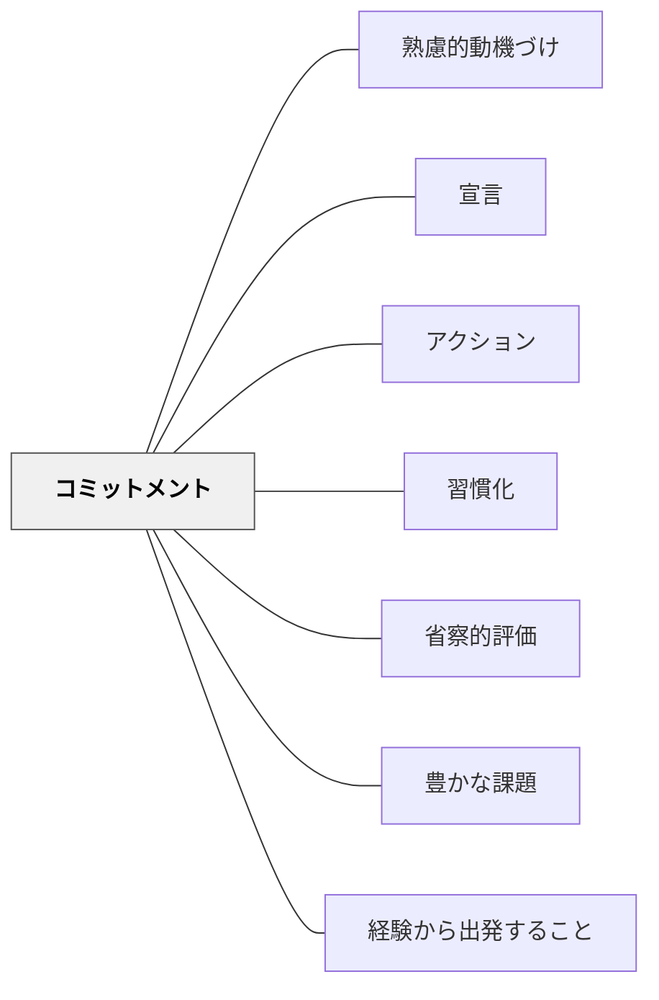

# コミットメント

> 自分との約束が行動を引き出す。宣言・誓約・契約は動機付けの強力な触媒となる。

## 背景（Context）
コミットメントとは、自分自身や他者に対して「これをやる」と約束・宣言・誓約する行為である。コミットメントだけで1冊の本になるほど大きく多様なパターンであり、公言・契約・自己との約束など様々な形をとる。

## 問題（Problem）
意図はあっても行動に移せないことが多い。「やろうと思っていたのにできなかった」という状況が繰り返されると、自己効力感が低下し、動機も弱まっていく。意図と行動のギャップを埋める仕組みが必要である。

## 力のかたち（Forces）
- 一貫性の原理：人は自分が言ったことと行動を一致させようとする
- 公言の強さ：他者に宣言するほどコミットメントの拘束力が高まる
- 負担感：過度なコミットメントは逆にプレッシャーとなる
- 自律性：強制された約束は内発的動機付けを損なう可能性がある

## 解決（Solution）
**自分が本当にやりたいことについて、具体的・公言的なコミットメントを設定し、行動と意図のギャップを縮める。**

宣言・契約・ベティング（賭け）・実施意図（if-thenプランニング）など多様な形でコミットメントを設計する。他者への公言、書面への記録、定期的な振り返りなどを組み合わせることで効果が高まる。自己決定に基づくコミットメントが長続きする。

## 結果（Consequences）
- 意図と行動のギャップが縮まり、実行率が上がる
- 過度なコミットメントはストレスや燃え尽きにつながる
- 達成できたときの自己効力感の向上につながる

## クラスター図

## Actionable Insight

- 「今日やること」を一言クラスで宣言させてから活動を始める——他者への公言がコミットメントの拘束力を高め実行率が上がる
- if-thenプランニング（「○○のときは△△する」）の形で実施意図を書かせる——具体的な実施計画がコミットメントと行動のギャップを縮める
- 達成したいことを紙に書かせ見えるところに貼る——書面への記録が自己との約束の意識を高める

## 出典

- 一つの教育のパタン・ランゲージ（岩井輝久）

## 関連パタン
- [[学級経営/学級経営で使えるパタン]]
- [[特別支援/特別支援で使えるパタン]]
- [[パタン/熟慮的動機づけ]] — 親パタン
- [[パタン/宣言]] — コミットメントの一形態
- [[パタン/アクション]] — 行動から始めるアプローチ
- [[パタン/習慣化]] — コミットメントを習慣に変える
- [[パタン/省察的評価]] — コミットメントの振り返りが次の行動を改善する
- [[パタン/豊かな課題]] — 豊かな課題へのコミットメントが深い学びを生む
- [[パタン/経験から出発すること]] — 体験への関与がコミットメントの起点になる
