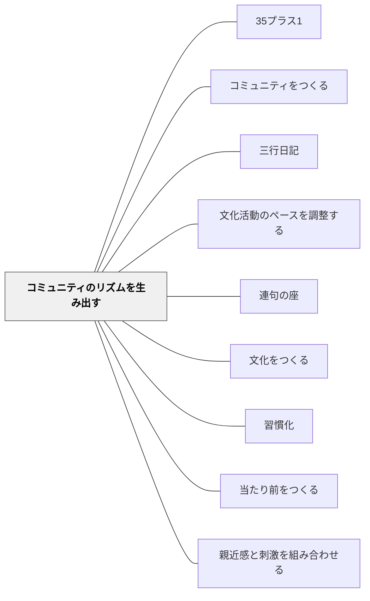

# コミュニティのリズムを生み出す

> コミュニティのリズムはその活気を最もよく表す指標である。— ウェンガー（p.107）

## 背景（Context）

リズムは生命の基本原理である。心臓の鼓動、呼吸、季節の循環——これらすべてがリズムを持つ。コミュニティも同様に、固有のリズムを持つことで生命力を維持する。リズムをつくることは、文化をつくることそのものである。

## 問題（Problem）

リズムのないコミュニティは停滞し、予測不能であるため参加者が不安定になる。逆にリズムが速すぎると息切れし、遅すぎると活気を失う。

## 力のかたち（Forces）

- リズムは「当たり前」「習慣」を支える構造的基盤
- 1日・1週間・1学期・1年のそれぞれのスケールでリズムがある
- 千葉雅也『センスの哲学』：リズムが「のり（groove）」を生み出す

## 解決（Solution）

**1日・1週間・1学期・1年のスケールで、一貫したリズム（定例の集まり・活動・儀式）を設計し、維持する。**

リズムの例：
| スケール | 例 |
|---------|-----|
| 1日 | 朝のチェックイン、読書の時間、終わりの振り返り |
| 1週間 | 月曜のクラス会議、金曜の発表 |
| 1学期 | 単元の開始儀式・締めくくりの発表会 |
| 1年 | 年度始めのオンボーディング・年度末の振り返り |

ウェンガーの警告：
- 鼓動が速すぎ → 息切れ、参加をやめる
- 鼓動が遅すぎ → 停滞感

学校での実践例：リーディングワークショップの「定時定形」が安心感を生む

## 結果（Consequences）

- 学習者が何を期待すればいいかがわかり、安心感が生まれる
- リズムが「当たり前」を自然に強化する
- コミュニティの活気がリズムに可視化される

## 関連パタン
- [[学級経営/学級経営で使えるパタン]]
- [[実践/デイリー5の起動]]
- [[パタン/35プラス1]]
- [[パタン/コミュニティをつくる]]
- [[パタン/三行日記]]
- [[パタン/文化活動のペースを調整する]]
- [[パタン/連句の座]]

- [[パタン/文化をつくる]] — 親パタン
- [[パタン/習慣化]] — リズムが習慣化を支える
- [[パタン/当たり前をつくる]] — リズムが当たり前の基盤
- [[パタン/親近感と刺激を組み合わせる]] — 定例リズムが刺激の土台になる

## クラスター図

## Actionable Insight

- 毎朝・毎授業の「始まりの儀式」を1つ決めて1週間続ける——「これがあると授業が始まった」という感覚がリズムの核になる
- 週1回「今週の振り返り」を同じ形式で行う——金曜の振り返りが「週のリズム」を刻む最小の習慣
- 学期の始まりと終わりに「特別な儀式（開幕・締めくくり）」を設ける——1年のリズムを意識することがコミュニティの活気につながる

## 出典

- エティエンヌ・ウェンガー他（2002）『コミュニティ・オブ・プラクティス』翔泳社、第3章 p.107
- 千葉雅也（2024）『センスの哲学』
- 動画記録：[[文献/コミュニティオブプラクティスと文化をつくるパタン（動画記録）]]
