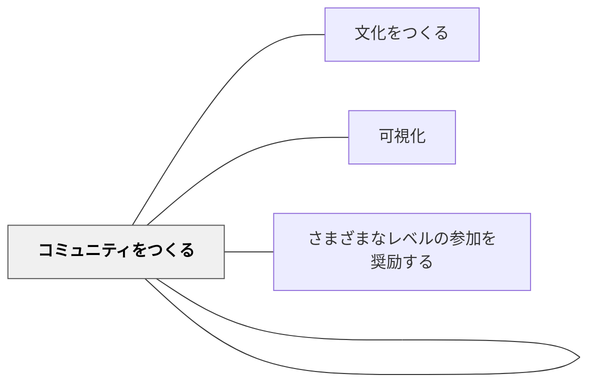

# コミュニティの価値を可視化する

> コミュニティにいる価値が見えにくい。可視化することで、積極的な関与を促す。

## 背景（Context）

コミュニティに参加することの価値は、多くの場合「感じるもの」であり、言語化・可視化されていない。その結果、メンバーは「なぜここにいるのか」を意識しにくくなり、参加への動機が薄れていく。

## 問題（Problem）

価値が見えない状態では、コミュニティへの積極的な関与を促すことが難しい。特に周辺メンバーにとって、中心に近づく理由が見えなくなる。

## 力のかたち（Forces）

- コミュニティの価値は長期的に蓄積されるため、短期的には見えにくい
- 価値の可視化には「物語・データ・アーティファクト」の3つの方法がある
- 過剰な可視化（成果の数値化）は本来の目的を歪めることがある

## 解決（Solution）

**コミュニティに参加することで生まれた価値（学び・つながり・変化）を定期的に物語・成果物・記録として可視化し、メンバーで共有する。**

実践例：
- 「みんながいるからこそこんないいことがあった」を定期的に共有する
- 学習の成長（以前の作品との比較）を振り返る場をつくる
- 「このコミュニティで学んだこと・気づいたこと」を定期的に言語化・掲示する
- 学習の物語（ポートフォリオ・記録写真）をコミュニティの記憶として保存する

## 結果（Consequences）

- メンバーが「ここにいることに意味がある」という感覚を持つようになる
- 新しいメンバーや周辺メンバーがコミュニティの価値を感じやすくなる
- コミュニティの歴史・文化が次の世代に引き継がれる

## 関連パタン

- [[パタン/文化をつくる]] — 親パタン
- [[パタン/可視化]] — 価値を見えるようにする実践
- [[パタン/コミュニティをつくる]] — 価値を共有する関係性
- [[パタン/さまざまなレベルの参加を奨励する]] — 可視化された価値が周辺を引き寄せる

## クラスター図

## Actionable Insight

- 月1回「このコミュニティにいるからこそよかったこと」を1文ずつ書いて共有する——言語化と共有が価値を見えるものにし参加動機を高める
- 単元の前後の作品を並べて「学習の成長」を掲示する——変化の可視化が「ここにいる意味」を具体的に示す
- 学習コミュニティの「歴史」を写真・作品・記録で蓄積し、新しいメンバーに引き継ぐ——コミュニティの記憶が文化として次世代に受け継がれる

## 出典

- エティエンヌ・ウェンガー他（2002）『コミュニティ・オブ・プラクティス』翔泳社
- 動画記録：[[文献/コミュニティオブプラクティスと文化をつくるパタン（動画記録）]]
